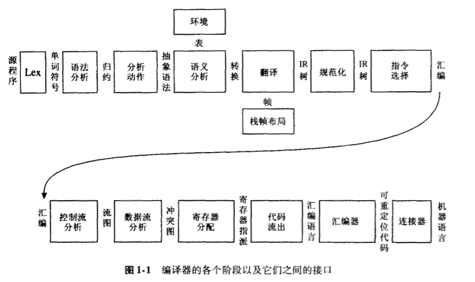
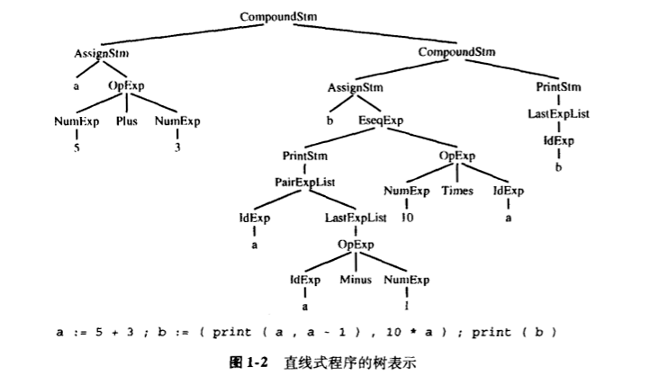

# Chapter 01 - 绪论

程序设计语言转换成可执行代码时使用的技术、数据结构和算法。

<div style="text-align: center">

</div>


|阶段|描述|

|:-:|:-:|

|词法分析|将源文件分解为一个个独立的单词符号|

|语法分析|分析程序的短语结构|

|语义动作|建立每个短语对应的*抽象语法树*|

|语义分析|确定每个短语的含义，建立变量和其声明的关系，检查表达式的类型，翻译每个短语|

|栈桢布局|按照机器要求的方式将变量、函数参数等分配于活跃记录内（即栈桢）|

|翻译|生成*中间表示树*，IR Tree，这是一种与任何特定程序设计语言和目标机体系结构无关的表示|

|规范化|提取表达式中的副作用，整理条件分支，以方便下一阶段处理|

|指令选择|将IR树结点组合成与目标机指令相应的块|

|控制流分析|分析指令的顺序并建立*控制流图*，此图表示程序执行时可能流经的所有控制流|

|数据流分析|收集程序变量的数据流分析，如*活跃分析*计算每个变量仍需使用其值的地点即*活跃点*|

|寄存器分配|为程序中的每一个变量和临时数据选择一个寄存器，不在同一点活跃的两个变量可以共享同一个寄存器|

|代码流出|用机器寄存器替代每一条指令中出现的临时变量名|


编译器分解成多个阶段是为了能复用其各个构件。`抽象语法 Abstract Syntax`、`IR 树 IR Tree`和`汇编 Assem`之类的接口是数据结构的形式。`翻译`接口是一组可由*语义分析*阶段调用的函数，`单词符号 Token`接口是函数形式，分析器通过调用它而得到输入程序中的下一个单词符号。

# 树语言的数据机构

编译器中使用的许多重要数据结构在编译程序中都有*中间表示*，通常采用树的形式，树的节点有若干类型，对应含有不同的属性。

## 举例：直线型程序语言的树表示

|||
|:-:|:-:|
| Stm → Stm ; Stm (*CompoundStm*) | ExpList → Exp, ExpList (*PairExpList*) |
| Stm → id:= Exp (*AssignStm*) | ExpList → Exp (*LastExpList*) |
|Stm → print( ExpList ) (*PrintStm*) | Binop → + (*Plus*) |
|Exp → id (*IdExp*) |Binop → - (*Minus*) |
|Exp → num (*NumExp*)|Binop → x (*Times*)|
|Exp → Exp Binop Exp (*OpExp*) |Binop → / (*Division*) |
|Exp → ( Stm, Exp ) (*EseqExp*) | |

- **标识符表达式**，表示变量的当前内容。
- **数**，按命名它的整数计值。
- **操作符表达式 e<sub>1</sub> op e<sub>2</sub>**，表示先计算**e<sub>1</sub>**，再计算**e<sub>2</sub>**，然后按给定的二元操作符计算表达式结果
- **表达式序列 (s,e)**，类似与C语言中的逗号操作符，在计算表达式**e**（并返回其结果）之前先计算语句**s**的副作用。

> 程序：
>
> a := 5 + 3; b := (print(a, a-1), 10*a); print(b)
>
> 运行结果：
>
> 8 7
>
> 80
>
> <div style="text-align: center">
> 
> </div>
> 
> 用下面提供的原型来书写上树时，可得到程序 
```C 
A_stm program = 
A_CompoundStm(
    A_AssignStm("a", A_OpExp(A_NumExp(5), A_plus, A_NumExp(3))),
    A_CompoundStm(
        A_AssignStm("b", A_EseqExp(A_PrintStm(A_PairExpList(A_IdExp("a"), A_LastExpList(A_OpExp(A_IdExp("a"), A_minus, A_NumExp(1))))), A_OpExp(A_NumExp(10), A_times, A_IdExp("a")))),
    ),
    A_PrintStm(A_LastExpList(A_IdExp("b")))
);
```

```C
# 每个文法符号对应于一种typedef的数据结构，在这里给出每种文法规则的构造函数原型。

typedef char *string;
typedef struct A_stm_ *A_stm;
typedef struct A_exp_ *A_exp;
typedef struct A_expList_ *A_expList;
typedef enum { A_plus, A_minus, A_times, A_div } A_binop;

struct A_stm_ { enum {A_compoundStm, A_assignStm, A_printStm } kind; 
                union { struct { A_stm stm1, stm2; } compound;
                        struct { string id; A_exp exp; } assign;
                        struct { A_expList exps; } print;
                } u;
    };

A_stm A_CompoundStm(A_stm stm1, A_stm stm2);
A_stm A_AssignStm(string id, A_exp exp);
A_stm A_PrintStm(A_expList exps);

struct A_exp_ { enum { A_idExp, A_numExp, A_opExp, A_eseqExp } kind;
                union { string id;
                        int num;
                        struct { A_exp left; A_binop oper; A_exp right; } op;
                        struct { A_stm stm; A_exp exp; } eseq;
                } u;
    };
A_exp A_IdExp(string id);
A_exp A_NumExp(int num);
A_exp A_OpExp(A_exp left, A_binop oper, A_exp right);
A_exp A_EseqExp(A_stm stm, A_exp exp);

struct A_expList_ { enum { A_pairExpList, A_lastExpList } kind;
                    union { struct { A_exp head; A_expList tail; } pair;
                            A_exp last;
                    } u;
    };

```

[Back to Preface](../compiler-implementation-c.md)
