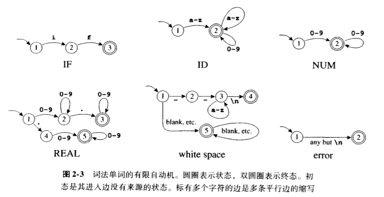
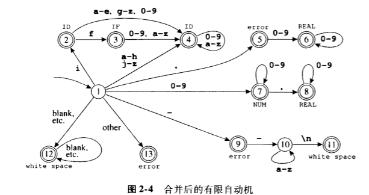
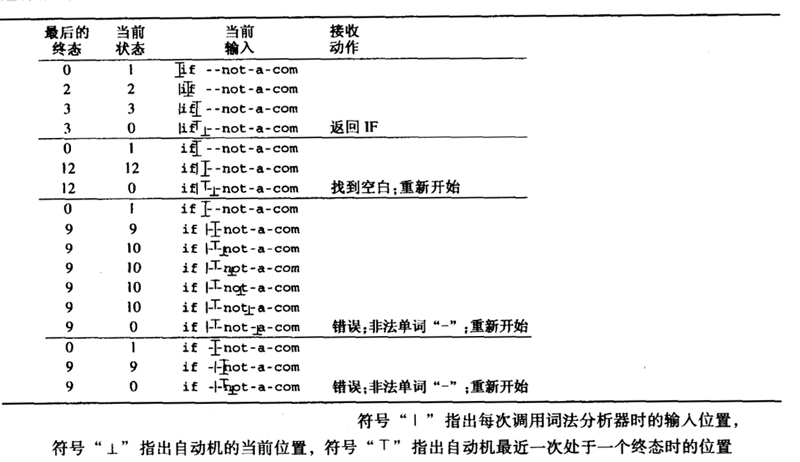

# Chapter 02 - 词法分析

为了将一个程序从一种语言翻译成另一种语言，编译器必须首先把程序的各种成分拆开，并搞清其结构和含义，之后再用另一种方式把这些成分组合起来。编译器的前端执行分析，后端进行合成。

分析一般分3种：
- 词法分析：将输入分解成一个个独立的词法符号，即“单词符号”token，简称单词。
- 语法分析：分析程序的短语结构。
- 语义分析：推算程序的含义。

语法分析器以字符流作为输入，生成一系列的名字、关键字和标点符号，同时抛弃单词之间的空白符和注释。

> 如果让语法分析器来处理程序中任意位置都可能出现的空白符和注释会让语法分析变得过于复杂，因此将词法分析从语法分析中分离出来。

## 词法单词

词法单词是字符组成的序列，是程序设计语言的文法单位，可归类为有限的几组单词类型。

|类型|例子|
|:-:||:-:|
|ID|foo n14 last|
|NUM| 73 0 00 515 082|
|REAL|66.1 .5 10. 1e67 5.5e-10|
|IF|if|
|COMMA|,|
|NOTEQ|!=|
|LPAREN|(|
|RPAREN|)|

IF、VOID、RETURN等保留字是不能作为标识符使用的。

非单词的例子：
- 注释    /* try agian */
- 预处理命令   #include<stdio.h>
- 预处理命令    #define NUMS 5, 6
- 宏     NUMS
- 空格符号、制表符、换行符  \s \t \n

对C或Java中标识符的一种描述：

> 标识符是字母和数字组成的序列，第一个字符必须是字母。下划线`_`视为字母。大小写字母不同。如果经过若干单词分析后输入流已到达一个给定的字符，则下一个单词将由有可能组成一个单词的最长字符串所组成。其中的空格符、制表符、换行符和注释都将被忽略。另外还需要有某种空白符来分隔相邻的标识符、关键字和常数。

将用**正则表达式**的形式语言来指明**词法单词**，用**确定的有限自动机**来实现**词法分析器**，并用数学方法将两者联系起来得到一个简单且可读性更好的词法分析器。

## 正则表达式

**语言language**是**字符串string**组成的集合，**字符串**是**符号symbol**的有限序列。**符号**本身来自有限**字母表alphabet**。

为了用有限的描述来指明这类（可能是无限）的语言，使用正则表达式的表示法，每个正则表达式代表一个字符串集合。

- **符号**。对于语言字母表中的每个字符`a`，正则表达式 *a* 表示仅包含字符串`a`的语言。

- **可选（并集）**。对于给定的两个正则表达式 *M* 和 *N* ，可选操作符 `|` 形成一个新的正则表达式， *M|N* 。如果一个字符串属于语言 *M* 或属于 *N*，则它属于 *M|N* 。

- **联结（串接）**。对于给定的两个正则表达式 *M* 和 *N* ，联结操作符`·`形成一个醒的正则表达式， *M·N* 。如果一个字符串由任意两个字符串α和β的联结，且α属于语言 *M* ，β属于 *N* ，则该字符串属于 *M·N* 组成的语言。

- **ϵ**。正则表达式 *ϵ* 表示仅含一个空字符串的语言。

- **重复（闭包）**。对给定的正则表达式，其克林闭包是／ M* ／。如果一个字符串是由 *M* 中的字符串经过0次至多次联结运算的结果，则该字符串属于／ M* ／。

使用时，会省略联结操作符或 ϵ 符号。并假定优先级上 克林闭包 -> 联结运算 -> 可选运算。

|正则|意义|
|:-:|:-:|
|a|一个表示字符本身的原始字符|
|ϵ|空字符串|
| |空空字符串的另一种写法
| *M\|N* | 可选，在 M 和 N之间选择|
| *MN* |联结，M 之后跟随 N|
| *M·N* |联结的另一种写法|
| M* | 重复0次及以上|
| M+ | 重复1次及以上|
| M? |选择，M 出现0次或1次|
| [a-zA-Z] |字符集|
| . | 句点表示除换行符以外的任意单个字符 |
| " a. + *  " | 引号中的字符串表示文字字符串本身 |

> 问题，对于形如`if8`这样以保留字开头的字符串看作什么？
>
> 消除二义性的规则：
>
> - 最长匹配：初始输入子串中，取可与任何正则表达式匹配的那个最长的字符串作为下一个单词
> - 规则有限：对于一个特定的最长初始子串，第一个与之匹配的正则表达式决定了这个子串的单词类型。意味着，正则表达式规则的书写顺序有意义。
>

## 有限自动机

用*正则表达式*可以方便的指明词法单词。用*有限自动机*可以实现形式化方法。

有限自动机有一个有限*状态*合集和一些从一个状态通向另一个状态的*边*，每条边上标记有一个*符号*；其中一个状态是*初态*，某些状态是*终态*。

|正则|意义|
|:-:|:-:|
|if|{return IF;}|
|[a-z][a-z0-9]*|{return ID;}|
|[1-9][0-9]*|{return NUM;}|
|([0-9]+"."[0-9]* ) \| ([0-9]*"."[0-9]+) |{return REAL;}|
|("--"[a-z]* "\n") \| (" "\|"\n"\|"\t" )|{ /* do nothing, space */}|
|.|{error();}|

在*确定的*有限自动机中，不会有同一状态出发的两条边标记有相同的符号。

DFA以如下方式*接受*或*拒绝*一个字符串：从初始状态出发，对于输入字符串中的每个字符，自动机都将沿着一条边到达另一状态，这条边必须是标有输入字符的边。对n个字符的字符串进行了n次状态转换后，如果自动机到达了一个终态，那么自动机将接受这个字符串。若到达的不是终态，或者找不到与输入字符相匹配的边，自动机将拒绝这个字符串。

由一个自动机识别的*语言*是该自动机接受的字符串集合。

将上面的六个自动机合并后可以得到下图。

### 识别最长的匹配

词法分析器的任务是要找到最长的匹配，因为输入中最长的初始子串才是合法的单词。在进行转换的过程中，词法分析器要一直追踪到迄今见到的最长匹配以及这个最长匹配的位置。

追踪最长匹配一位置需要用两个变量 Last_Final(最近遇到的终态的编号) 和 Input_Position_at_Last_Final 来记住自动机最后一次处于终态时的时机。每次进入一个终态时，词法分析器都要更新这两个变量；当到达停滞状态(无出口转换的非终态状态)时，从这两个变量就能得知所匹配的单词和它的结束位置。

下图说明了一个词法分析器识别最长匹配的操作过程。注意，当前输入位置可能相距识别器最近到达终态时的位置已很远。

## 非确定有限自动机

非确定有限自动机是一种需要对从一个状态出发的多条标有相同符号的边进行选择的自动机。它可能存在标有 ϵ 的边，表示空字符串。

// todo

[Back to Preface](../compiler-implementation-c.md)
