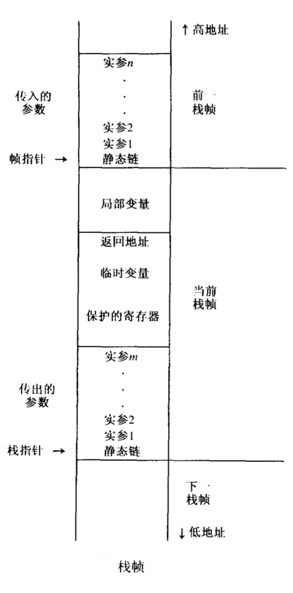
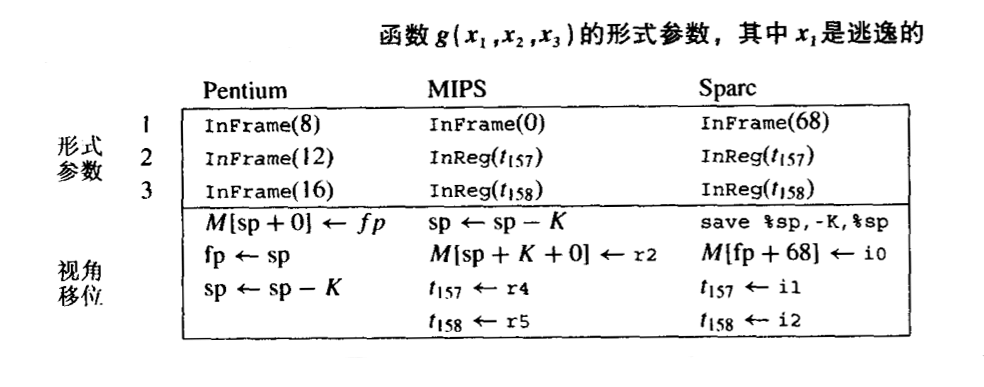
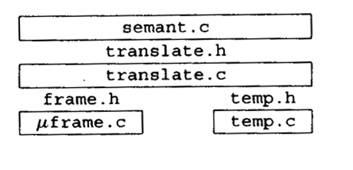

# 活动记录

几乎所有现代程序设计语言中，函数都可以由 *局部变量* ，这些局部变量是在函数的入口创建的。在同一时刻可能存在对函数的多个调用，每个调用都有它自己的局部变量 *实例* 。

当函数返回时，局部于该函数的变量都会消失，因为一个函数只有在它调用的所有函数都返回以后，它才能返回，因此可以说函数调用是 *先进后出* 的方式进行的。如果在函数入口创建局部变量，在函数出口删除他们，则可以使用 *栈* 来存放他们。

在既支持嵌套函数也支持函数值变量的语言中，则可能会需要在一个函数返回后仍保存其局部变量！（具有这样能力的函数称为高阶函数）

嵌套函数（内层函数可能会使用到外层函数中定义的变量）和作为 *返回值返回的函数（保存在变量中的函数）* ，会导致函数内的局部变量需要的生命期超过函数本身的声明期。（参考闭包的概念）

## 栈帧

与通常的 压入push、弹出pop 的栈不同，局部变量是在 *函数入口处* 成批压入，并在 *出口出* 成批弹出。此外当局部变量在栈中被创建时，它们总是没有被立刻初始化的。而且，当栈中压入很多变量之后，还需要访问压在栈顶下较深的变量。

因此将这个栈看成一个大型数组，并带有 一个特殊寄存器，即 *栈指针* ，它指向栈内某个存储单元。

超出栈指针的所有位置都看作自由存储空间，位于栈指针之前的所有位置都被看作已分配的存储单元。

栈通常只在函数的入口处增长，通过增加足以容纳该函数的所有局部变量的一片存储空间来扩大栈，并且在函数出口处收缩，收缩的空间就是入口时扩大的空间。

栈中用来存放函数的局部变量、参数、返回地址和其他临时变量的区域称为该函数的 *活动记录 activation record* 或 *栈帧 stack frame* 。

运行栈在存储器中总是从高地址开始向低地址方向增长，即往下增大，往上收缩，这样可使得相对于栈指针的偏移总是非负的。

<div style="text-align: center">

</div>

上图展示了一种典型的栈帧布局。该栈帧有一组由调用者 *传入的参数 incoming argument* （这些传入的参数是前一个栈帧的一部分，但是 它们位于相对栈指针的位移是已知的单元中）。 *返回地址* 是由 CALL 指令产生的，它告诉当前函数结束时应当将控制返回至何处（此处位于调用函数内）。有些 *局部变量* 分配在栈帧内，另一些局部变量则保存在寄存器中。有时候，存放在寄存器中的局部变量会需要 *保护* 到栈帧中，以便为其他用途提供空闲的寄存器。栈帧内有一部分区域用于此目的。最后，在当前函数调用其他函数时，可以用 *传出参数 outgoing argument* 空间来传递参数。

### 帧指针

设函数 g(...) 调用函数 f(a<sub>1</sub>,a<sub>2</sub>,...a<sub>n</sub>) ，称 g 为调用者 caller ， f 是被调用者 callee 。在进入函数 f 时，栈指针指向 g 传递给 f 的第一个参数。在 f 的入口， f 简单地使用栈指针 SP 减去帧的长度而分配一个新栈帧。 

原来的 SP 则变成了当前的 帧指针FP 。在某些栈帧布局中， FP 是一个单独的寄存器。原来的 FP 则保存到存储器中（栈帧内），并且新的 FP 变成了老的 SP。当函数 f 退出时，需要做的就是复制 FP 到 SP，并取出保存在存储器中的 FP。当函数 f 的栈帧大小是可变的，或者当栈帧在栈内不总是连续的时候，这种安排时可取的。但是如果栈帧的大小是固定不变的，则对于每一个函数 f ，FP 与 SP 所指的位置总是相差一个已知的常数， FP 则变成一个其值总是等于 SP+ *栈帧大小* 的“虚”寄存器。

栈帧的大小只有等到编译处理相当晚的阶段（要到给临时变量分配的空间大小和用于保护寄存器的空间大小都确定时）才能知道。因此尽早地知道形式参数与局部变量的位移量是有好处的。为了方便，仍然需要讨论帧指针，以便将较早的知道其位移量的形式参数和局部变量放在靠近帧指针处，而将临时变量和要保护的寄存器放在离帧指针较远的地方，这些对象的位移量要在较晚时候才能知道。

### 寄存器

现代计算机中由大量的寄存器。将 局部变量、表达式的中间结果和其他值 保存在寄存器中而不是栈帧中，将有助于编译生成的程序快速运行。

算术指令可以直接访问寄存器。存储器访问需要使用独立的存取指令。即使在那种算术指令可以访问存储器的计算机中，访问寄存器的速度也要比访问存储器快。

一台计算机通常只有一组寄存器，但是有许多不同的过程和函数需要使用寄存器。比如函数 f 在寄存器 r 中保存了它的一个局部变量的同时调用了函数 g ，而 g 也需要使用寄存器 r 来完成自己的计算。因此 g 必须要在使用 r 之前将 r 保护起来（保存在 g 的栈帧内），在完成计算后不再需要 r 之后需要将 r 恢复（从帧内取出被保存的内容）。

如果必须由调用者（ 即 f ）来保护和恢复寄存器 r ，可称 r 是 *调用者保护 caller-sav* 的寄存器；如果是由被调用者 (即 g )来保护和恢复，则称 r 时 *被调用者保护的 callee-save* 寄存器。

有时，对寄存器的进行这种保护和回复并不必要。如果 f 知道某个变量 x 的值在函数调用之后不再需要，它可以把 x 放在一个调用者保护的寄存器中，并且在调用过程 g 时 不保护它。相反，如果 f 有一个局部变量 i ，并且在若干次函数调用之前和之后都需要使用，则可以把 i 放在某个 被调用者保护的寄存器 r 中，并且只在 f 的入口保护 r 一次，在 f 的出口将 r 取回一次。

像这样明智地为局部变量和临时变量选择调用者保护的寄存器或被调用者保护的寄存器，可以减少程序执行存取操作的次数。将依靠寄存器分配器来为每一个局部变量和临时变量选择适当种类的寄存器。

### 参数传递

早些时候，调用函数的参数时通过栈来传递的，但这导致了一些不必要的存储器访问。

对实际程序的研究表明，很少由函数的参数个数超过4个，并且极少超过6个。因此，现代计算机中的参数传递约定都规定，一个函数的前 k 个参数（typically， k = 4 or k = 6）放在寄存器 r<sub>p</sub>,...,r<sub>p+k-1</sub> 中传递，剩余参数在存储器中传递。

假设函数 f(a<sub>1</sub>,...,a<sub>n</sub>) （从 r<sub>1</sub>,...,r<sub>n</sub> 处接受参数）调用函数 h(z) 。它必须通过寄存器 r<sub>1</sub> 里面传递参数 z ，因此 f 需要在调用 h 之前将 r<sub>1</sub> 原有的内容（a<sub>1</sub>的值）保护到它的栈帧中。但是这里存着原本假定通过将参数传递在寄存器中可以避免的存储器访问！该怎么使用寄存器才能节省时间呢？

有4种方式，可以同时使用其中的一种或全部都使用：

1. 某些过程并不调用其他的过程 —— 这种过程称为 *叶过程 leaf procedure* 。接下来考虑在所有过程中，叶过程的比例有多大。乐观地假设平均的过程调用情况时，要么不调用其他过程，要么调用至少另外两个过程，则可以描述出一棵过程调用 “树” ，在这棵树中，叶子结点的数目必然多于内部结点的数目。这意味着所调用的过程 *大多数* 是叶过程。叶过程不必将传入的参数保存到存储器中。事实上甚至可以完全不为他们分配栈帧。这是一种重要的节省。

1. 有些优化编译器使用 *过程间寄存器分配* ，它可以一次分析整个程序中的所有函数。这样编译器便可以给不同的过程指派不同的寄存器用于接受参数和存放局部变量。因此 f(x) 可用寄存器 r<sub>1</sub> 来接受参数 x ，但用寄存器 r<sub>7</sub> 来传递参数 z 以调用函数 h 。

1. 即使 f 不是叶过程，它仍有可能在调用函数之前完成所有需要使用参数 x 的操作（技术上，在调用 h 的那一点，x 是一个死变量）。于是 f 可以重写 r<sub>1</sub> 而不需要保护它。

1. 某些体系机构有 *寄存器窗口* ，它们使得每次函数调用都分配一组新的寄存器，而无需存储访问。

另，如果函数 f 需要将传入的参数写到栈帧中，应当写到栈帧的什么位置呢？一种直接的处理方法是： *调用者将参数 a<sub>1</sub>,...,a<sub>k</sub> 传递至寄存器中，将参数 a<sub>k+1</sub>,...,a<sub>n</sub> 传递到自己的栈帧的末尾。具体可看前面的图。图中标记为 *传出参数* 的位置，他们将成为被调用者的 *传入参数* 。如果被调用者需要将这些参数写至寄存器，则可以将他们写到标记为 *局部变量* 的区域内。

在很多现代计算机的表中调用约定中， *调用函数* 在它自己的栈帧中也为寄存器参数保留空间，此空间紧邻着第 k+1 个参数空间。但是调用者并不实际往其中存放任何内容，这片空间由 *被调用函数* 使用，并且只有当某种原因需要时，被调用函数才将参数写入其中。

取局部变量地址的一种更优雅的方法是采用 *传地址* 的方式。用这种方式，程序猿不需要显示地操作变量 x 的地址。替代地，当 x 作为实参传递给函数 f(y) 时，如果 y 时 “传地址” 参数，编译器将生成传递 x 的地址，而不是 x 的值的代码。对于该函数中 y 的任何使用，编译器将生成额外的通过指针进行的间接引用。采用传地址的方法，将不会存在 “悬挂引用” ，因为当 f 返回时，y 肯定不存在了，并且在 x 的作用域结束之前 f 已经返回。

### 返回地址

当函数 f 被函数 g 调用时，它最终必须返回，因此需要知道返回何处。如果函数 g 中调用 f 的 call 指令位于地址 a ，则正确的返回地址是 a+1 ，即 g 中 call 指令的下一条指令处。这个地址被称为 *返回地址* 。

现代计算机中， call 指令只需将返回地址（call 指令之后下一条指令的地址）放入指定的寄存器中。这样，非叶过程必须将返回地址保存到自己的栈帧中（除非使用了过程间寄存器分配）；而叶过程则不需要保存它。

### 栈帧内的变量

遵循现代的过程调用约定，函数的参数通过寄存器传递，返回地址存放在一个寄存器中，函数结果将保存在寄存器中而返回。

很多局部变量以及表达式的中间结果都将分配到寄存器中。只有在下面的情况下，才需要将一个变量的值写到存储器中（栈帧内）：

- 该变量将作为传地址参数，因此它必须要有一个存储器地址。
- 该变量被嵌套在当前过程内的过程访问。
- 该变量的值太大以至于不能 将它放入到单个寄存器中（虽然有的编译器会为了效率将它会分散放到若干寄存器中存放）
- 该变量是个数组，为了引用其元素需要进行地址运算。
- 需要使用存放该变量当寄存器作为特殊用途，如传递参数，
- 存放太多当局部变量和临时变量，以至于不能将他们全部放入寄存器中。这种情况下，它们中的一部分将被 “溢出spilled” 到栈帧中。

#### 逃逸
如果一个变量是传地址实参，或者它被取了地址（ &操作符 ），或者内层的嵌套函数对其进行了访问，称该变量是 *逃逸的escape* 。

在处理程序的过程中，当遇到一个形式参数或者局部变量的声明时，可以方便地为他们分配空间（要么是寄存器，要么时栈帧中的存储单元）。这样表达式中发现该变量出现，便可将他们翻译称引用该变量正确位置的机器代码。

但不幸的时，上述情况不能很早的显露出来。当编译器第一次遇到变量声明时，它还不知道该变量是否会用作传地址参数，是否会被内层的嵌套函数访问，或者是否会取它的地址，并且也不知道表达式的计算会使用多少个寄存器。产品质量的编译器必须先为所有形式参数和局部变量分配临时位置，晚些时候再决定它们中的哪些变量应该真正的放到寄存器中。

### 静态链

在允许声明嵌套函数的语言中，内层函数可以使用外层函数声明的变量，这种语言特征称为 *块结构 block structrue*。

有几种方法可以实现这一目的：

- 每当调用函数 f 时，便传递给 f 一个指针，该指针指向静态包含 f 的那个函数，称这个指针为 *静态链 static link* 。
- 建立一个全局数组，该数组的位置 i 处包含一个指针，指向最近一次进入的，且 *静态嵌套深度*  是 i 的过程的栈帧，这个数组叫做 *嵌套层次显示表 display* 。
- 当 g 调用 f 时， g 中每一个实际被 f （或者是 f 内的任意函数）访问了当变量，都在将作为额外的参数传给 f 。这称为 *λ - 提升 lambda lifting*

每当函数 f 被调用时，都将传递给它一个指针，该指针指向程序正文中 直接 包含 f 当函数 g 的 “当前” 活动记录。

因此对于每个过程调用或者变量访问，需要一条由0至多次存储器读取操作组成的链，这条链的长度正好就是涉及的两个函数之间静态嵌套深度之差。

## Tiger 编译器的栈帧

Tiger 编译器应当使用哪种类型的栈帧呢？此时面临的问题是：各种目标机体系结构有不同的标准栈帧布局，如果希望 Tiger 函数能够调用 C 函数，必须使用标准布局。但又不想在 Tiger 编译器的语义分析模块的实现中强行塞入任何特定机器的规定。

因此，必须使用 *抽象* 的方法。使用栈帧的抽象表示。

```C
/* frame.h */

typedef struct F_frame_ *F_frame;
typedef struct F_access_ *F_access;

typedef struct F_accessList_ *F_accessList;
struct F_accessList_ { F_access head; F_accessList tail; };

F_frame F_newFrame(Temp_label name, U_boolList formals);

Temp_label F_name(F_frame f);
F_accessList F_formals(F_frame f);
F_access F_allocLocal(F_frame f, bool escape);
 
 .
 .
 .
```

抽象接口 frame.h  用一个与目标机相关的模块来实现。

一般而言，我们可以嘉定编译器中与机器无关的部分是通过以下方式来访问 frame.h 的实现的，例如：

```C
#include "frame.h"
 .
 .
 .
F_frame frame  = F_newFrame(...);
```
用这种方式，编译器的其余部分可以访问 Frame 模块而不需要知道具体目标机的特征。

F_frame 类型表示 有关形式参数 和 分配在栈帧中的局部变量 的信息。为了给带有 k 个形参的函数 f 创建一个新栈帧，要调用函数 F_newFrame(f,l) ，其中 l 是 k 个布尔量组成的一个表: true 表示参数是逃逸的， false 表示参数是不逃逸的。[reference](#逃逸)

函数 F_newFrame 的结果是一个 F_frame 对象。例如，对于一个带有3个参数的函数 g ，如果其中第一个参数是逃逸的（需要保存在存储器中），则

    F_newFrame(g, U_BoolList(TRUE,
                            U_BoolList(FALSE,
                                    U_BoolList(FALSE, NULL))))

将返回一个新的栈帧对象。

F_Access 类型用于描述那些可以存放在栈中或寄存器中的形式参数和局部变量，它是一种 抽象数据类型 ，因此 struct F_access_ 的内容只在 Frame 模块内才是可见的。

```C
#include "frame.h"

struct F_access_
    { enum {inFrame, inReg} kind;
        union {
            int offset; /* Inframe */
            Temp_temp reg; /* InReg */
        } u;
    };
```

InFrame(X) 指出一个相对 帧指针 偏移量为 X 的存储位置；InReg（t<sub>84</sub>) 指出将使用 “寄存器” t<sub>84</sub>。 F_access 是抽象数据类型，因此，在该模块之外，构造函数 InFrame 和 InReg 都是不可见的。

F_formals 接口函数抽取由 k 个 “访问” 组成的一张表，这些访问指明运行时存放形式参数的位置。这种位置是从 `被调用函数` 的角度来看的，因为 `调用者` 和 `被调用者` 看到的参数位置是不同的。例如，当通过 `栈` 来传递参数时，调用者将一个参数放在相对 `栈指针` 位移为4的存储单元内，但是 `被调用者` 却看到该参数的位置距 `帧指针` 4个位移。或者， `调用者` 可能将参数传递到 `6号寄存器`， 但是被调用者希望将它从 `6号寄存器` 中移出， 并总是从 `13号寄存器` 访问它。

这种 “视角位移 view shift” 与目标机的调用约定有关，因此必须由 Frame 模块来处理， Frame 模块则启动 newFrame 。对于每个形式参数， newFrame 函数必须计算两件事情：

- 在函数内是如何看待参数的（在寄存器中，还是在栈帧存储单元中）。

- 为了实现 “视角位移”， 必须生成哪些指令。

### 栈帧描述的表示

Frame 模块的实现假设其使用者看不到 F_frame 类型的表示。但事实上 F_frame 是一个包含以下内容第数据结构：

- 所有形式参数的位置
- 实现 “视角位移” 需要的指令
- 迄今为止已分配第栈帧大小
- 该函数开始点第机器代码标号

下图给出了一个 含3个参数的函数 g 的形式参数，以及在三种不同体系结构中 newFrame 可能给出第分配。第一个参数是逃逸的，因此在三种机器上它都必须位于 InFrame ；其余参数在 Pentium 机器中位于 InFrame ，在另外机器中都位于 InReg。

<div style="text-align: center">

</div>

新产生的临时变量 t<sub>157</sub> 和 t<sub>158</subt> 及复制 r<sub>4</sub>、r<sub>5</sub> 到这两个临时变量的 move 操作似乎是多余的，为什么函数 g 不直接从接收参数的寄存器中访问它们？先看看下面的代码：

    function m(x: int, y:int) = { h(y,y); h(x,x); };

如果 x 在 m 中始终呆在 “参数寄存器1” 中，并且又要将参数传递给 h 的 y 放在 “参数寄存器1” 中 来传递时，就会出现问题。

寄存器分配器最终会选择应当将 t<sub>157</sub> 存放在哪个寄存器中。如果不存在函数 m 给出这类冲突，寄存器分配器（MIPS机器）会小心的选择用 r<sub>4</sub> 来保存 t<sub>157</sub>， 用 r<sub>5</sub> 来保存 t<sub>158</sub>。 于是可以不需要那两条 move 指令，并可在此时删除它们。

### 局部变量

局部变量有一些保存在栈中，另一些则保存在寄存器中。为了在函数 f 的栈帧中分配一个新的局部变量，语义分析阶段需要调用函数 `F_allocLoal(f, TRUE)` 。该函数返回一个相对 `帧指针` 位移地址的 InFrame 访问。

例如，在 Sparc 机器中为了分配两个局部变量，要调用函数 allocLocal 两次，并返回连续的 InFrame(-4) 和 InFrame(-8)，它们是这两个局部变量相对标准 Sparc 帧指针的位移。

传给函数 allocLocal 的布尔参数指明这个新变量是否逃逸，即是否需要将它放入栈帧中；如果布尔参数是 false，则变量可以分配到寄存器中。因此 F_allocLocal(f, FALSE) 可能返回 InReg(t<sub>481</sub>)。

对 alloclLocal 的调用不必紧跟在创建栈帧之后。因为函数体内可能还有嵌套的变量声明块。

例如：

```C
void f()
{
    int v = 6;
    print(v);
    {
        int v = 7;
        print(v);
    }
    print(v);
    {
        int v = 8;
        print(v);
    }
    print(v);
}
```

上面的程序由三个不同的变量 v ，在处理过程中，每次遇到 v 的声明，便调用 allocLocal 分配一个临时变量或在栈帧内分配一个新的单元，并使之与名字 v 关联。每当遇到 语句块 结束时，与 v 的关联将被遗忘，但是，其空间仍保留在栈帧中。这样整个函数声明中的每一个变量都有一个临时空间或栈帧单元。

寄存器分配器在给临时变量分配寄存器时会尽可能少地使用寄存器。在上面的例子中，第二个和第三个（分别用 7 和 8 赋初值）可以存放在同一个临时变量中。一个好的编译器还可以注意到可分配到同一个栈单元的两个栈变量的情况，从而优化栈帧的大小。

### 计算逃逸变量

非逃逸的局部变量可以分配到寄存器中，而逃逸的局部变量必须分配在栈帧中。函数 FindEscape 可以找出逃逸变量，并将这一信息记录在抽象语法的 escape 域中。 实现 FindEscape 最简单的方法时遍历整个抽象语法树，寻找每一个变量的逃逸使用。因为 Semant 在第一次看到一个变量时便需要立即知道它是否逃逸，所以在这个阶段必须出现在语义分析开始之前。

FindEscape 使用的遍历函数在抽象语法的表达式和变量上是相互递归的，就像类型检查器的情形一样。并且和类型检查器用伊昂，它也使用变量映射到绑定的环境。但是在这里，绑定非常简单，它只是一个在发现特定变量是逃逸变量时设置的布尔标志：

```C
/* escape.h */
void Esc_findEscape(A_exp exp);

/* escape.c */
static void traverseExp(S_table env, int depth, A_exp e);
static void traverseDec(S_table env, int depth, A_dec d);
static void traverseVar(S_table env, int depth, A_var v);
```

每当在静态嵌套深度为 d 的函数内发现了变量或形式参数的声明，例如 `A_VarDec{ name = symbol("a"), escape=r,...}` 就将 EscapeEntry(d, &(x->escape)) 添加到环境中，并且将 x 的 escape 域置为 FALSE。

这个新的环境用于处理该变量作用域内的表达式；每当在大于 d 的深度中使用 a 时， x 的 escape 域就设置为 TRUE。

对于允许程序员显示地去变量的地址，或以传地址方式传递参数的语言，可类似地按这种方法 FindEscape 找出逃逸的变量。

### 临时变量和标号

编译器的语义分析阶段需要为参数和局部变量选择寄存器，并且确定过程体的机器代码的地址。但是要确切的确定哪些寄存器是可用的，或确切地知道过程体位于什么位置，此时还太早。我们用术语 *临时变量* 表示暂时保存在寄存器中的值，并用术语 *标号* 表示其准确地址还需要确定的某种机器语言的位置——类似于汇编语言中的标号。

Temp 是局部变量的抽象名， label 是静态存储器地址的抽象名。 Temp 模块管理由这两种不同的名字组成的两个集合。

```C
/* temp.h */
typedef struct Temp_temp_ *Temp_tem;
Temp_temp Temp_newtemp(void);

typedef S_symbol Temp_label;
Temp_label Temp_newlabel(void);
Temp_label Temp_namedlabel(string name);
string Temp_labelstring(Temp_label s);

typedef struct Temp_tempList_ *Temp_tempList;
struct Temp_tempList_ { Temp_temp head; Temp_tempList tail; }
Temp_tempList Temp_TempList(Temp_temp head, Temp_tempList tail);

typedef struct Temp_labelList_ *Temp_labelList;
struct Temp_labelList_{Temp_label head; Temp_labelList tail; }
Temp_labelList Temp_LabelList(Temp_label head; Temp_labelList tail;)
```

Temp_newtemp() 从临时变量的无穷集合中返回一个新的临时变量。 Temp_newlabel() 从标号的无穷集合中返回一个新的标号。 Temp_namedlabel( string ) 返回一个汇编名为 string 的新标号。

在处理声明 `function f(..)` 的过程中，通过调用 Temp_newlabel() 可生成 f 的机器代码地址的标号。另一种做法是调 Temp_namedlabel("f") (如果这样做，将使用标号 f 而不是诸如 L214 这样的标号， 后者可以使汇编语言程序的调试比较容易)，但是不幸的是，在不同的作用域可能存在两个名为 f 的不同函数。

### 两层抽象

Tiger编译器在语义分析和栈帧布局细节之间由两层抽象：

<div style="text-align: center">

</div>

接口 frame.h 和 temp.h 提供存储器变量和寄存器变量的与机器无关的视图。Translate 模块通过处理嵌套作用域的表示（利用静态链），并提供接口 translate.h 给模块 Semant 来扩大这个视图。

关键是要有一个抽象层 frame.h 将源语言的语义与 机器相关的栈帧布局分开（μ 代表诸如mips, pentinum之类的目标机）。用接口 translate.h 分开 Semant 和 Translate 并不是绝对必要的，这样做的目的是为了避免用一个 既做类型检查又做语义转换的又大又笨拙的模块。

下面展示了 Translate 如何为 Semant 管理着局部变量和静态函数嵌套。

```C
typedef struct Tr_access *Tr_access;

typedef ... Tr_accessList ...

Tr_accessList Tr_AccessList(Tr_access head, Tr_accessList tail);

Tr_level Tr_outermost(void);
Tr_level Tr_newLevel(Tr_level parent, Temp_label name, U_boolList formals);
Tr_accessList Tr_formals(Tr_level level);
Tr_access Tr_allocLocal(Tr_level level, bool escape);
```

在Tiger编译器的语义分析阶段， transDec 通过调用 Tr_newLevel 为每一个函数创建一个新的 “嵌套层” ， Tr_newLevel 则调用 F_newFrame 建立一个新栈帧。 Semant 将这个嵌套层保存在该函数的 FunEntry 数据结构中，以便当它遇到一个函数调用时，能够将这个被调用函数的嵌套层传回给 Translate 。 FunEntry 也需要该函数的机器代码入口点的标号：

```C
/* new version of VarEntry and FunEntry */
struct E_enventry_ {
    enum { E_varEntry, E_funEntry } kind;
    union { struct {Tr_access access;  Ty_ty ty;} var;
            struct {Tr_level level; Temp_label label;
                    Ty_tyList formals; Ty_ty result; } fun;
        } u;
};
E_enventry E_VarEntry(Tr_access acces, Ty_ty ty);
E_enventry E_FunEntry(Tr_level level, Temp_label label,
                    Ty_tyList formals, Ty_ty result);
```

当 Semant 处理一个位于 lev 层的局部变量的声明时，它调用 Tr_allocLocal(lev, esc) 在 lev 指定的这一层创建变量；参数 esc 指出该变量是否是逃逸当。此函数的返回结果是抽象数据类型 Tr_access，（ 与 F_access 不同，因为它必须知道与静态链相关当信息）。随后，当一个表达式中使用了该变量， Semant 便可以将这个 access 交给 Translate 来生成访问该变量当机器代码。与此同时， Semant 也在值环境当每个 VarEntry 中记录这个访问。

可以将抽象数据类型 Tr_access 表示成由变量当层次 level 和它的 F_access 组成当偶对：

```C
/* inside translate.c */
struct Tr_access_ {Tr_level level; F_access access; };
```

因此， Tr_allocLocal 要调用 F_allocLocal，同时要记住此变量生存在哪个层次。随后当从（可能）不同的层次访问该变量时，便会需要用到这个层次信息来计算静态链。

### 管理静态链

Frame 模块应与被编译的特定源语言无关。很多源语言没有嵌套函数声明；因此 Frame 不应当知道有关静态链对任何信息。相反，静态链是由 Translate 负责的。

Translate 知道每一个栈帧都含有一个静态链。静态链是通过寄存器传递给函数并保存在栈帧中的。因为静态链与形式参数很相似，因此要尽可能地将它作为形式参数对待。

对于一个具有 k 个参数的函数，令 l 是指明其参数是否逃逸的布尔量组成的表，则 `l' = U_BoolList(TRUE, l)` 是一个新表；位于 l 前面的 TRUE 指明作为 “额外参数” 的静态链是逃逸的。然后 newFrame(label, 'l') 创建一个新的栈帧，其形式参数包含这个 “额外的” 参数。

例如，假设函数 f(x,y) 嵌套在函数 g 之内， g 的 level （已创建） 称为 level<sub>g</sub> 。则 transDec 可以调用

    Tr_newLevel(levelg, f, U_BoolList(FALSE, U_BoolList(FALSE, NULL)))

其中假定 x, y 都不是逃逸的。然后 Tr_newLevel(label, fmls) 给形式参数表增加一个（关于静态链的）额外的元素，并调用 `F_newFrame(label, U_BoolList(TRUE, fmls))`。返回值是一个栈帧 F_frame 。在这个栈帧中由三个通过调用 F_formals(frame) 可以访问的栈帧位移值。其中第一个是静态链的位移，另外两个是参数 x, y 的位移。当 Semant 调用 Tr_formals(level) 时，它可得到这两个位移，并已适当当转换成为了 access 值。

### 追踪层次信息

每次调用 Tr_newLevel 时， Semant 都必须传递 包围层的 level 值。当为 Tiger 程序的 “主” 函数 （一个不位于任何函数之内的函数）创建层次时， Semant 应当传递一个特殊的层次值，此值由调用 Tr_outermost() 而得到，它不是 Tiger 的主函数的层次，而是包含该程序的层次。所有声明了的 “库” 函数都在最外层，这个最外层没有栈帧和形式参数表。每次调用 Tr_outermost() 时，它返回的都是相同的层次；将它作为一个函数仅仅是因为在 C 中对分配在堆中的全局变量进行初始化比较困难。

函数 transDec 将为每个 Tiger 函数声明创建一个新层次。但 Tr_newLevel 必须知道外层包围函数的层次，这意味着 transDec 在处理每一个声明期间必须知道当前的静态嵌套层。

实现这一点并不难： transDec 现在能得到一个指明当前层次的额外参数（除了类型环境和值环境之外），它是通过适当调用 newLevel 而得到的。 transExp 也会需要此参数，这样 transDec 可以将 level 传递给 transExp， transExp 反过来可以将它传递给 transDec 用于处理嵌套函数的声明。同样， transVar 也需要又一个 level 参数。

[Back to Preface](../compiler-implementation-c.md)
