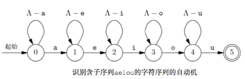
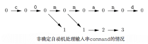
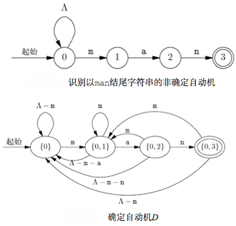
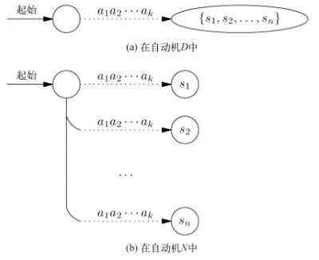
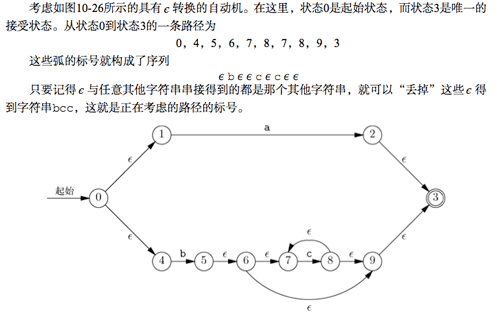
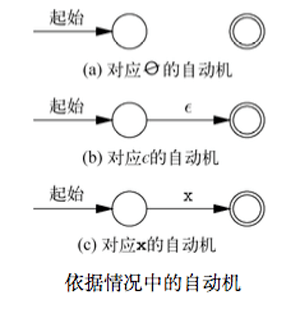
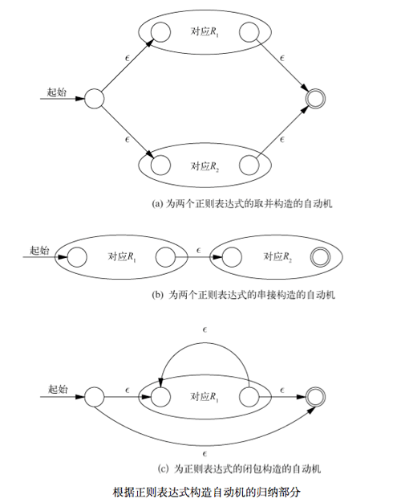
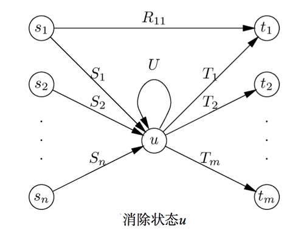
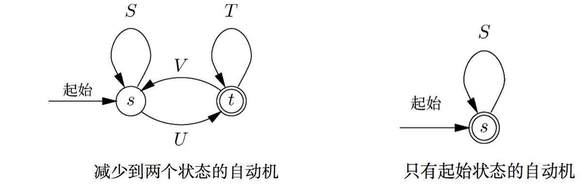

# 模式、自动机、正则表达式

模式`pattern`是具有某个可识别属性的对象组成的集合。与模式相关的两个基本问题是它们的定义`difinition`与识别`recoginition`。

围绕模式的定义和识别建立起的庞大的知识体系，称为“自动机理论 automata theory”或“语言理论 language theory”.

# 状态机和自动机

用来查找模式的程序通常有着特殊的结构，可以在代码中确定某些位置，在这些位置可以得知与程序寻找模式实例的过程有关的特殊信息。这些位置称为状态 。

程序的整体行为可以视作程序随着读入输入从一种状态转移到另一种状态。

## 状态机的图表示

表示程序状态的图都是有向图，他们的弧都是用字符集标记的。图中的节点表示该程序的各个状态。

当程序在`状态s`时，刚好还有当符合`特定情况C`下，才能进行到`状态t`，于是存在从`状态s`到`状态t`的标号为`情况C`的弧，这样的弧称作*转换*。

还会给某些节点标记*接受状态*，表示当达到这些状态之一时，就找到了模式并“接受”它。按惯例，接受状态用双层圆圈表示。此外，节点之一会被指定为起始状态，即模式识别开始的所处状态。用一条没有起始节点的弧来表示起始状态。
例如：

> <div style="text-align: center">
> 
> </div>

上述的表示图称作*有限自动机*。

> 自动机与其程序之间的区别
>
> 自动机是种抽象。通过确定的从起始状态道某个应用相应序列标记的接受状态之间是否存在路径，自动机呈现了一种对任意输入字符序列的接受\拒绝决定。
>
> 由自动机创建的程序能以多种方式使用这种接受\拒绝决定。

## 确定自动机和非确定自动机

使用自动机进行的最基本的操作之一是接受一系列的符号 *a<sub>1</sub>a<sub>2</sub>a<sub>3</sub>...a<sub>k</sub>*，并从起始状态起循着一条由标号依次为这些符号的弧组成的路径行进。也就是对 *i = 1, 2, 3, ..., k* 来说，*a<sub>i</sub>* 都是集合*S<sub>i</sub>* 作为路径上第 *i* 条弧标号的成员。可以说这一路径的标号为 *a<sub>1</sub>a<sub>2</sub>a<sub>3</sub>...a<sub>k</sub>* ，当然它也可能有其他标号，因为给路径上的弧提供标号的各集合 *S<sub>i</sub>* 可能各自含有很多字符。

> 自动机的输入可能不仅仅是 *“字母和数字”* 这种明确的字符串序列。还有可能是从比 ASCII 码字符集更广泛的集合中选出。 因此有时候称这些输入为 *“符号token”*，而非 *“字符”*。

### 确定自动机

对于任意状态 *s* 和任意输入字符 *x* 来说，至多有一种从状态 *s* 出发的转换的标号中含有 *x*，这样的自动机称为*确定自动机*。

为给定的输入序列模拟确定自动机是很简单的。在任意状态 *s* 中，给定下一个输入字符 *x*，考虑从 *s* 出发的每种转换的标号。如果找到标号含 *x* 的转换，那么该转换久指向适当的下一个状态。如果没有含有 *x* 的转换，那么自动机就“司机”，而且不能再继续处理输入。

将确定自动机转变为程序很容易的。为每个状态编写一段代码。对应状态 *s* 的代码会检查它的输入，并决定应该遵循从 *s* 出发的哪种转换。如果选定了从状态 *s* 到状态 *t*，那么必须安排从表示状态 *t* 的代码接着表示表示状态 *s* 的代码执行，可能是通过 `goto` 来实现的。

```C
# 例如
void bounce()
{
    char x;

a:  putchar('0');
    x = getchar();
    if ( x == '0' ) goto a;
    if ( x == '1' ) goto b;
    goto finis;

b:  putchar('0');
    x = getchar();
    if ( x == '0' ) goto a;
    if ( x == '1' ) goto c;
    goto finis;

c:  putchar('1');
    x = getchar();
    if ( x == '0' ) goto d;
    if ( x == '1' ) goto c;
    goto finis;

b:  putchar('1');
    x = getchar();
    if ( x == '0' ) goto a;
    if ( x == '1' ) goto c;
    goto finis;

finis:  ;
}
```

### 非确定自动机

*非确定自动机* 可以从具有某一状态出发的包含相同符号的*两个*或*多个*转换，但这不是必须的。

> 严格讲，*确定自动机* 是 *非确定自动机* 的一种，它只是刚好没有针对同一符号的多种转换。

非确定自动机无法直接用程序实现。不过可以将任意非确定自动机转换成接受相同符号集合的确定自动机。

#### 非确定自动机的接受

试图模拟针对符号序列 *a<sub>1</sub>a<sub>2</sub>a<sub>3</sub>...a<sub>k</sub>* 的非确定自动机时，可能发现同一个符号时多条路径的标号。习惯上讲，如果至少有一条由输入编辑的路径可以通向接受状态，就可以说非确定自动机接受这一输入符号序列。以接受状态结尾的那一条路径，要比任意数量以非接受状态结尾的路径更重要。

> 认为不确定性让自动机可以“猜测”是种看待不确定性的实用方式。如果我们不知道在某给定状态中要对某给定的输入符号做什么，就可以多下一个状态做出若干选择。因为由带向接受状态的字符串标记的任意路径会被解释为接受，所以非确定自动机其实被赋予了进行一次正确猜测的信用，而不管它还会造成多少次错误的猜测。

一种含有 *n* 种状态的非确定自动机有可能只能转换成含 *2<sup>n</sup>* 个状态的确定自动机。因此，对于同一个问题而言，设计非确定自动机可能要比设计确定自动机简单的多。

## 从不确定到确定

事实上，每一个非确定自动机都可以被确定自动机替代。在执行某些任务时，考虑非确定自动机有时更加简单。但是很难依据非确定自动机来编写程序，所以找到一种将不确定自动机变形为等价的确定自动机的算法是很重要的。

严格地讲，假设 *A* 和 *B* 是两个自动机，如果他们接受相同的输入字符串集合，就说他们时等价的。换句话，对于任意符号序， *a<sub>1</sub>a<sub>2</sub>a<sub>3</sub>...a<sub>k</sub>* 下面两个条件的成立表示了自动机之间的等价。

1. 如果从 *A* 的起始状态到 *A* 的某个接受状态存在 *a<sub>1</sub>a<sub>2</sub>a<sub>3</sub>...a<sub>k</sub>* 标记的路径，那么从 *B* 的起始状态到 *B* 的某个接受状态也存在以 *a<sub>1</sub>a<sub>2</sub>a<sub>3</sub>...a<sub>k</sub>* 标记的路径。

1. 如果从 *B* 的起始状态到 *B* 的某个接受状态存在 *a<sub>1</sub>a<sub>2</sub>a<sub>3</sub>...a<sub>k</sub>* 标记的路径，那么从 *A* 的起始状态到 *A* 的某个接受状态也存在以 *a<sub>1</sub>a<sub>2</sub>a<sub>3</sub>...a<sub>k</sub>* 标记的路径。

### 子集构造

如何通过构造等价的确定自动机来“消除自动机的不确定性”。这一技巧叫做 *子集构造* 。

下图模拟了处理特殊输入的非确定自动机可能出现的路径。因此，在任何给定的时间，非确定自动机都在某一状态集合中，而且这些状态都出现在模拟图的同一列中。也就是说，在读入序列 *a<sub>1</sub>a<sub>2</sub>a<sub>3</sub>...a<sub>k</sub>* 之后，非确定自动机就“在”那些从起始状态出发沿着标记有 *a<sub>1</sub>a<sub>2</sub>a<sub>3</sub>...a<sub>k</sub>* 的路径可以到达的状态中。

> <div style="text-align: center">
> 
> </div>

**依据**。如果非确定自动机 *N* 的起始状态是 *s<sub>0</sub>* 那么确定自动机 *D* 的起始状态是 *{ s<sub>0</sub> }*，也就是只含 *s<sub>0</sub>* 这一个元素的集合。

**归纳**。假设已经确定了 *N* 的状态集 *S* 是 *D* 的一个状态。依次考虑每个可能的输入字符 *x*。 对某个给定的 *x* ,设 *T* 是 *N* 的状态 *t* 构成的集合，其中状态 *t* 满足对 *S* 中对某个状态 *s* 而言，存在标号含 *x* 的从 *s* 到 *t* 到转换。那么集合 *T* 就是 *D* 的一个状态，而且存在针对输入 *x* 的从 *S* 到 *T* 的转换。

*D* 的接受状态是 *N* 的状态集中至少包含 *N* 的一个接受状态。

子集构造时相当不好理解的，特别是确定自动机的状态可以是非确定自动机状态集的思路。

> <div style="text-align: center">
> 
> </div>

### 子集构造起效的原因

显然，如果 *D* 时利用子集构造从非确定自动机 *N* 构建的，那么 *D* 就是确定自动机。原因在于，对于每个输入符号 *x* 和 *D* 的每个状态 *S* 而言，我们定义了 *D* 的某特定状态 *T*，它满足从 *S* 到 *T* 的转换的标号中包含了 *x*。

为了检验 *N* 和 *D* 是否等价，需要知道，对于任意符号序列， *a<sub>1</sub>a<sub>2</sub>a<sub>3</sub>...a<sub>k</sub>*， 当且仅当 *N* 接受 *a<sub>1</sub>a<sub>2</sub>a<sub>3</sub>...a<sub>k</sub>* 时，在下列情况下，自动机 *D* 达到到状态 *S* 时一种接受状态。

1. 从起始状态开始
1. 并且沿着标记为 *a<sub>1</sub>a<sub>2</sub>a<sub>3</sub>...a<sub>k</sub>* 的路径行进。

请记住，当且仅当从 *N* 的其实状态有一条标记为 *a<sub>1</sub>a<sub>2</sub>a<sub>3</sub>...a<sub>k</sub>* 的路径能到达 *N* 到某个接受状态时， *N* 才会接受*a<sub>1</sub>a<sub>2</sub>a<sub>3</sub>...a<sub>k</sub>* 。

如果 *D* 和 *N* 是等价到，需要满足下面到关系。

> <div style="text-align: center">
> 
> </div>

# 正则表达式 

自动机定义了模式，即表示自动机的图中，作为从其实状态到某个接受状态的路径标号的字符串组成的集合。有趣的是，可以用正则表达式代数表示的模式组成的集合，刚好与可以用自动机描述的模式组成的集合相同。

## regex的操作数

在regex中，原子操作数是以下几种：

- 字符
- є符号
- ∅符号
- 由正则表达式定义的任意模式的变量

对于正则表达式来说，每个表达式的值都是由通常被称为*语言*的字符串集合组成的模式。由正则表达式E表示的语言被称为`L(E)`。定义如下：

1. `x`是任意字符，语言`L(x) =  {x}`，包含一个字符串的集合，长度为1，且字符串中唯一的位置被字符`x`占据。

1. `L(є) = {є}`，作为正则表达式的特殊字符`є`表示只含一个空字符串（长度为0的字符串）的字符串集合。

1. `L(∅) = {∅}`，作为正则表达式的特殊字符`∅`表示字符串集合为空。

## regex的运算

运算符共有3种。可以用括号分组。

*并*: 如果R和S为两个正则表达式，那么`R|S`表示R和S所表示的语言取并。即`L(R|S) = L(R) ∪ L(S)`

*串接*：`RS`表示语言`L(RS)`是通过按次序取第一个字符串串接第二个字符串而形成的。

*闭包*：也称*克林闭包（Kleene closure）*，是一个一元的后缀运算符。闭包用星号表示，`*`，所以`R*`是正则表达式R的闭包。闭包运算符有最高的优先级，所以通常要在R的两侧放上括号，写为`(R)*`。闭包运算符的作用表示“R中的字符串没有出现或多次出现”。非正式的，`R* = є|R|RR|RRR|...`

运算优先级：闭包 -> 串接 -> 并。

# 正则表达式与自动机互相转换

存在某种方式可以把人意正则表达式转换成非确定自动机，接着就可以利用子集构造将得到的非确定自动机转换成等价的确定自动机。

同样的，也能把任意的自动机转换成相应的正则表达式。其中正则表达式的语言刚好是自动机接受的字符串集合。

不过，从直觉上来看，自动机不会数数，即它不太能确切的记住已经看到了多少个符号。

## 正则表达式 -> 自动机

要完成3件事情。

1. 引入具有 є 转换的自动机，也就是具有标号为 є 的弧的自动机。

1. 把任意正则表达式转换成定义同一语言的具有 є 转换的自动机。

1. 把任意具有 є 转换的自动机转换成接受同一语言的不含 є 转换的自动机。

具有 є 转换的自动机中空字符串 є 在字符串中是不可见的，但是可以在路径中假装添加 є 进去。因此沿着有 є 路径的被接受的字符串，最后删除掉 є ，就得到了“真实”的字符串。

> <div style="text-align: center">
> 
> </div>

从正则表达式到具有 є 转换的自动机可以用归纳法进行证明转换的可行性。

**命题 *S(n)*。**如果 *R* 是含 *n* 个运算符，而且不含变量作为原子操作数的正则表达式，那么存在具有 є 转换的自动机 *A*，只接受 *L(R)* 中的字符串。此外， *A* 满足如下所有条件：

1. 只有一个接受状态 

1. 没有弧通向它的起始状态

1. 没有弧从它的接受状态出发

**依据。**对于 *n=0* 的情形， R一定只含一个原子操作数，该操作数可能是 ∅， є， 或只含一个字符的**x**正则表达式，则可以构造如下的双状态自动机。

> <div style="text-align: center">
> 
> </div>

**归纳。**假设对于 *i<=n*， *S(i)* 均成立。那么对于含有 *n+1* 个运算符的正则表达式 *R*，可以将注意力放在“最外侧”的运算符。 *R* 可以表示为 *R<sub>1</sub>|R<sub>2</sub>*、或者 *R<sub>1</sub>R<sub>2</sub>*，或者是 R<sub>1</sub><sup>*</sup>。

易知，*R<sub>1</sub>，R<sub>2</sub>* 都不可能含有 *n* 个以上的运算符，因为分解后的表达式中还有一个运算符，不属于他们之中。

于是可以通过 *R<sub>1</sub>，R<sub>2</sub>* 所满足的初始状态和接受状态，进行二次构造一个自动机，就能证明 *n+1* 时，命题依然成立，而这种构造是相当简单的。


> <div style="text-align: center">
> 
> </div>

从具有 є 转换的自动机到没有转换 є 的自动机也是很容易的。原因是在具有转换的某个自动机的任意状态 *s*，其实也是从状态 *s* 沿着由标记为 є 的弧形成的路径可以到达的任意状态，不管什么字符串标记了到达 *s* 状态所经过的路径，同样的字符串都是可以用任意个 є 转换扩展过的路径标号。

下面开始分析如何将自动机转换为正则表达式。转换过程涉及从自动机中一个一个地删除状态，然后把弧上的标号由最初的字符串集合替换为更复杂的正则表达式。一开始，如果弧上的标号是 { x<sub>1</sub>, x<sub>2</sub>, ... , x<sub>n</sub> }，就可以把这些标号替换为正则表达式 x<sub>1</sub>|x<sub>2</sub>| ... | x<sub>n</sub>，该正则表达式从本质上讲表示的相同的符号集合，虽然严格地讲，正则表示表达式表示的是长度为 1 的字符串。

一般而言，可以讲路径的标号是为路径沿线上正则表达式的串接，或是看作这些表达式的串接定义的语言。亦即，如果路径的弧使用正则表达式 R<sub>1</sub>, R<sub>2</sub>, ..., R<sub>n</sub> 按此次序标记道，则当且仅当字符串 w 在语言 L(R<sub>1</sub> R<sub>2</sub> ... R<sub>n</sub>) 中时有该路径被标记为 w 。

## 自动机 -> 正则表达式

从自动机到正则表达式的转化，关键步骤是状态的消除。

比如希望消除状态 *u* ，必须保留弧的正则表达式标号，从而使剩余状态中两两之间的路径标号集合不发生改变。

> <div style="text-align: center">
> 
> </div>

如上图所示，状态 *u* 的前导状态分别是 *s<sub>1</sub>, s<sub>2</sub>, ..., s<sub>n</sub>*， 而后继状态分别是 *t<sub>1</sub>, t<sub>2</sub>, ..., t<sub>m</sub>* 。这些 *s* 和 *t* 是不相交的状态集，但是可能存在一些相同的状态。

考虑如果 *u* 是它本身的后继，就要用标记为 U 的弧来表示这个事实。如果 *u* 没有这样的自环，则引入一个标号为 ∅ 的弧，意为空语言的弧。另外，对于从 *s<sub>i</sub>* 到 *t<sub>j</sub>* 假设存在相应的弧，且由某个正则表达式 *R<sub>ij</sub>* 标记，如果事实不存在 *s<sub>i</sub> → t<sub>j</sub>* 弧，则将其赋予标号为 ∅ 即可。

在消除状态 *u* 之前，标记了从 *s<sub>i</sub>* 到 *u* 然后从 *u* 到 *t<sub>j</sub>* 的路径，可以正则表达式 *S<sub>i</sub>U\*T<sub>j</sub>* 来表示。亦即 *L(S<sub>i</sub>)* 能满足从状态 *s<sub>i</sub>* 变换到 *u* , *L(U\*)* 能满足从 *u* 到 状态 *u*，沿着自环0次、1次或多次。最后 *L(T<sub>j</sub>)* 能满足从状态 *u* 变换到状态 *t<sub>j</sub>*。

因此消除状态 *u* 和所有进出 *u* 的弧之后，必须把弧 *s<sub>i</sub> → t<sub>j</sub>* 的标号由 *R<sub>ij</sub>* 替换为 *R<sub>ij</sub> | S<sub>i</sub>U\*T<sub>j</sub>*。于是对于出现 ∅ 的情况，无论时 *U\*= ∅\*= є*， 或者时 *R<sub>ij</sub>= ∅*,最后到表达式化简之后一定成立。

> 自动机到完全简化

要得到只表示所有由自动机 A 接受到字符串正则表达式，就要一次考虑 A 的各接受状态。借助上面到方式进行反复消除，直到只剩 *s* 和 *t* 两个状态。如下左图。

> <div style="text-align: center">
> 
> </div>

上左图中展示了所有4条可能的弧，每一条都以一个正则表达式作为其标号。如果弧不存在，标号则记为∅。

直观的，第一次可以由 *L(S\*U)* 的路径到达状态 *t*，然后从 *t* 到最终的 *t* 可能存在的路径为 *(T|VS\*U)\**。于是合并起来，从状态 *s* 到状态 *t* 的字符串集合对应的正则表达式为 *S\*U(T|VS\*U)\** 。

存在一种特殊情况，即最后只剩下一种状态，就可以选择 *S\**作为接受的正则表达式。

**总结自动机转换成等价正则表达式。** 对于每个接受状态 *t* 而言，从自动机 *A* 开始，消除各种 状态，直到剩下状态 *s* 和 *t*。对于每个接受状态 *t* 来说，都要从全新的原自动机 *A* 开始处理。

如果 *s!=t*，就使用上面简化的前一种方式取得相应的字符串集合的正则表达式，如果 *s==t*，就可以使用上面简化到第二种方式。最后，为对应每个接受状态 *t* 的正则表达式去并。 最后就能得到等价的刚好被 *A* 接受到字符串集合。

