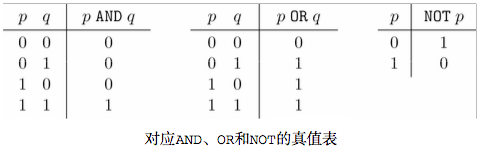

# Propositional Logic 命题逻辑

命题逻辑是让可以对逻辑表达式的真假进行推理的数学模型。

*命题*：任何可以具有某一`真值`（真或加）的语句。

*逻辑运算符*：AND, OR, NOT, NAND, NOR。

> NAND: 与非， `p NAND q` 等价于 `NOT (p AND q)`。
> NOR: 或非， `p NOR q` 等价于 `NOT (p OR q)`。


基本规则：

1. 当且仅当`p`和`q`都为真时，`p AND q`为真，否则为假。

1. 当`p`为真，或者`q`为真，或者`p`和`q`都为真时，`p OR q`为真，否则为假。

1. 当`p`为真时，`NOT p`为假，如果`p`为假时，`NOT p`为真。

运算符的优先级：NOT -> NAND -> NOR -> AND -> OR

## 布尔函数

接受真值赋值作为参数，并返回TRUE或者FALSE的函数。
```C
BOOLEAN foo( BOOLEAN p, BOOLEAN q)
{
    return p && (p||q);
}
```

很容易的就能把布尔函数表示为真值表。

> <div style="text-align: center">
> 
> </div>

TODO 12.5

