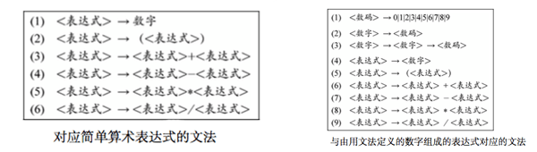
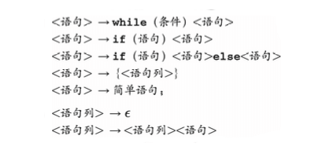
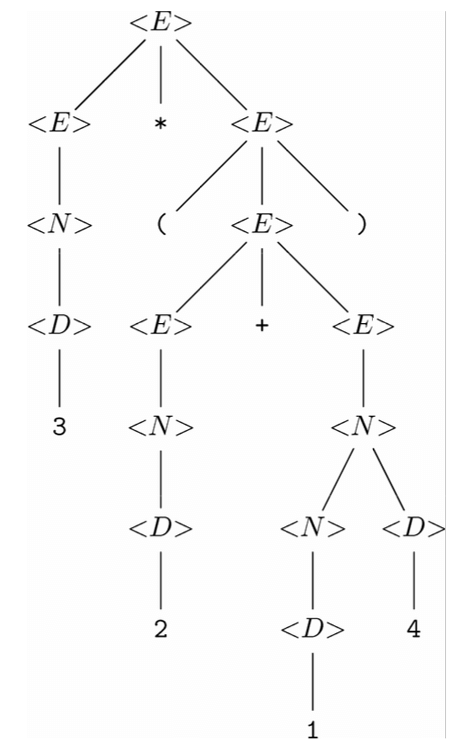
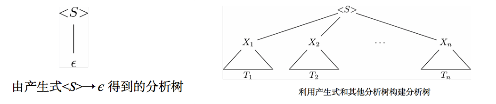
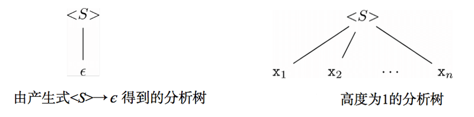
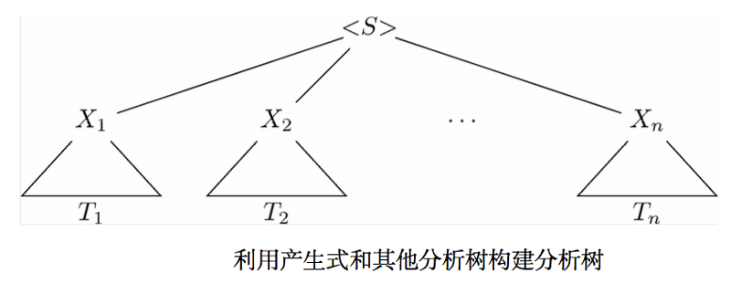

# Recursive Description of Patterns 模式的递归描述

描述模式的方法有很多种，[文章](./pattern-automata-regex.md)分别利用了“自动机”这种图中路径标号的图论方式，和正则表达式的代数方式。现在学习第三种描述模式的方式，称为“上下文无关文法”的递归定义。

除特殊说明，下面到文法均指“上下文无关文法”。

## 上下文无关文法

文法中会出现3种符号。

1. “元符号meta symbol”，扮演特殊角色却并不代表他们自身的符号。
1. “语法分类syntactic category”，要定义的字符串集合。
1. “终结符terminal”，可以是 ‘+’ ，也可以是 ‘数字’ 这样的抽象符号。

文法是由 *产生式production* 组成的。一般而言，产生式有以下3部分：

1. 左部head，元符号左侧的语法分类。
1. 元符号，
1. 右部body，元符号右侧0个或以上的语法分类和（或）终结符。

> 关于文法的例子
>
> 

> 
> 

> 定义了C语言中某些语句形成方式的产生式
>
> 

> 
> 

## 源自文法的语言

文法从本质上讲，是设计字符串集合的归纳定义。一种文法定义若干语法分类的情况很常见。对于某文法的各语法分类 *< S >* 而言，可以按照如下方式定义语言 *L(< S >)* 。

**依据。** 首先假设对文法中的各语法分类 *< S >* 而言， 语言 *L(< S >)* 为空。

**归纳。** 假设该文法具有产生式 *< S > → X1X2...Xn* ，其中对于 *i=1,2,...,n* ，各个 *Xi* 要么是语法分类，要么是终结符。并且对 *i=1,2,...,n* ，按照如下方式为各个 *Xi* 选择一个字符串 *si* ：

1. 如果 *Xi* 是终结符，就可以只使用 *Xi* 作为字符串 *si*。
1. 如果 *Xi* 是语法分类，就可以选择任何一个已知在 *L(Xi)* 中的字符串作为 *si*。如果若干个 *Xi* 是相同的语法分类，就可以从各次出现的 *L(Xi)* 中分别选不同的字符串作为 *si*。

那么所选的这些字符串的串接 *s1s2...sn* 就是语言 *L(< S >)* 中的字符串。如果 *n==0*,就把 є 放到该语言中。

实现这一定义的一种系统化就是经过 该文法各产生式 若干轮。在每轮中，要以所有的可能方式利用归纳规则更新各语法分类的语言。也就是说，对于各个属于语法分类的 *Xi*，要以所有可能的方式从 *L(Xi)* 中选出字符串。

## 分析树

可以通过反复应用产生式，为某语法分类 *< S >* 得出字符串 *s* 属于语言 *L(< S >)* 的结论。

从由右部不含语法分类的依据产生式得到的字符串开始，然后对已经从各语法分类得到的字符串“应用”产生式。每次应用都要用字符串替换产生式右部中出现的各语法分类，并构造处属于产生式左部中语法分类的字符串。最终通过应用左部为 *< S >* 的产生式来构造字符串。

把 *s* 在 *L(< S >)* 中的 “证明” 化成一棵称作 *分析树 parse tree* 的对于帮助语法分类很有用。分析树的节点都是带标号的，要么是终结符，要么是语法分类，要么是 є 。叶子节点只会被标记为终结符或者符号 є ，内部节点只能用语法分类作为标号。

每个内部节点 *v* 都是表示产生式的应用。亦即，一定存在某个产生式，同时满足下列条件：

1. 标号 *v* 的语法分类是该产生式的左部
1. *v* 的子节点的标号从左往右构成了该产生式的右部

> 例子： 下面的分析树表示的字符串是 *3\*(2+14)*。 *<表达式expression>、<数字number>、<数码digit>* 分别简记为 *<E>、<N>、<D>*。
>
> 

> 
> 

## 分析树的构建

每棵分析树都表示某一终结符串 *s* ，可以称该串为这棵树的产出(yield)。串 *s* 由相应分析树的所有叶子节点的标号按照从左到右的次序排列而成。此外对分析树进行前序遍历并只依次列出那些属于终结符的标号，也可以得到产出。

如果树只有一个节点，那么该节点的标号只能是某个终结符或者 є 。如果树不止一个节点，根节点的标号就是语法分类，根节点必然是个内部节点。而且该语法分类的字符串中总会包含该树的产出。递归定义如下：

**依据。** 对文法中的每个终结符 **x** 来说，存在一棵树只含一个标号为 **x** 的节点的树。当然该树的产出就是 **x**。

**归纳。** 假设我们有产生式 *< S > → X1X2...Xn*，其中各种 *Xi* 要么是终结符，要么是语法分类。如果 *n == 0* ，则该产生式实际上为 *< S > → є * ，那么就有下左图的树，产出为 є ，根节点为 *< S >*。因此 є 显然是在 *L< S >* 中的。 

现假设 *< S > → X1X2...Xn* ，且 n >= 1 。对每个 i = 1、2、...、n 而言，按如下方式为每个 *Xi* 选择树 *Ti* ：

1. 如果 *Xi* 是终结符，就必须选择标号为 *Xi* 的单节点树。如果有两个或多个 X 是同一终结符，就必须为该终结符的每次出现选择具有相同标号的不同节点树。

1. 如果 *Xi* 是语法分类，可以选择任何已经构建好的以 *Xi* 为根节点标号的分析树。然后构建上面右边图的树。亦即，创建的根节点标号是该产生式左部的语法分类 *< S >* ，而这棵树的根节点的子节点从左到右依次是 *X1, X2, ... , Xn* 选择的树的根节点。如果由两个或多个 X 是相同的语法分类， 也许要为各语法分类选择相同的树，但必须在该树每次被选中时为其生成不同的副本。还可以为同一语法分类的不同出现选择不同的树。

## 分析树为何 “行得通”

分析树的构建与字符串属于某语法分类的归纳定义非常相似。我们可以通过两次简单的归纳来证明，对任意语法分类 < S > 来说，以 < S > 为根节点的分析树的产出刚好是 L(< S >) 中的字符串。亦即：

1. 如果 T 是根节点标号为 < S > 且产出为 s 的分析树，那么字符串 s 在语言 L(< S >) 中。

1. 如果字符串 s  在语言 L(< S >) 中，那么存在产出为 s 且根节点标号为 < S > 的分析树。

粗略的讲，分析树是由更小的分析树，按照由较短的字符串够长长字符串的方式，对产生式右部中的语法分类进行替换构成的。

用对树 T 高度的完全归纳证明第 1 部分。

**依据。**  假设分析树的高度是1，这棵树就像下图一样， n == 0 时是 є ，构建这种树第唯一方法是，若存在产生式 *< S > → X1X2...Xn* ，其中各 **x** 都是终结符。因此 **x1x2...xn** 是 L(< S >) 中第字符串。

**归纳。** 假设命题对所有高度不超过k的树都成立。现在考虑下面的高度为 k+1 的树。对 i = 1,2,...,n ，各子树 Ti 的高度至多为 k 。如果这些子树中有任何一棵的高度达到或超过 k+1 ，那么整棵树对高度就至少是 k+2 。因此，归纳假设适用于各棵树 Ti 。另根据归纳假设，如果子树 Ti 的根节点 Xi 是语法分类，那么 Ti 产出 si 就在语言 L(Xi) 中。如果 Xi 是终结符，就定义字符串 si 是 Xi 。整棵树的产出就是 s1s2...sn 。根据分析树的定义，可知 *< S > → X1X2...Xn* 是产生式。假设只要 Xi 是语法分类就是 si 替换 Xi 。根据定义，如果 Xi 是终结符， Xi就是 si 。这样一来，替换后对右部就变成了 s1s2...sn， 与该树对产出是相同的。根据 < S > 的语言的归纳规则， s1s2...sn 是在 L(< S >) 中的。

现在必须证命题 2 ，语法分类 L< S > 中的每个字符串 s 都具有以 < S > 为根节点且以 s 为产出的分析树。首先要注意到，对每个终结符 x ，存在根节点和产出都是 x 的分析树。现在我们要对得出 s 在 L(< S >) 中时的归纳步骤（下面证明过程中加引号的 “归纳步骤” 就表示该归纳步骤）的应用次数进行完全归纳。

**依据。** 假设证明 s 在 L(< S >) 中需要应用 “归纳步骤” 一次。则一定存在 *< S > → X1X2...Xn* ，其中所有的 **x** 都是终结符，而去 *< S > = X1X2...Xn* 。对 i = 1,2,..., n ，都有标号为 xi 的单节点分析树。因此，存在产出为 s 且根节点标号为 < S > 的分析树。该树的结构类似如下，在 n == 0 的特例中， s 为空字符串。

**归纳。** 假设应用 “归纳步骤” 不超过 k 次所发现的任意语法分类 < T > 中，任何字符串 t 都具有以 t 为产出而且以 < T > 为根节点的分析树。考虑通过 k+1 次应用 “归纳步骤” 找到的在语法分类 < S > 的语言中的字符串 s 。那么存在产生式 *< S > → X1X2...Xn* ，且 s = s1s2...sn， 其中每个子串 si 都会是 如下两种可能之一。

1. 为 Xi， 此时 Xi 为终结符。

1. 某个至多应用 k 次 “归纳步骤” 就可知在 L(Xi) 中的字符串，此时 Xi 是语法分类。

因此，对每个 i ，都可以找到一棵具有产出 si 而且根节点标号为 Xi 的树 Ti 。如果 Xi 是语法分类，那么就利用归纳假设声明 Ti 存在，如果 Xi 是终结符，则不需要归纳假设就可以声明存在标号为 Xi 的单节点树。

## 二义性和文法设计

如果文法中有两棵或多棵分析树具有相同产出，且根节点标号是相同的语法分类，就说该文法是具有二义性的 ambiguous 。不一定要每个字符串都是若干分析树的产出，只要有一个这样的字符串就足够让文法具有二义性。

不具有二义性的文法叫做 无二义 unambiguous 文法。在无二义文法中，对每个字符串 s 和语法分类 < S > 而言，至多存在一棵产出为 s 且根节点标号固定的分析树。

证明文法的无二义性相当困难，唯一方法就是证明语言中每个字符串都具有唯一的分析树。

对于编译器来说，文法的 **无二义性** 非常重要，无二义性意味着明确指定机器语言程序该做什么。

## 分析树的构造

一般而言，根本不可能把文法转换成确定自动机。

下面介绍一种简单的却不是很强大的分析技术—— **递归下降分析** 。在该分析中，文法会被一系列相互递归的函数代替，每个递归函数都对应文法中的一个语法分类。对应语法分类 < S > 的函数 S 的目标是读入构成语言 L(< S >) 中的字符串的字符序列，并返回指向该字符串分析树根节点的指针。

产生式的右部可以看作找到左部的语法分类中的字符串所必须满足的一系列目标 —— 终结符和语法分类。

一般而言，如果发现下一个输入符号是终结符，终结符的目标就得到满足了。但是下一个输入符号是其他内容，这个目标就不会被满足。要弄清右部中的语法分类是否得到满足，可以调用对应该语法分类的函数。

假设需要确定终结符序列 X1X2...Xn 是否为语法分类 < S > 中的字符串，而且如果是，则需要给出它的分析树。然输入序列为 X1X2...Xn ENDM ，其中 ENDM 是一个不输入终结符的特殊符号，称为 端记号 endmarker ，作用表示待检查的整个字符串已经被读入完成。

输入游标 input cursor 标记了当前正在被处理的终结符，如果输入是字符串，那么游标可以是指向字符的指针。分析程序首先要调用对应语法分类 < S > 的函数 S  ，而且输入游标是在输入的开头位置。

每当处理产生式的右部，并在产生式中遇到终结符 a 的时候，就要在输入游标指示的位置查找相匹配的终结符 a 。如果找到了 a ，就把输入游标移至下一个终结符。如果没有找到，匹配失败，就不能为该输入字符串给出分析树。

如果当前处理的产生式是语法分类 <T> ，就要调用对应 <T> 的函数 T 。如果 T 失败了，就表示整个分析失败了。如果 T 成功了，就会 “消灭” 输入，把输入游标向后移动对应输入的 0个或更多个 偏移位置。 T 还会返回一棵树，就是被消灭部分的分析树。

处理完各个符号之后，就要为该产生式表示的那部分输入生成分析树。要完成这一工作，就需要创建一个新的根节点，并以该产生式的左部作为其标号。该根节点的子节点是成功调用与右部中语法分类对应的函数所返回的树的根节点，而且要为右部中的每个终结符创建相应的叶子节点。

