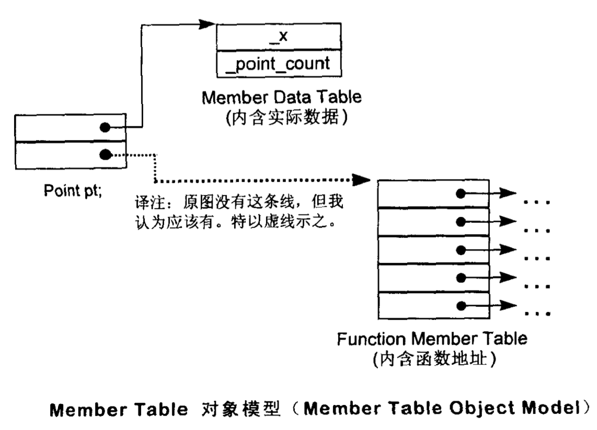

# 关于对象 Object Lessons

在 C 中， _数据_ 和 _处理数据的操作（函数）_ 是分开声明的，语言本身并没有支持 _数据和函数_ 之间的关联性，这样的程序方法称为程序性的(procedural)，由一组 _分布在各个以功能为导向的函数中_ 的算法所驱动，处理的是共同的外部数据 。

## 1.1 C++对象模式 The C++ Object Model

在 C++中，有两种 class data members：static 和 nonstatic，以及三种 member function: static、nonstatic、vitrual。

### 简单对象模型

尽量减低 C++ 编译器的设计复杂度而设计的，牺牲的是空间和执行效率。

在该简单模型中，一个 object 是一系列的 slots 组成，每个 slots 指向一个 member， member 按其声明次序各被指定一个 slot ，要么是 data member ，要么是 function member 。

<div style="text-align: center">

</div>

在该模型中， members 本身并不放在 object 中，只有 _指向 member 的指针_ 才放在 object 中，这么做可以避免 _members 有不同的类型而需要的存储空间不同_ 所导致的问题。 Object 中的 members 是以 slot 的索引值来寻址。一个 class object 的大小很容易计算出来：_指针大小，乘以 class 中所声明的 members 数目_。

> 虽然这个模型没有应用到实际产品中，不过关于索引或者 slot 的观念被应用到 C++ 的 _指向成员的指针（pointer-to-member）_ 观念中。

### 驱动对象模型 A Table-driven Object Model

为了对所有 classes 的所有 objects 都有一致的表达方式，另一种对象模型是把所有与 members 相关的信息抽出来，放在一个 data member table 和 member function table 之中， class object 本身则含有指向这两个表格的指针。 Member function table 是一系列 slots， 每一个 slot 指向一个 member function； Data member table 则直接含有 data 本身。

<div style="text-align: center">

</div>

> 这个模型依然没有被应用与真正的 C++ 编译器身上，但是 member function table 这个观念却成为支持 virtual functions 的一个有效方案。

### 对象模型 The C++ Object Model

Stroustrup 当初设计的 C++ 对象模型是从简单对象模型派生而来的，并对内存空间和存取时间做了优化。在这个模型中， nonstatic data members 被配置于每一个 class object 之中， static data members 则被存放在所有的 class object 之外。Static 和 nonstatic function members 也被放在所有的 class object 之外， Virtual functions 则以两个步骤支持之：

1. 每个 class 产生出一堆指向 virtual functions 的指针，放在被称为 virtual table （`vtbl`） 的表格中。

1. 每一个 class object 被添加了一个指向相关 class 的 virtual table 的指针，通常这个指针被称为 `vptr`。 vptr 的 设定 setting 和 重置 resetting 都由相应 class 的 constructor、deconstructor 和 copy assignment 运算符自动完成，每一个 class 所关联的 type_info object(用以支持 runtime type indentification, RTTI)也经由 virtual table 指出，通常是放在表格的第一个 slot 处。

<div style="text-align: center">

</div>

> 上述模型的主要优点是它的空间和存取时间效率；主要缺点则是，如果应用程序代码本身没改变，而所用到的 class objects 的 nonstatic data members 发生了修改，那么应用代码需要重新编译。

### 加上继承 Adding Inheritance

```c++
// C++ 支持单一继承
class Library_materials { ... };
class Book : public Library_materials { ... };
class Rental_book : public Book { ... };

// C++ 也支持多重继承
class iostream:
    public istream,
    public ostream { ... };

// 甚至继承关系也可以指定为虚拟，
// 即 virtual，也就是共享的意思
class istream : virtual public ios { ... };
class ostream : virtual public ios { ... };
```

在虚拟继承的情况下， base class 不管在继承链中被 派生 derived 多少次，永远只会存在一个实体，被称为 subobject。

一个 derived class 如何在本质上模塑其 base class 的实体？ 在 _简单对象模型_ 中，每一个 base class 可以被 derived class object 内的一个 slot 指出，该 slot 内含 base class subobject 的地址。 这个方式的主要缺点是，因为间接性而导致了空间和存取时间上的额外负担，有点则是 class object 的大小不会因其 base classes 的改变而受到影响。

还有一种的 base table 的模型：当 base class table 被产生出来时，表格中的每一个 slot 内含一个相关的 base class 地址，这很像 virtual table 内含一个 virtual function 的地址一样，每一个 class object 内含一个 bptr， 初始化时指向 base class table。

这个策略的主要缺点时由于间接性而导致的空间和存取时间上的额外负担，优点则是每一个 class object 中对于继承都有一致的表现方式： 每个 class object 都应该在某个固定位置上安放一个 base table 指针，与 base classes 的大小或数目无关；第二个优点是，不需要改变 class object 本身，就可以放大、缩小、更改 base class table。

<div style="text-align: center">

</div>

## 1.3 对象的差异

C++ 程序设计模型直接支持三种 programming paradigms：

**程序模型 procedural model** 。 就像 C 一样， C++ 也支持它。

```c++
char boy[] = "Danny";
char *p_son;
// ...
p_son = new char[strlen(boy) + 1];
strcpy(p_son, boy);
// ...
```

**抽象数据类型模型 abstract data type model, ADT** 。该模型所谓的 _抽象_ 是和一组表达式 public 接口一起提供，而其运算定义仍然不明确。

```c++
String girl = "Anna";
String daughter;
// ...
// String::operator=();
daugter = girl;
// ...
// String:operator==();
if (girl == daughter)
    take_to_play(girl);
```

**面向对象模型 object-oriented model** 。在此模型中有一些彼此相关的类型，通过一个抽象的 base class（用以提供共通接口）被封装起来。

```c++
// `Library_materials` class 就是一个例子，
// 真正的 subtypes 例如 `Book Video ...` 都可以从那里派生出来。
void
check_in(Library_material *pmat)
{
    if (pmat->late())
        pmat->fine();
    pmat->check_in();

    if (Lender *plend = pmat->reserved())
        pmat->notify( plend );
};
```

纯粹的采用一种 paradigm 来写程序有利于整体行为的良好稳固。当你混合了不同的 paradigm ，则很有可能对程序带来不稳定的影响。

在 C++ 中，多态只存在于一个个的 public class 体系中。Nonpublic 的派生行为以及类型为 \*void 的指针可以说是多态，但是他们并没有被语言显式的支持，也就是说他们必须要通过程序员的转型操作来管理。

C++ 以下方法支持多态：

1. 经由一组隐含的转化操作，例如把一个 derived class 指针转化为一个指向其 public base type 的指针： `shape *ps = new circle();` 。

1. 经由 virtual function 机制： `ps->rotate();`

1. 经由 dynamic_cast 和 typeid 运算符： `if (cicle *pc = dynamic_cast< circle * >(ps)) ...`

多态的主要用途是经由一个共同的接口来影响类型的封装，这个接口通常被定义在一个抽象的 base class 中。这个共享接口是以 virtual function 的机制引发，它可以在执行期间根据 object 的真正类型解析出到底哪一个函数实体被调用。

那么，接下来的问题是需要多少内存才能够表现一个 class object？一般而言要有：

1. 其 nonstatic data members 的总和大小；

1. 加上任何由于 alignment 的需求而填补上去的空间（可能存在于 member 之间，也可能存在于集合体的边界），

1. 加上为了支持 virtual 而由内部产生的任何额外负担 overhead 。

> 一个指针，或者说是一个 reference， 不管它指向的数据类型是什么，指针本身所需的内存大小是固定的。

### 指针的类型 the type of a Pointer

_指向不同类型的指针们_ 之间的差异，不在于其指针表示法的不同，也不在其内容（代表一个地址）的不同，而是在于其所寻址出来的 object 类型不同。亦即，_指针类型_ 会教导编译器如何解释某个特定地址中的内存内容及其大小：

<div style="text-align: center">

</div>

那么一个指向地址 1000 而类型为 void* 的指针，将涵盖怎么样的地址空间？答案是不知道！这就是为什么一个类型为 void* 的指针能够含有一个地址，却不能通过它操作所指向的 object 的缘故。（编译器无法解释指针指向的内存块的内容，无论是大小，还是 slot 里面的内容，这种行为是未定义的，所以成为了错误，由程序员来处理。）

所以 转型 cast 其实只是编译器指令，大部分它并不改变一个指针所含的真正地址，它只影响 _被指出内存的大小和其内容_ 的解释方式。

### 现在加了多态， Adding Polymorphism

举例，定义一个经由 public 继承自 ZooAnimal 的 Bear 类。

```c++
class Bear : public ZooAnimal {
    public:
        Bear();
        ~Bear();
        // ...
        void rotate();
        virtual void dance();
        // ...
    protected:
        enum Dances { ... };
        Dances dances_known;
        int cell_block;
};

Bear b("Yogi");
Bear *pb = &b;
Bear &rb = *pb;
```

上述代码可能的内存布局如下

<div style="text-align: center">

</div>

现在假设 `Bear` Object 放在地址 1000 处，一个 `Bear` 指针和一个 `ZooAnimal` 指针有什么不同？

```c++
Bear b;
ZooAnimal *pz = &b;
Bear *pb = &b;
```

它们每个都指向 `Bear` object 的第一个 byte ，差别在于 `pb` 所涵盖的地址包含整个 `Bear` object ，而 `pz` 所涵盖的地址只包含 `Bear` object 中的 `ZooAnimal` subobject。

除了 `ZooAnimal` subobject 中出现的 members，无法直接通过 `pz` 处理 `Bear` 的任何 members，唯一的例外是通过 virtual 机制：

```c++
// 不合法： cell_block 不是 ZooAnimal 的一个 member，
// 虽然 pz 当前指向一个 Bear object
pz->cell_block;

// ok, 经过一个明白的 downcast 操作就没有问题
((Bear*)pz)->cell_block;

// better, 但是一个 run-time operation ，成本较高
if (Bear* pb2 = dynamic_cast< Bear* >(pz))
    pb2->cell_block;

// ok, 因为 pb 是 Bear 的指针，而且 cell_block 是其 member
pb->cell_block;
```

当写出语句： `pz->rotate();` 时， `pz` 的类型将在编译时期决定以下两点：

1. 固定的可用接口，亦即 `pz` 只能够调用 `ZooAnimal` 的 public 接口；

1. 该接口的 access level，比如 private member 就无法访问。

在每一个执行点， `pz` 所指向的 object 类型可以决定 `rotate()` 所调用的实体，类型信息的封装并不是维护于 `pz` 中，而是维护在 `link` 中，这个 `link` 存在于 _object 的 vptr_ 和 _vptr 所指向的 virtual table_ 中。

---

现在考虑以下情况：

```c++
Bear b;
ZooAnimal za = b; // 会引起切割 sliced

// 调用 ZooAnimal::rotate()
za.rotate();
```

_为什么 1. rotate() 所调用的是 ZooAnimal 实体而不是 Bear 实体_？

此外，如果初始化函数（应用于上述 assignment 操作发生时）将一个 object 内容完整拷贝到另一个 object 中去，_为什么 2. za 的 vptr 不指向 Bear 的 virtual table_?

2.的答案是，编译器在 **初始化** 及 **指定** 操作（将一个 class object 指定给另一个 class object ） 之间做出了仲裁。编译器必须确保如果某个 object 含有一个或多个 vptrs ，那些 vptrs 的内容不会被 base class object 初始化或改变。

至于 1. 的答案是： `za` 并不是也绝不会是一个 `Bear`， 它是并且只能是一个 `ZooAnimal` 。多态所造成的 _一个以上的类型_ 的潜在力量，并不能实际发挥在 _直接存取 objects_ 这件事情上，有一个似是而非的观念： _OO 程序设计并不支持对 object 的直接处理_ 。可以通过下面的例子来验证。

```c++
ZooAnimal za;
ZooAnimal *pza;

Bear b;
Panda *pp = new Panda;

pza = &b;
```

可能的内存布局如下，

<div style="text-align: center">

</div>

将 `za` 或 `b` 的地址，或 `pp` 所含的内容（也是个地址）指定给 `pza` ，显然不是问题，一个 pointer 或一个 reference 之所以支持多态，是因为他们并不引发内存中任何 _与类型有关的内存委托操作 type-dependent commitment_ ；会受到改变的只是他们所指向的内存的 _大小和内容解释方式_ 而已。

然而，任何试图改变 object `za` 的大小的尝试，便会违反其定义中受契约保护的 _资源需求量_ ，如果把整个 Bear object 指定给 `za` ，则会溢出它所配置得到的内存，执行结果当然也就不对了。

当一个 base class object 被直接初始化为（或被指定为）一个 derived class object 时， derived object 就会被切割，以塞入较小的 base type 中。 derived type 将没有留下任何蛛丝马迹，多态不再呈现。而一个严格的编译器可以在编译时期解析一个 _通过该 object 而出发的 virtual function 调用操作_，因而回避 virtual 机制，如果 virtual function 被定义为 inline ，则更有效率上的收获。

### Summary on Polymorphism

总而言之，多态之一种威力强大的设计机制，它允许你继一个抽象的 public 接口之后，封装相关的类型。需要付出的代价就是额外的间接性。 C++ 通过 class 的 pointers 和 references 来支持多态，这种程序风格被称为 _面向对象_ 。

C++ 也支持具体的 ADT 程序风格，如今被称为 object-based OB。 一个 OB 设计可能比一个对等的 OO 设计速度更快而且空间更紧凑。速度快是因为所有的函数引发的操作都在编译时间解析完成，对象建构起来时不需要设置 virtual 机制；空间紧凑则是因为每一个 class object 不需要负担传统上为了支持 virtual 机制而需要的额外负担 overhead。不过 OB 设计比较没有弹性。
