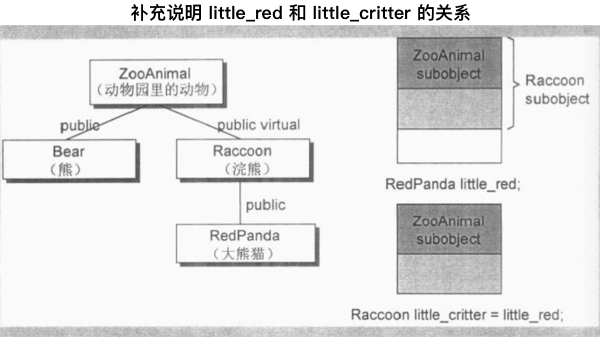

# 构造函数语意学 The Semantics of Constructors

本章主要挖掘编译器对于 _对象构造过程_ 的的干涉，以及对于 _程序形式_ 和 _程序效率_ 上的冲击。

## 2.1 Default Constructor 的建构操作

default constructors 是在编译器需要它的时候，它才会被编译器产生出来。这里的需要，一种是程序需要，一种是编译器的需要。

即使有需要为 class Foo 合成一个 default constructor ，那个 constructor 也不会将两个 data member 初始化为 0。数据的初始化应当是程序负责将其适当的初始化。

```c++
class Foo { public: int val; Foo *pnext; };
```

因此为了让代码正确执行， class Foo 的设计者必须提供一个明显的 default constructor ，将两个 members 适当的初始化。

> Global objects 的内存保证会在程序激活时被清为 0 。Local objects 配置于程序的堆栈中， heap objects 配置于自由空间中，都不一定会被清为 0，它们的内容将是内存上次被使用后的痕迹。

c++ Standard[ISO-c++95] 是这么描述的：

    对于 class X ，如果没有任何 user-declared constructor ，那么会有一个 default constructor 被暗中(implicitly)声明出来......一个被暗中声明出来的 default constructor 将是一个 trivial constructor.....

这里， nontrivial default constructor 就是编译器所需要的那种，必要的时候，会由编译器合成出来。下面分别讨论 nontrivial default constructor 的四种情况。

### 带有 Default Constructor 的 Member Class Object

如果一个 class 没有任何 constructor ，但它内含一个 member object ，而后者刚好有 default constructor ，那么这个 class 的 implicit default constructor 就是 nontrivial， 编译器需要为此 class 合成出一个 default constructor，不过这个合成操作只有在 constructor 真正需要被调用时才会发生。

于是出现一个有趣的问题：在 c++ 各个不同的编译模块中，编译器如何避免合成出多个 default constructor ？解决方法是把合成的 default constructor 、 copy constructor 、 deconstructor 、 assignment copy operator 都以 _inline_ 的方式完成，一个 _inline_ 函数有静态链接 static linkage，不会被档案以外者看到。如果函数太复杂，不适合做成 _inline_，就会合成出一个 explicit non-inline static 实体。

```c++
class Foo { public: Foo(), Foo(int) ... };
class Bar { public: Foo foo; char *str; }; //  不是继承而是内含！

void foo_bar()
{
    Bar bar; // 成员对象， Bar::foo 必须在此处完成初始化，

    if (str) { } ...
};
```

被合成的 `Bar` default constructor 内含必要的代码能够调用 class `Foo` 的 default constructor 来处理 member object `Bar::foo`，但是它并不产生任何代码来初始化 `Bar::str`。将代码 `Bar::foo` 初始化是编译器的责任。将 `Bar::str` 初始化是程序员的责任，被合成的 default constructor 看起来可能是这样：

```c++
// Bar 的 default constructor 可能会被这样合成
// 被 member foo 调用 class Foo 的 default constructor
inline
Bar::Bar()
{
    // c++ 伪码
    foo.Foo::Foo();
};

// 假设为了使得程序能够正确执行，成员对象的字符指针 str 由程序员初始化
Bar::Bar() { str = 0; };
```

现在程序的需求得到了满足，但是编译器还需要初始化 member ojbect foo，此时程序的 default constructor 已经被明确定义出来了，编译器没办法合成第二个，那么编译器要怎么做呢？

编译器的行动是：

_如果 class A 内含一个或一个以上的 member class objects，那么 class A 的每一个 constructor 必须调用每一个 member classes 的 default constructor_ 。编译器会扩张已存在的 constructors ，在其中安插一些代码，使得 user code 在被执行前，先调用必要的 default constructor。

```c++
// 延续前例，扩张后的 constructors 可能像这样
Bar::Bar()
{
    foo.Foo::Foo();
    str = 0;
};
```

如果有多个 class member objects 都要求 constructor 初始化操作，则又该如何？

c++要求以 _member object 在 class 中的生命次序_ 来调用各个 constructors 。这一点由编译器完成，它为每一个 constructor 安插程序代码，以 _member 声明次序_ 调用每一个 member 所关联的 default constructors， 这些代码将会被安插在 explicit user code 之前。

```c++
// an example
class Dopey { public: Dopey(); ... };
class Sneezy { public: Sneezy( int ); Sneezy(); ... };
class Bashful { public: Bashful(); ... };

class Snow_White
{
    Dopey dopey;
    Sneezy sneezy;
    Bashful bashfu;
    // ...
    private:
        int mumble;
};

/*
如果 Snow_White 没有定义 default constructor，
就会有一个 nontrivial constructor 被合成出来，
依序调用 Dopey、 Sneezy、 Bashful 的 default constructors，
然而如果 Snow_White 定义了如下的 default constructor：
*/

// 程序员写的 default constructor
Snow_White::Snow_White() : sneezy ( 1024 )
{
    mumble = 2048;
}

// 它将会被扩张为
Snow_White::Snow_White() : sneezy( 1024 )
{
    // invoke member object constructor
    dopey.Dopey::Dopey();
    sneezy.Sneezy::Sneezy(1024);
    bashful.Bashful::Bashful();

    // explicit user code
    mumble = 2048;
}
```

### 带有 Default Constructor 的 Base Class

类似的道理，如果一个没有任何 constructors 的 class 派生自一个带有 default constructor 的 base class，那么这个 derived class 的 default constructor 会被视为 nontrivial，因此需要被合成出来。

它将根据 base classes 的声明次序，依次调用他们的 default constructor。对一个后继派生的 class 而言，这个合成的 constructor 和一个 _被明确提供的 default constructor_ 没有什么差异。

如果设计者提供多个 constructors， 但其中都没有 default constructor 呢？

编译器会扩张现有的每一个 constructors，将 _用以调用所有必要的 default constructors_ 的程序代码加进去，它不会合成一个新的 default constructor ，这是因为其他 _由 user 所提供的 constructors_ 存在的缘故，如果同时亦存在着 _带有 default constructors_ 的 member class objects， 那么这些 default constructor 也会在 _所有 base class constructors 调用之后_ 被调用。

### 带有一个 Virtual Function 的 Class

下面两种情况也需要合成出 default constructor：

1. class 声明（或继承）一个 virtual function，

1. class 派生自一个继承串连，其中有一个或更多的 virtual base classes。

不管哪一种情况，由于缺乏 user 声明的 constructors， 编译器会详细记录合成一个 default constructor 的必要信息。

```c++
// example
class Widget {
    public:
        virtual void flip() = 0;
        // ...
};

void flip( const Widget& widget  ) { widge.flip(); }

void foo()
{
    Bell b;
    Whistle w;

    flip( b );
    flip( w );
};
```

下面两个扩张操作会在编译期间发生：

1. 一个 virtual function table 会在编译器产生出来， 内放 class 的 virtual functions 地址。

1. 在每一个 class object 中， 一个额外的 pointer member （也就是 vptr） 会被编译器合成出来，内含相关的 class vtbl 的地址。

此外，`widget.flip()` 的虚拟引发操作 virtual invocation 会被重新改写，以使用 widget 的 `vptr` 和 `vtbl` 中的 `flip()` 条目：

    // widget.flip() 的 virtual invocation 的转变
    ( *widget.vprt[ 1 ])( &widget )

其中：

- 1 表示 flip() 在 virtual table 中的固定索引；

- &widget 代表要交给 _被调用的某个 flip() 函数实体_ 的 **this** 指针。

为了让这个机制发挥功效，编译器必须为每一个 Widget (或其派生类之) object 的 vptr 设定初值，放置适当的 virtual table 地址。 对于 class 所定义的每一个 constructor， 编译器会安插一些代码来做这样的事情。对于那些未声明任何 constructors 的 classes， 编译器会为它们合成一个 default constructor， 以便正确的初始化每一个 class object 的 vptr。

### 带有一个 Virtual Base Class 的 Class

Virtual base class 的实现法在不同编译器之间有很大差别，然而其共通点在于 \_必须使 virtual base class 在其每一个 derived object 中的位置，能够在执行期准备妥当。

```c++
// example
class X { public: int i; };
class A : public virtual X { public: int j; };
class B : public virtual X { public: double d; };
class C : public A, public B { public: int k; };

// 无法在编译时期决定 resolve 出 pa->X::i 的位置
void foo( const A* pa ) { pa->i  = 1024; }

main()
{
    foo( new A );
    foo( new C );
    // ...
}
```

编译器无法固定住 `foo()` 之中 _经由 pa 而存取的 X::i_ 的实际偏移位置，因为 pa 的真正类型可以改变，编译器必须改变*执行存取操作*的那些码，使 `X::i` 可以延迟到执行期才决定下来。

原先 cfront 的做法是靠 _在 derived class object 的每一个 virtual base classes 中安插一个指针_ 来完成。所有 _经由 reference 或 pointer 来存取一个 virtual base class_ 的操作都可以通过相关指针来完成。

上面的例子可以改写如下:

```c++
// 可能的编译器转变操作
void foo( const A* pa ) { pa->__vbcX->i = 1024; }
// 其中 __vbcX 表示编译器所产生的指针，指向 virtual base class X
```

事实上，`__vbcX` 是在 class object 建构期间被完成的。对于 class 所定义的每一个 constructor， 编译器会安插那些 _允许每一个 virtual base class 的执行期存取操作_ 的代码。 如果 class 没有声明任何 constructor ，编译器必须为他合成一个 default constructor。

### Summary on Default Constructors

C++ Standard 把合成出来的 constructor 称为 implicit nontrivial default constructors ，被合成出来的 constructor 只能 _满足编译器而非程序的需要_ 。它之所以能够完成任务，是借着 _调用 member object 或 base class 的 default constructor_ 或是 _为每一个 object 初始化其 virtual function 机制或 virtual base class 机制_ 而完成。至于没有存在那四种情况而又没有声明任何 constructor 的 classes ，它们拥有的是 implicit trivial default constructors ，实际上它们并 _不会被合成出来_ 。

在合成的 default constructor 中，只有 base class subobjects 和 member class objects 会被初始化，所有其他的 nonstatic data member ，如整数、整数指针、整数数组等都不会被初始化，这些初始化操作对程序而言或许有需要，但对编译器则并非必要。如果程序需要一个 _把某指针设为 0_ 的 default constructor ，那么提供它的人应该是程序员。

因此下面两种说法都是错误的：

1. 任何 class 如果没有定义 default constructor, 就会被合成出一个来。

1. 编译器合成出来的 default constructor 会明确设定 class 内每一个 data member 的默认值。

## 2.2 Copy Constructor 的建构操作

有三种情况，会以一个 object 的内容作为另一个 class object 的初值。

```c++
// 情形 1
// 最明显的一种情况当然就是对一个 object 做明确的初始化操作，像这样：
class X { ... };
X x;

// 明确地以一个 object 的内容作为另一个 class object 的初值
X xx = x;

// 情形 2
// 还有就是当 object 被当作参数交给某个函数时，例如：
extern void foo( X x );

void bar()
{
    X xx;
    // 以 xx 作为 foo() 的第一个参数的初值（不明显的初始化操作）
    foo( xx );
    // ..
}

// 情形 3
// 以及当函数返回一个 class object 时：
X
foo_bar()
{
    X xx;
    // ...
    return xx;
}
```

假设 class 的设计者明确定义了如下一个 copy constructor （一个至少含有参数类型为 class type 的 constructor）

```c++
// user-defined copy constructor 的实例
// 可以是多参数形式，其第二个及后继参数以一个默认值供应

X::x( const X& x );
Y::y( const Y& y, int = 0 );
```

那么在大部分情况下，当一个 class object 以另一个同类实体作为初值时，上述的 constructor 会被调用，这可能会导致一个暂时性 class object 的产生或程序代码的蜕变（或两者都有）。

### Default Memberwise Initialization

当 class 没有提供一个 explicit copy constructor 会怎样？当 class object 需要以 _相同 class 的另一个 object_ 作为初值时，其内部是以所谓的 default memberwise initialization 手法完成的，也就是把每一个内建的或派生的 data member （例如一个指针或一数组）的值，从某个 object 拷贝一份到另一个 object 身上，不过它并不会拷贝其中的 member class object ，而是以递归的方式进行 memberwise initialization。

```c++
// example
class String {
    public:
        // ... no explicit copy constructor
    private:
        char *str;
        int len;
};

// 一个 String object 的 default memberwise initialization 发生如下：

String noun( "book" );
String verb = noun;

// 其完成方式就好像个别设定每一个 members 一样：

// 语意相等
verb.str = noun.str;
verb.len = noun.len;

// 如果一个 String object 被声明为另一个 class 的 member，如：

class Word {
    public:

    // ... no explicit copy constructor

    private:
        int _occurs;
        String _word;
};

// 那么一个 Word object 的 default memberwise initialization 会
// 拷贝其内建的 member_occurs ，然后再于 String member object_word
// 身上递归实施 memberwise initialization 。

```

正如前文， Default constructors 和 copy constructors 在必要的时候才需要由编译器产生出来。

上述讨论更形式化如下， 一个 class object 可以从两种方式复制得到，一种时被初始化，另一种是被指定即 assignment。从概念上说，这两个操作分别是以 copy constructor 和 copy assignment operator 完成的。

如果 class 没有声明一个 copy constructor ，就会有隐含的声明 implicitly declared 或者是隐含的定义 implicitly defined 出现。 C++ Standard 也会把 copy constructor 区分为 trivial 和 nontrivial 两种，只有 nontrivial 的实体才会被合成于程序之中，决定一个 copy constructor 是否为 trivial 的标准在于 class 是否展现出所谓的 _bitwise copy semantics_ 。

### Bitwise Copy Semantics 位逐次拷贝

例如

```c++
#include "Word.h"

Word noun( "book" );

void foo()
{
    Word verb = noun;
    // ...
}
```

显然 `verb` 是根据 `noun` 来初始化的，但是在尚未看过 class `Word` 的声明之前，无法预测这个初始化操作的程序行为。如果 class `Word` 的设计者定义了一个 copy constructor ，`verb` 的初始化操作会调用它，但是如果 class `Word` 没有 explicit copy constructor ，那么是否会有一个编译器合成的实体被调用？

这个问题需要视该 class 是否展现 _bitwise copy semantics_ 而定。例如下面的 class Word 声明：

```c++
// 以下声明展现了 bitwise copy semantics
class Word {
    public:
        Word( const char* );
        ~Word() { delete [] str; }
        // ...
    private:
        int cnt;
        char *str;
};
```

这种情况下不需要合成出一个 default copy constructor ，因为上述声明中展现了 _default copy semantics_ ，而 `verb` 的初始化操作也就不需要一个函数调用收场。

```c++
// 以下声明没有展现出 bitwise copy semantics
class Word {
    public:
        Word( const String& );
        ~Word();
        // ...
    private:
        int cnt;
        String str;
};

// 其中 String 声明一个 explicit copy constructor:
class String {
    public:
        String( const char * );
        String( const String& );
        ~String();
        // ...
};

// 在这个情况下，编译器必须合成一个 copy constructor 以便调用
// member class String object 的 copy constructor ：

// 一个被合成的 copy constructor
// C++ 伪码
inline Word::Word( const Word& wd )
{
    str.String::String( wd.str );
    cnt = wd.cnt;
}
```

有一点需要注意，被合成出来的 copy constructor 中，如整数、指针、数组等等 nonclass members 也会被复制。

### 不要 Bitwise Copy Semantics

什么时候一个 class 没有展现出 "bitwise copy semantics" 呢？有四种情况：

1. 当 class 内含一个 member object 而后者的 class 声明有一个 copy constructor 时（不论是被 class 设计者明确声明、或者是被编译器合成的）

1. 当 class 继承自一个 base class 而后者存在有一个 copy constructor 时

1. 当 class 声明了一个或多个 virtual functions 时

1. 当 class 派生自一个继承串链，其中有一个或多个 virtual base classes。

对于前两种情况，编译器必须将 member 或 base class 的 _copy constructor 调用操作_ 安插到被合成的 copy constructor 中。后两种在下面讨论。

#### 重新设定 Virtual Table 的指针

前文提到 ，编译期间的两个程序扩张操作（只要有一个 class 声明了一个或多个 virtual functions 就会如此）：

1. 增加一个 virtual function table `vtbl` ，内含每一个有作用的 virtual function 地址。

1. 将一个指向 virtual function table 的指针 `vptr`，安插在每一个 class object 内。

很显然，如果编译器无法对于每一个新产生的 class object 的 `vptr` 都成功且正确的设置好初值，将导致可怕的后果。因此当编译器导入一个 `vptr` 到 class 之中时，该 class 就不再展现 bitwise semantics 了。现在编译器需要合成出一个 copy constructor ，以求将 `vptr` 适当地初始化，如下例

```c++
class ZooAnimal {
    public:
        ZooAnimal();
        virtual ~ZooAnimal();

        virtual void animate();
        virtual void draw();
        // ...
    private:
        // 上述 ZooAnimal 的 animate() 与 draw() 需要到数据
};

class Bear : public ZooAnimal {
    public:
        Bear();
        void animate();
        void draw(); // 虽未注明 virtual，该方法其实是 virtual
        virtual void dance(); // 虽未注明 virtual，该方法其实是 virtual
        // ...
    private:
        // 上述 Bear 的 animate() 、 draw() 、 dance() 所需数据
};
```

`ZooAnimal` class object 以另一个 `ZooAnimal` class object 作为初值，或 `Bear` class object 以另一个 `Bear` class object 作为初值，都可以直接靠 _bitwise copy semantics_ 完成。

例如

    Bear yogi;
    Bear winnie = yogi;

`yogi` 会被 default Bear constructor 初始化，而在 constructor 中，`yogi` 的 `vptr` 会被设定指向 Bear class 的 virtual table （靠编译器安插的码完成）。因此，把 `yogi` 的 `vptr` 值拷贝给 `winnie` 的 `vptr` 是安全的。

<div style="text-align: center">

</div>

当一个 base class object 以其 derived class 的 object 内容做初始化操作时，其 `vptr` 复制操作也必须安全。

    ZooAnimal franny = yogi; // 这会发生切割行为， sliced

`franny` 的 `vptr` 不可以被设定指向 Bear class 的 virtual table ，否则当下面程序片段中的 `draw()` 被调用而 franny 被传进去时，程序炸毁 blow up。

```c++
void draw( cosnt ZooAnimal& zoey ) { zoey.draw(); }
void foo() {
    // franny 的 vptr 指向的是 ZooAnimal 的 virtual table,
    // 而不是 Bear 的 virtual table(由 yogi 的 vptr 指出)
    ZooAnimal franny = yogi;

    draw( yogi ); // invoke Bear::draw()
    draw( franny ); // invoke ZooAniaml::draw()
}
```

<div style="text-align: center">

</div>

### 处理 Virtual Base Class Subobject

Virtual base class 的存在需要特别处理。一个 class object 如果以另一个 object 作为初值，而后者有一个 virtual base class subojbect，那么也会使得 _bitwise copy semantics_ 失效。

每一个编译器对于虚拟继承的支持承诺，都表示必须让 _derived class object 中的 virtual base class subobject 位置_ 在执行期间就准备妥当。

维护 _位置的完整性_ 是编译器的责任。 _Bitwise copy semantics_ 可能会破坏这个位置，所以编译器必须在它自己合成处理的 copy constructor 中做出仲裁。

```c++
class Raccoon : public virtual ZooAnimal

public:
    Raccoon() { /* initialize private data */}
    Raccoon(int val) { /* initialize private data */}
    // ...
private:
    // necessary data

```

编译器所产生的代码（用以调用 ZooAnimal 的 default constructor，将 Raccoon 的 vptr 初始化，并定位出 Raccoon 中的 ZooAnimal subobject）将会被安插在两个 Raccoon constructors 之内，成为其先头部队。

那么 _memberwis 初始化_ 呢？一个 virtual base class 的存在会使 bitwise copy semantics 无效。而且，问题并不发生于 _一个 class object 以另一个同类的 object 作为初值_ 的时候，而是发生于 _一个 class object 以其 derived classes 的某个 object 作为初值_ 的时候。

如，让 Raccoon object 以一个 RedPanda object 作为初值，而 RedPanda 的声明如下：

```c++
class RedPanda : public Raccoon

public:
    RedPanda() { /* initialize private data */}
    RedPanda(int val) { /* initialize private data */}
    // ...
private:
    // necessary data
```

如果以一个 Raccoon object 作为另一个 Raccoon object 的初值，那么 _bitwise copy_ 就绰绰有余：

```c++
// 简单的 bitwise copy 就足够了
Raccoon rocky;
Raccoon little_critter = rocky;
```

然而如果企图以一个 RedPanda object 作为 little*critter 的初值，编译器必须判断 *后续当程序员企图存取其 ZooAnimal subobject 时是否能够正确地执行\_:

```c++
// 简单的 bitwise copy 还不够
// 编译器必须明确地将 little_critter 的
// virtual base class pointer/offset 初始化
RedPanda little_red;
Raccoon little_critter = little_red;
```

<div style="text-align: center">

</div>

这种情况下，为了完成正确的 little_critter 初值设定，编译器必须合成一个 copy constructor，安插一些代码以设定 virtual base class pointer/offset 的初值，对于每一个 members 执行必要的 memberwise 初始化操作，以及执行其他的内存相关工作。

在下面的情况下，编译器无法知道 _bitwise copy semantics_ 是否还保持着：

```c++
// 编译器无法知道 Raccoon 指针是否
// 指向一个真正的 Raccoon object，或是
// 指向一个 derived class object
Raccoon *ptr;
Raccoon little_critter = *ptr;
```

## 程序转化语意学 Program Transformation Semantics

```c++
#include "X.h"

X foo()
{
    X xx;
    // ...
    return xx;
}
```

如果每次 `foo()` 被调用，是否传回 `xx` 的值？

如果 class X 定义了一个 copy constructor，那么当 `foo()` 被调用时，是否保证 copy constructor 也被调用？

### 明确的初始化操作 Explicit Initialization

已知有这样的定义

    X x0;

下面有三个定义，每一个都显式的以 `x0` 来初始化其 class object：

```c++
void foo_bar()
{
    X x1( x0 );     // 定义了 x1
    X x2 = x0;      // 定义了 x2
    X x3 = X( x0 ); // 定义了 x3
    // ...
}
```

必要的程序转化有两个阶段：

1. 重写每一个定义，其中的初始化操作会被剥除。

1. class 的 copy constructor 调用操作会被安插进去。

在明确的两个阶段转化后，上述代码可能变成：

```c++
void foo_bar() {
    X x1; // 定义被重写，初始化操作被删除
    X x2; // 定义被重写，初始化操作被删除
    X x3; // 定义被重写，初始化操作被删除

    // 编译器安插的 X copy constructor 的调用操作
    x1.X::X( x0 );
    // 这个调用表现出对 X copy constructor 的调用
    // 等价于  X::X( const X& xx)

    x2.X::X( x0 );
    x3.X::X( x0 );
    // ...
}
```

另外，C++ standard 中指出，把一个 class object 当做按值传递的参数传给一个函数（或是作为一个函数的返回值），会出现要求以这个 class object 为初值的调用了 copy constructor 的初始化操作。

### 参数的初始化 Argument Initialization

在编译器实现技术上，有一种策略是导入所谓的暂时性 object, 并调用 copy constructor 将它初始化，然后将该暂时性 object 交给函数：

```c++
void foo(X x0);

X xx;
// ...
foo( xx );

// 上面的代码将会转换成

// 编译器产生出来的暂时对象
X __temp0;

// 编译器对 copy constructor 的调用
__temp0.X::X( xx );

// 重新改写函数调用操作，以便使用上述的暂时对象
// 带来的副作用就是 foo 的声明也必须被转化，
//   形式参数必须从原先的一个 class X object 改变
//   成为一个 class X reference -> void foo(X& x0);
foo( __temp0 );

// class X 需要声明一个 destructor，以便在 foo() 调用完成后来销毁暂时性的 object
```

另一种实现方法是以 _拷贝建构 copy construct_ 的方式把实际参数直接构建在其应该的位置上，该位置根据函数活动范围的不同记录于程序堆栈中。

### 返回值的初始化 Return Value Initialization

例如函数定义中， `bar()` 的返回值如何从局部对象 xx 中拷贝过来？

```c++
X bar()
{
    X xx;
    // ...
    return xx;
}
```

Stroustrup 在 cfront 中的解决方法是一个双阶段转化：

1. 首先加上一个额外的参数，类型是 class object 的一个 reference. 这个参数将被用来放置被 _拷贝建构 copy constructed_ 而得到的返回值。

1. 在 return 指令之前安插一个 copy constructor 调用操作，以便将传回的 object 的内容作为上述新增参数的初值。

因此，第二个转化操作会重新改写函数，使它不再传回任何值。前面的函数转换后如下：

```c++
// cpp 伪码
void
bar( X& __result )
{
    X xx;

    // 编译器产生的 default constructor 调用操作
    xx.X::X();

    // ... 处理 xx

    // 编译器产生的 copy constructor 调用操作
    __result.X::XX( xx );

    return;
}
```

于是，所有的关于 `bar()` 的调用操作会变成：

```c++
// 程序代码
X xx = bar();

// 编译后代码
X xx;
bar( xx );

// ###########

// 程序代码
bar().memfunc();

// 编译后代码
X __temp0;
(bar(__temp0), __temp0).memfunc();

// ###########

// 程序代码，函数指针
X (*pf)();
pf = bar;

// 编译后代码
void ( *pf )( X& );
pf = bar;
```

### 使用者层面的优化 Optimization at the User Level

存在一种程序员优化的概念，定义一个计算用的 constructor， 程序不能被写成：

```c++
X bar(const T &y, const T &z)
{
    X xx;
    // ..., 用 y 和 z 处理 xx
    return xx;
}
```

而定义成另一种形式，可以直接计算 xx 的值：

```c++
X bar(const T &y, const T &z)
{
    return X( y, z );
}

// 上面这个函数会被转化成：

X bar(X& __result, const T &y, const T &z)
{
    __result.X::X(y, z);
    return
}

// ###########

// 程序代码
X xx = bar(yy, zz);

// 编译后代码
X __temp0;
bar(__temp0, yy, zz);
```

这种情况下， \_\_result 被直接计算出来，而不是经由 copy constructor 拷贝而来。

这种 class 的设计是以效率考虑居多，而不是以 _支持抽象化_ 为优先。

### 在编译层面的优化 Optimization at the Compiler Level

编译器采取了一种 Named Return Value 优化操作，将所有的 return 指令传回具名值 named value。

```c++
// 程序代码
X bar()
{
    X xx;
    // ... 操作 xx
    return xx;
}

// 编译后代码
void
bar( X& __result )
{
    // default constructor 调用
    __result.X::X();

    // ... 操作 __result

    return;
}
```

更多解释信息，略。

虽然 Named Return Value 优化提供了重要的效率改善，但是它依然有几个问题存在：

1. 这种优化是编译器默默完成的，至于是否有哈真的完成了，取决于编译器的对 NRV 的实现程度

1. 一旦函数变得复杂，优化变得难以实现。因此，编译器可能没有做出相应的 NRV 优化。

1. 某些程序员不喜欢编译器替他们做这一步的优化，因为程序员已经实现的相应的 copy constructor，NRV 优化会压抑掉原有的 copy constructor 调用。

### Copy Constructor 程序必需吗？

一般而言，面对 _以一个 class object 作为另一个 class object 的初值_ 的问题，语言允许编译器有大量的自由发挥空间，优点就是产生的机器码执行效率很高，缺点则是程序员不能安全地规划 class 中 copy constructor 的副作用，必须根据执行情况而定。

语言没有强迫 class 的设计者必须提供一个 copy constructor 的函数实体，因为编译器会自动选择最好的行为。

针对性的问题是，程序员在设计时，能否预见 class 需要大量的 memberwise 初始化操作。

如果 class 需要大量的 memberwise 初始化操作，一个 copy constructor explicit inline 函数就非常合理 -- 前提是编译器提供 NRV 优化。

### 摘要

copy constructor 的应用，迫使编译器或多或少地对程序代码做出部分转化。尤其是当一个函数以传值 by value 的方式传回一个 class object， 而且这个 class 有一个 copy constructor (明确定义的或者合成的)，这种情形会导致函数的定义和调用上出现较为复杂的程序转化。

此外编译器也将 copy constructor 的调用操作优化，以一个额外的第一参数（数值被直接存放于其中）取代 Named Return Value。

## 成员们的初始化 Member Initialization List

通常程序会在 class 的 constructor 里面来对 class menmbers 进行初值设定。

在下面的四种情况下，在 constructor 里面使用 member initialization list 才能使得程序被顺利编译：

1. 当初始化一个 reference member ；

1. 当初始化一个 const member ；

1. 当调用一个 base class 的 constructor，且这个 constructor 需要一组参数；

1. 当调用一个 member class 的 constructor，且这个 constructor 需要一组参数；

member initialization list 不是一组函数调用。编译器会一一操作 initialization list，并且以合适的顺序在 constructor 中安插初始化操作，这些操作代码会在任何 explicit user code 之前。这里有个值得注意的地方， list 中的项目顺序是根据 class 中 members 的声明次序决定的，并不是由 initialization list 中的排列次序决定。

```c++
class X {
    int i;
    int j;
public:
    X (int val) : j(val), i(j) {

    }
    // ...
}
/*
    X 的 member 声明次序为 i -> j
    initialization list 中的次序则是 j -> i
    但实际上，编译后的结果中， i(j) 要比 j(val) 更早执行

    下面的改写能够解决这个顺序问题，
    因为 initialization list 的转换代码
    会在 explicit user code 之前，
    于是 j(val) 会被 i = j 更早执行
*/

// better

class X {
    int i;
    int j;
public:
    X (int val): j(val) {
        i = j;
    }
}
```

另一个常见问题是，initialization list 中能否调用一个 member function 来对 member 进行初始化：

```c++
// X::xfoo(int) 被调用
X::X( int val) : i(xfoo(val)), j(val)
{ // explicit user code }

// constructor 被扩充的一种结果
X::X(/* this pointer, */ int val)
{
    i = this->xfoo(val);
    j = val;
    // explicit user code
}
```

尽管上面的操作是合法的，但是谨慎使用。 xfoo() 可能对于 X object 存在其他依赖，比如用到了其他 member ，因此无法判断到底哪一个 member 在 xfoo() 执行时需要被初始化，让编译器陷入困境。
