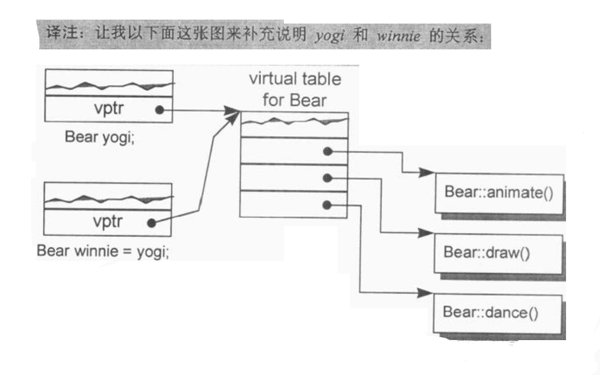
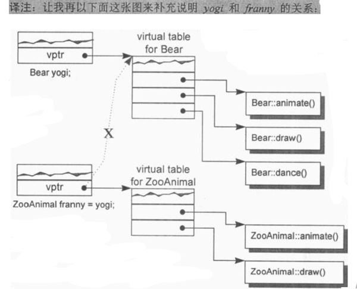

# 构造函数语意学 The Semantics of Constructors

本章主要挖掘编译器对于 “对象构造过程” 的的干涉，以及对于 “程序形式” 和 “程序效率” 上的冲击。

## 2.1 Default Constructor 的建构操作

default constructors 是在编译器需要它的时候，它才会被编译器产生出来。此外被合成出来的 constructor 只执行编译器所需的行动，也就是说，即使有需要为 class Foo 合成一个 default constructor ，那个 constructor 也不会将两个 data member 初始化为 0.

```C++
class Foo { public: int val; Foo *pnext; };
```

因此为了让代码正确执行， class Foo 的设计者必须提供一个明显的 default constructor ，将两个 members 适当的初始化。

C++ Standard 是这么描述的：

> 对于 class X ，如果没有任何 user-declared constructor ，那么会有一个 default constructor 被暗中(implicitly)声明出来......一个被暗中声明出来的 default constructor 将是一个 trivial constructor.....

下面分别讨论 nontrivial default constructor 的四种情况。

### 带有 Default Constructor 的 Member Class Object

如果一个 class 没有任何 constructor ，但它内含一个 member object ，而后者刚好有 default constructor ，那么这个 class 的 implicit default constructor 就是 nontrivial， 编译器需要为此 class 合成出一个 default constructor， 不过这个合成操作只有在 constructor 真正需要被调用时才会发生。

于是出现一个有趣的问题：在 C++ 各个不同的编译模块中，编译器如何避免合成出多个 default constructor ？ 解决方法是把合成的default constructor 、 copy constructor 、 deconstructor 、 assignment copy operator 都以 inline 的方式完成， 一个 inline 函数有静态链接 static linkage， 不会被档案以外者看到， 如果函数太复杂，不适合做成 inline， 就会合成出一个 explicit non-inline static 实体。

```C++
class Foo { public: Foo(), Foo(int) ... };
class Bar { public: Foo foo; char *str; }; //  不是继承而是内含！

void foo_bar()
{
    Bar bar;

    if ( str  ) { } ...
};
```

被合成的 Bar default constructor 内含必要的代码能够调用 class Foo 的 default constructor 来处理 member object Bar::foo, 但是它并不产生任何代码来初始化 Bar::str 。 将代码 Bar::foo 初始化是编译器的责任。 将 Bar::str 初始化是程序员的责任，被合成的 default constructor 看起来可能是这样：

```C++
// Bar 的 default constructor 可能会被这样合成
// 被 member foo 调用 class Foo 的 default constructor

inline
Bar::Bar()
{
    foo.Foo::Foo();
};

// 假设为了使得程序能够正确执行，字符指针 str 由程序员初始化
Bar::Bar() { str = 0; };
```

此时程序的 default constructor 已经被明确定义出来了，那么编译器要怎么做呢？
编译器的行动是：
> “如果 class A 内含一个 或一个以上的 member class objects ，
> 那么 class A 的每一个 constructor 必须调用每一个 member classes 的 default constructor” 。

编译器会扩张已存在的 constructors ，在其中安插一些代码，
使得 user code 在被执行前，先调用必要的 default constructor。

```C++
// 延续前例，扩张后的 constructors 可能像这样
Bar::Bar()
{
    foo.Foo::Foo();
    str = 0;
};
```

如果有多个 class member objects 都要求 constructor 初始化操作，则又该如何？

C++要求以 “member object 在 class 中的生命次序” 来调用各个 constructors 。这一点由编译器完成，它为每一个 constructor 安插程序代码，以 “member 声明次序” 调用每一个 member 所关联的 default constructors， 这些代码将会被安插在 explicit user code 之前。

```C++
// an example
class Dopey { public: Dopey(); ... };
class Sneezy { public: Sneezy( int ); Sneezy(); ... };
class Bashful { public: Bashful(); ... };

class Snow_White
{
    Dopey dopey;
    Sneezy sneezy;
    Bashful bashfu;
    // ...
    private:
        int mumble;
};

/*
如果 Snow_White 没有定义 default constructor，
就会有一个 nontrivial constructor 被合成出来，
依序调用 Dopey、 Sneezy、 Bashful 的 default constructors，
然而如果 Snow_White 定义了如下的 default constructor：
*/

// 程序员写的 default constructor
Snow_White::Snow_White() : sneezy ( 1024 )
{
    mumble = 2048;
}

// 它将会被扩张为

Snow_White::Snow_White() : sneezy( 1024 )
{
    dopey.Dopey::Dopey();
    sneezy.Sneezy::Sneezy(1024);
    bashful.Bashful::Bashful();

    mumble = 2048;
}
```

### 带有 Default Constructor 的 Base Class

类似的道理，如果一个没有任何 constructors 的 class 派生自一个带有 default constructor 的 base class， 那么这个 derived class 的 default constructor 会被视为 nontrivial， 因此需要被合成出来。

它将根据 base classes 的声明次序，依次调用他们的 default constructor，对一个后继派生的 class 而言，这个合成的 constructor 和一个 “被明确提供的 default constructor” 没有什么差异。

如果设计者提供多个 constructors， 但其中都没有 default constructor 呢？ 编译器会扩张现有的每一个 constructors， 将 “用以调用所有必要的 default constructors” 的程序代码加进去，它不会合成一个新的 default constructor ，这是因为其他 “由 user 所提供的 constructors” 存在的缘故，如果同时亦存在着 “带有 default constructors” 的 member class objects， 那么这些 default constructor 也会在 “所有 base class constructors 调用之后” 被调用。

### 带有一个 Virtual Function 的 Class

下面两种情况也需要合成出 default constructor：

1. class 声明（或继承）一个 virtual function，

1. class 派生自一个继承串连，其中有一个或更多的 virtual base classes。

不管那种情况，由于缺乏 user 声明的 constructors， 编译器会详细记录合成一个 default constructor 的必要信息。

```C++
/*
example
*/
class Widget {
    public:
        virtual void flip() = 0;
        // ...
};

void flip( const Widget& widget  ) { widge.flip(); }

void foo()
{
    Bell b;
    Whistle w;

    flip( b );
    flip( w );
};
```

下面两个扩张操作会在编译期间发生：

1. 一个 virtual function table 会在编译器产生出来， 内放 class 的 virtual functions 地址。

1. 在每一个 class object中， 一个额外的 pointer member （也就是 vptr） 会被编译器合成出来，内含相关的 class vtbl 的地址。

此外， widget.flip() 的虚拟引发操作 virtual invocation 会被重新改写，以使用 widget 的 vptr 和 vtbl 中的 flip() 条目：

    // widget.flip() 的 virtual invocation 的转变
    ( *widget.vprt[ 1 ])( &widget )

其中：

1. 1表示 flip() 在 virtual table 中的固定索引；

1. &widget 代表要交给 “被调用的某个 flip() 函数实体” 的 this 指针。

为了让这个机制发挥功效，编译器必须为每一个 Widget (或其派生类之) object 的 vptr 设定初值，放置适当的 virtual table 地址。 对于 class 所定义的每一个 constructor， 编译器会安插一些代码来做这样的事情。对于那些未声明任何 constructors 的 classes， 编译器会为它们合成一个 default constructor， 以便正确的初始化每一个 class object 的 vptr。

### 带有一个 Virtual Base Class 的 Class

Virtual base class 的实现法在不同编译器之间有很大差别，然而其共通点在于 “必须使 virtual base  class 在其每一个 derived object 中的位置，能够在执行期准备妥当。

```C++
// example
class X { public: int i; };
class A : public virtual X { public: int j; };
class B : public virtual X { public: double d; };
class C : public A, public B { public: int k; };

// 无法在编译时期决定 resolve 出 pa->X::i 的位置
void foo( const A* pa ) { pa->i  = 1024; }

main()
{
    foo( new A );
    foo( new C );
    // ...
}
```

编译器无法固定住 foo() 之中 “经由 pa 而存取的 X::i” 的实际偏移位置，因为 pa 的真正类型可以改变，编译器必须改变“执行存取操作”的那些码，使 X::i 可以延迟到执行期才决定下来。原先 cfront 的做法是靠 “在derived class object 的每一个 virtual base classes 中安插一个指针” 来完成。所有 “经由 reference 或 pointer 来存取一个 virtual base class” 的操作都可以通过相关指针来完成。上面的例子可以改写如下

```C++
// 可能的编译器转变操作
void foo( const A* pa ) { pa->__vbcX->i = 1024; }
// 其中 __vbcX 表示编译器所产生的指针，指向 virtual base class X
```

事实上， __vbcX 是在 class object 建构期间被完成的。对于 class 所定义的每一个 constructor， 编译器会安插那些 “允许每一个 virtual base class 的执行期存取操作” 的代码。 如果class没有声明任何 constructor ，编译器必须为他合成一个 default constructor。

### Summary on Default Constructors

C++ Standard 把合成出来的 constructor 称为 implicit nontrivial default constructors ，被合成出来的 constructor 只能满足编译器而非程序的需要。它之所以能够完成任务，是借着 “调用 member object 或 base class 的 default constructor” 或是 “为每一个 object 初始化其 virtual function 机制或 virtual base class 机制” 而完成。至于没有存在那四种情况而又没有声明任何 constructor 的 classes ，它们拥有的是 implicit trivial default constructors ，实际上它们并不会被合成出来。

在合成的 default constructor 中，只有 base class subobjects 和 member class objects 会被初始化，所有其他的 nonstatic data member ，如整数、整数指针、整数数组等都不会被初始化，这些初始化操作对程序而言或许有需要，但对编译器则并非必要。如果程序需要一个 “把某指针设为0” 的 default constructor ，那么提供它的人应该是程序员。

## 2.2 Copy Constructor 的建构操作

有3种情况，会以一个 object 的内容作为另一个 class object 的初值。

最明显的一种情况当然就是对一个 object 做明确的初始化操作，像这样：

```C++
class X { ... };
X x;
// 明确地以一个 object 的内容作为另一个 class object 的初值
X xx = x;
```

还有就是当 object 被当作参数交给某个函数时，例如：

```C++
extern void foo( X x );

void bar()
{
    X xx;
    // 以 xx 作为 foo() 的第一个参数的初值（不明显的初始化操作）
    foo( xx );
    // ..
}
```

以及当函数返回一个 class object 时：

```C++
X
foo_bar()
{
    X xx;
    // ...
    return xx;
}
```

假设 class 的设计者明确定义了如下一个 copy constructor （一个至少含有参数类型为 class type 的 constructor）

```C++
// user-defined copy constructor 的实例
// 可以是多参数形式，其第二个及后继参数以一个默认值供应

X::x( const X& x );
Y::y( const Y& y, int = 0 );
```

那么在大部分情况下，当一个 class object 以另一个同类实体作为初值时，上述的 constructor 会被调用，这可能会导致一个暂时性 class object 的产生或程序代码的蜕变（或两者都有）。

### Default Memberwise Initialization

当 class 没有提供一个 explicit copy constructor 又需要以 “相同 class 的另一个 object” 作为初值时，其内部是以所谓的 default memberwise initialization 手法完成的，也就是把每个内建的或派生的 data member （例如一个指针或一数组）的值，从某个 object 拷贝一份到另一个 object 身上，不过它并不会拷贝其中的 member class object ，而是以递归的方式进行 memberwise initialization。

```C++
// example
class String {
    public:
        // ... no explicit copy constructor
    private:
        char *str;
        int len;
};

// 一个 String object 的 default memberwise initialization 发生如下：

String noun( "book" );
String verb = noun;

// 其完成方式就好像个别设定每一个 members 一样：

// 语意相等
verb.str = noun.str;
verb.len = noun.len;

// 如果一个 String object 被声明为另一个 class 的 member，如：

class Word {
    public:

    // ... no explicit copy constructor

    private:
        int _occurs;
        String _word;
};
```

那么一个 Word object 的 default memberwise initialization 会拷贝其内建的 member_occurs ，然后再于 String member object_word 身上递归实施 memberwise initialization 。

正如前文， Default constructors 和 copy constructors 在必要的时候才需要由编译器产生出来。

上述讨论更形式化如下， **一个 class object 可以从两种方式复制得到，一种时被初始化，另一种是被指定即assignment。从概念上说，这两个操作分别是以 copy constructor 和 copy assignment operator 完成的。**

如果 class 没有声明一个 copy constructor ，就会有隐含的声明 implicitly declared 或者是隐含的定义 implicitly defined 出现。 C++ Standard 也会把 copy constructor 区分为 trivial 和 nontrivial 两种，只有 nontrivial 的实体才会被合成于程序之中，决定一个 copy constructor 是否为 trivial 的标准在于 class 是否展现出所谓的 “bitwise copy semantics” 。

### Bitwise Copy Semantics 位逐次拷贝

例如
```C++
#include "Word.h"
Word noun( "book" );

void foo()
{
    Word verb = noun;
    // ...
}
```

显然 verb 是根据 noun 来初始化的，但是在尚未看过 class Word 的声明之前，无法预测这个初始化操作的程序行为。如果 class Word 的设计者定义了一个 copy constructor ， verb 的初始化操作会调用它，但是如果 class Word 没有 explicit copy constructor ，那么是否会有一个编译器合成的实体被调用？

这个问题需要视该 class 是否展现 “bitwise copy semantics” 而定。

例如下面的 class Word 声明：

```C++
// 以下声明展现了 bitwise copy semantics
class Word {
    public:
        Word( const char* );
        ~Word() { delete [] str; }
        // ...
    private:
        int cnt;
        char *str;
};
```

这种情况下不需要合成出一个 default copy constructor ，因为上述声明中展现了 “default copy semantics” ，而 verb 的初始化操作也就不需要一个函数调用收场。

```C++
// 以下声明没有展现出 bitwise copy semantics
class Word {
    public:
        Word( const String& );
        ~Word();
        // ...
    private:
        int cnt;
        String str;
};

// 其中 String 声明一个 explicit copy constructor:
class String {
    public:
        String( const char * );
        String( const String& );
        ~String();
        // ...
};

// 在这个情况下，编译器必须合成一个 copy constructor 以便调用
// member class String object 的 copy constructor ：

// 一个被合成的 copy constructor
// C++ 伪码
inline Word::Word( const Word& wd )
{
    str.String::String( wd.str );
    cnt = wd.cnt;
}
```

有一点需要注意，被合成出来的 copy constructor 中，如整数、指针、数组等等 nonclass members 也会被复制。

### 不要 Bitwise Copy Semantics

什么时候一个 class 没有展现出 "bitwise copy semantics" 呢？有四种情况：

1. 当 class 内含一个 member object 而后者的 class 声明有一个 copy constructor 时（不论是被 class 设计者明确声明、或者是被编译器合成的）

1. 当 class 继承自一个 base class 而后者存在有一个 copy constructor 时

1. 当 class 声明了一个或多个 virtual functions 时

1. 当 class 派生自一个继承串链，其中有一个或多个 virtual base classes。

对于前两种情况，编译器必须将 member 或 base class 的 “copy constructor 调用操作” 安插到被合成的 copy constructor 中。后两种在下面讨论。

#### 重新设定 Virtual Table 的指针

前文提到 ，编译期间的两个程序扩张操作（只要有一个 class 声明了一个或多个 virtual functions 就会如此）：

1. 增加一个 virtual function table （vtbl） ，内含每一个有作用的 virtual function 地址。

1. 将一个指向 virtual function table 的指针 vptr ，安插在每一个 class object内。

很显然，如果编译器无法对于每一个新产生的 class object 的 vptr 都成功且正确的设置好初值，将导致可怕的后果。因此当编译器导入一个 vptr 到 class 之中时，该 class 就不再展现 bitwise semantics 了。现在编译器需要合成出一个 copy constructor ，以求将 vptr 适当地初始化，如下例

```C++
class ZooAnimal {
    public:
        ZooAnimal();
        virtual ~ZooAnimal();

        virtual void animate();
        virtual void draw();
        // ...
    private:
        // 上述 animate 与 draw 需要到数据
};

class Bear : public ZooAnimal {
    public:
        Bear();
        void animate();
        void draw(); // 虽未注明 virtual，该方法其实是 virtual
        virtual void dance(); // 虽未注明 virtual，该方法其实是 virtual
        // ...
    private:
        // 上述 animate 、 draw 、 dance 所需数据
};
```

ZooAnimal class object 以另一个 ZooAnimal class object 作为初值，或 Bear class object 以另一个 Bear class object 作为初值，都可以直接靠 “bitwise copy semantics” 完成。

例如

    Bear yogi;
    Bear winnie = yogi;

yogi 会被 default Bear constructor 初始化，而在 constructor 中， yogi 的 vptr 会被设定指向 Bear class 的 virtual table （靠编译器安插的码完成）。因此，把 yogi 的 vptr 值拷贝给 winnie 的 vptr 是安全的。


<div style="text-align: center">

</div>

 当一个 base class object 以其 derived class 的 object 内容做初始化操作时，其 vptr 复制操作也必须安全。

    ZooAnimal franny = yogi; // 这会发生切割行为， sliced

franny 的 vptr 不可以被设定指向 Bear class 的 virtual table ，否则当下面程序片段中的 draw() 被调用而 franny 被传进去时，程序炸毁 blow up。

```C++
void draw( cosnt ZooAnimal& zoey ) { zoey.draw(); }
void foo() {
    // franny 的 vptr 指向的是 ZooAnimal 的 virtual table,
    // 而不是 Bear 的 virtual table(由 yogi 的 vptr 指出)
    ZooAnimal franny = yogi;

    draw( yogi ); // invoke Bear::draw()
    draw( franny ); // invoke ZooAniaml::draw()
}
```

<div style="text-align: center">

</div>


