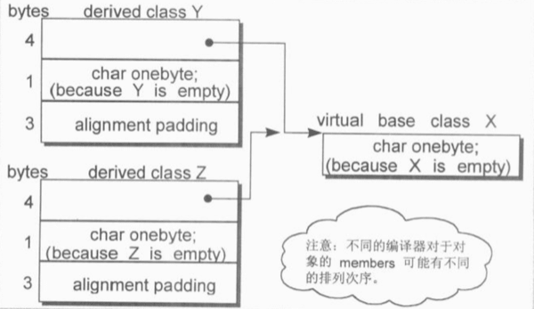
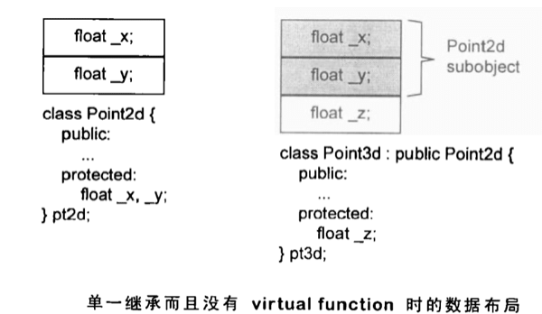

# Data 语意学 The Semantics of Data

一个空的 class 如 `class X {};` 的大小不为 0 ，而是 1 （`sizeof X == 1`）。

这 1 个隐含的字节是编译器安插进去的一个 char， 用来表示这个 object 在内存中的存在地址。

```c++
class Y : public virtual X {};
class Z : public virtual X {};
```

Y 和 Z 的大小也不为 0；在某些机器上 `sizeof Y == 8; sizeof Z == 8`。

Y 和 Z 的大小受到三个因素的影响：

1. 语言本身带来的额外负担 overhead ：当语言支持 virtual base classes 时，就会导致一些额外负担。在 derived class 中，这个额外负担反映在某种形式的指针上，它可能指向 virtual base class subobject，或指向一个相关的表格（表格中存放的不是 virtual base class subobject 的地址，就是其偏移量）。

1. 编译器对于特殊情况所提供的优化处理：Virtual base class X subobject 的 1 byte 大小也出现在了 class Y 和 Z 上面。传统上，它会被放在 derived class 的固定部分的尾端。某些编译器会对 empty virtual base class 提供特殊支持。

1. Alignment 的限制： class Y 和 Z 的大小截至目前为 5 bytes。alingment 的限制会补齐额外字节以提高在内存中的使用效率。最终结果变成了 8 bytes。

<div style="text-align: center">

</div>

Empty virtual base class 已经成为 C++ OO 设计的一个特有术语。它提供一个 virtual interface，没有定义任何数据。某些编译器对此提供了特殊处理，他们认为 empty virtual base class 被视为 derived class object 最开头的一部分，也就是说它不会花费任何额外空间。这就节约了上面的 1 个 byte， 因为既然有了 member，就不需要之前为了 empty class 而安插的那一个 char。这种模型情况下 Y 和 Z 的大小都是 4 （节约一个字节后，且不用再 alignment）。

```c++
class A : public Y, public Z {};
```

那么 class A 的大小是什么呢？

先不考虑编译器会特别处理 empty virtual base class 的情形：

一个 virtual base class subobject 只会在 derived class 中存在一份实体，不管它在 class 继承体系中出现了多少次。 class A 的大小由下面几点决定：

1. 被大家共享的唯一一个 class X 实体，大小为 1 byte

1. Base class Y 的大小，减去 _因 virtual base class X 而配置_ 的大小，是 4 bytes，同理，Z 也是 4 bytes。

1. class A 的 member，0 byte.

1. class A 的 alignment。

前三个大小总和是 9 bytes，在 32 位机上，A 会被补齐成 12 bytes；在 64 位机上，A 会被补齐位 16 bytes。

当编译器对 empty virtual base class 做优化处理时，class X 实体的那个 1 byte 节约掉了。A 从 9 bytes 变成了 8 bytes，不需要额外的 alignment 。

一个 class 的 data members，可以表现这个 class 在程序执行时的某种状态。Nonstatic data members 放置的是 _个别的 class object 感兴趣的数据_ ，static data members 则放置的是 _整个 class 感兴趣的数据_。

每一个 class object 因此必须有足够的大小来容纳它所有的 nonstatic data members，主要原因是：

1. 由编译器自动加上的额外 data members，用以支持语言的特性，如 virtual 。

1. Alignment 需要。

## Data Member 的绑定 The Bingding of a Data Member

C++ Standard 中 `member scope resolution rules` 限制了 class 内的变量引用问题。这就是对于 data member 的一种绑定。

简单的说，class 内的 data member 会把 global 或者 extern 的同名变量 shadow 掉。

## Data Member 的布局 Data Member Layout

C++ Standard 要求，在同一个 access level 中，members 的排列只需要符合 _较晚出现的 members 在 class object 中有较高的地址_ 这个规则就好了。

编译器还可能合成一些内部使用的 data members，以支持整个对象模型。 vptr 就是这样一个东西，当所有的编译器都把它安插在每一个 _内含 virtual function 的 class_ 的 object 中。 vptr 的位置可能在所有明确声明的 members 的最后，或者是在一个 class object 的最前端。

```c++
class Point3d {
public:
  //...
private:
  float x;
  static List<Point3d*> *freeList;
private:
  float y;
  static const int chunkSize = 250;
private:
  float z;
}

// 上下两种声明，对于编译器来说是等价的

class Point3d {
public:
  //...
private:
  float x;
  static List<Point3d*> *freeList;
  float y;
  static const int chunkSize = 250;
  float z;
}
```

## Data Member 的存取

一个 class 的 member 可能是 static member，也可能是 nonstatic member，也可能是从继承或者虚拟继承而来的。

### Static Data Members

Literally，Static Data Members 被编译器提出于 class 之外，并被视为一个 global 变量。每一个 member 的 access level，以及与 class 的关联，并不会导致任何空间上或者执行时间上的额外负担。

每一个 static data member 只有一个实体，存放在程序的 data segment 之中。每次程序存取 static member，就会被内部转化为对该唯一的 extern 实体的直接参考操作。

从指令执行的观点来看，这是 C++ 语言中 _通过一个指针和通过一个对象来存取 member，结论完全相同_ 的唯一一种情况。_经过 member selecttion operators (.运算符) 对一个 static data member 进行存取操作_ 只是一个语法糖。 member 其实不在 class object 中，因此存取 static members 并不需要通过 class object。

即使 class 中通过复杂继承结构而来的一个 member，程序的存取路径仍然是直接的。因为程序中对于 static members 只有唯一一个实体。

如果 static data member 的存取是经由函数调用该怎么处理？

```c++
cout << foobar().chunkSize << endl;
```

C++ Standard 里面要求 foobar() 要被 evaluated，虽然它的结果并无用处。一种可能的转化：

```c++
foobar().chunkSize = 250;

//evaluted expression, discard result
(void) foobar()
// using class directly rather than a class object
Point3d.chunkSize = 250;
```

如果取一个 static data member 的地址，会得到一个指向其数据类型的指针，而不是一个指向其 class member 的指针，因为 static member 并不内含在一个 class object 之中。

如果有多个 classes 都各自声明了 static member freeList，那么当他们都被放在程序的 data segment 时，会导致名称冲突。编译器的做法是采用 name-mangling，对每一个 static data member 进行编码以获得独一无二的程序识别码。

### Nonstatic Data Members

Nonstatic data members 直接存放在每一个 class object 中。除非通过 explict 或者 implicit 的 class object，程序没有办法直接存取他们。

程序中一个 member function 中直接处理一个 nonstatic data member，所谓的 implicit class object 就会发生：

```c++
Point3d
Point3d::translate(const Point3d &pt)
{
  x += pt.x;
  y += pt.y;
  z += pt.z;
}

// member function 内部转化， implicit object
Point3d
Point3d::translate(Point3d *const this, const Point3d &pt)
{
  this->x += pt.x;
  this->y += pt.y;
  this->z += pt.z;
}
```

如果要对一个 nonstatic data member 进行存取操作，编译器需要把 class object 的起始地址加上 data member 的偏移量 offset。

```c++
origin._y = 0.0;

// ->
&origin + (&Point3d::_y - 1);
```

注意其中的 -1 操作。指向 data member 的指针，其 offset 值总是被加上 1，这样有利于编译器区分 _一个指向 data member 的指针，用以指出 class 第一个 member_ 和 _一个指向 data member 的指针，没有指向任何 member_ 这两种情况。

每一个 nonstatic data member 的  offset 在编译时期就可以得到，即便是 member 属于一个 base class subobject （派生自单一或者多重继承串链）也是一样。因此，存取一个 nonstatic data member，其效率和存取一个 C struct member 或 nonderived class 的 member 是一样的。

现在考虑虚拟继承。虚拟继承会给 _经由 base class subobject 存取 class members_ 增加一层新的间接性。

```c++
Point3d *pt3d;
pt3d->_x = 0.0
```

它的执行效率在 \_x 是一个 struct member，class member，单一继承，多重继承的情况下完全相同。但如果 \_x 是一个 virtual base class 的 member，存取速度会比较慢一点。

```c++
origin.x = 0.0;
pt->x = 0.0;
```

在编译时期，如果使用 origin，它的类型无疑是 Point3d class，即使它继承自 virtual base class，members 的 offset 位置在编译时期就固定了（编译器甚至可以静态地经由 origin 就解决掉 x 的存取）。但是 pt 没有这么幸运，pt 指向哪一种 class type 只有到程序运行时期才能真正的确定下来，x 的存取因此延迟到了执行期，而且需要一个而外的简介导引。

## 继承 和 Data Member

在 C++ 继承模型中，一个 derived class object 所表现出来的东西，是他自己的 members 加上它 base class(es) members 的总和。但是 C++ Standard 中没强制规定 derived class members 和 base class(es) members 的排列次序，编译器可以自由安排。大部分的编译器采取的策略是： base class members 总是先出现，virtual base classes 的除外。

> 一般而言，任何一条规则一旦碰上 virtual base class 就没辙。

### 只有继承，没有多态 Inheritance without Polymorphism

一般而言，具体继承 concrete inheritance （相对于虚拟继承 virtual inheritance） 并不会增加空间或存取时间上的额外负担。

下面显示了一种 Point2d 和 Point3d 继承关系的实物布局，其中并没有声明 virtual 接口。

<div style="text-align: center">

</div>

如果把两个独立不相关的 classes 凑成一对 type/subtype，并带有继承关系，会出现哪些容易的设计误区？

1. 重复设计一些相同操作的函数。

1. 为了表现 class 体系的抽象化，可能需要更多存储空间（ Alignment 的副作用 ）。

TBC

### 多态的继承 Inheritance with Polymorphism

### 多重继承 Multiple Inheritance

## 对象成员的效率 Object Member Efficiency

## 指向 Data Members 的指针 Pointer to Data Members
