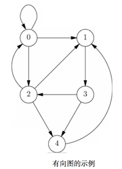
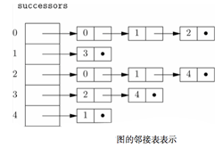
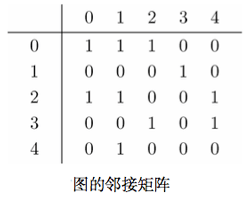
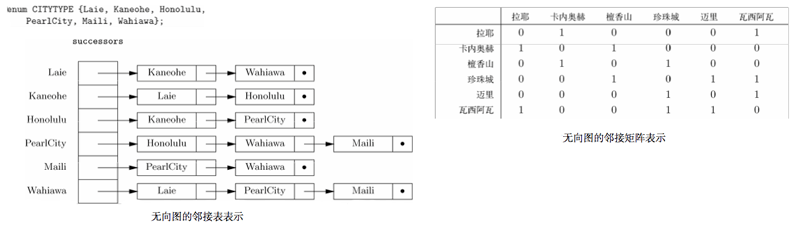

# 图

从某种意义上看，图就是二元关系。利用一系列由线（边）或箭头（弧）连接的点（节点）提供了强大的视觉效果。

图就是树魔性的泛化。

图具有多种形式：有向图/无向图，标号图/无标号图。

# 基本概念

## 有向图

*有向图*：由节点集合N以及N上的二元关系A组成。将A称为有向图*弧*的集合。因此弧时节点的有序对。

*弧*：`(u, v)`都是从节点`u`指向`v`的箭头表示的，也可以记作`u → v`。此时，`u`称为`v`的前导(predecessor)，`v`称为`u`的后继(successor)。

*标号*：可以为图中各个节点、弧添加标号。但是节点名称和标号是不同的概念，节点名称应该唯一，而标号可以相同。

*路径*：有向图中的路径是一列节点（v<sub>1</sub>, v<sub>2</sub>, ... , v<sub>k</sub>），每个节点到下一个节点都存在弧，因此路径长度为`k-1`。根据条件，允许存在路径的长度为0的情况，任何节点本身都是一条从自身到自身的长度为0的路径，该路径上没有弧。

> <div style="text-align: center">
> 
> </div>
> 节点集合 `N = {0, 1, 2, 3, 4}`。
> 因此弧的集合是 `A = {(0,0), (0,1), (0,2), (1,3), (2,0), (2,1), (2,4), (3,2), (3,4), (4,1)}`

*有环图和无环图*：有向图中的环路(cycle)是指起点与终点为同一节点的长度不为0的路径。环路的长度就是这条路径的长度。但是路径长度为0时，不是环路。然而，由一条弧`v → v`构成的路径时一条长度为1的环路。简单环路的唯一重复节点是最终节点，其他节点并不重复出现。

可以证明如果途中有一条环路，那么一定至少含有一条简单环路。

如果图中含有一条或者多条环路，就说该图时*有环的*，否则就是*无环的*。


> <div style="text-align: center">
> 
> </div>
> 函数自我调用，直接递归，在图中表现为*自环*。

*无环路径*：如果路径中没有节点出现一次以上，就说明该路径是*无环的*。如果存在从`u`到`v`的路径，就存在从`u`到`v`的无环路径。

## 无向图

*无向图*：用没有方向的线条（边）连接节点的图。记作`{u, v}`，表示节点`u`和`v`是邻接的。

*路径*：无向图的路径是各节点与下一节点都由边连通的节点列（v<sub>1</sub>, v<sub>2</sub>, ... , v<sub>n</sub>）。某个特定的边中元素是没有特定次序的。路径的长度为`k-1`，节点本身是一条长度为0的路径。

*环路*：无向图中定义的*简单环路*最简单的方式可能是指长度不小于3而且起点和终点为同一节点，而且预期最后的节点不会与任何节点重复的路径。

# 图的实现

标准方式有两种，*邻接表*与*邻接矩阵*。

## 对有向图的考虑

### 邻接表

```C
typedef struct CELL *LIST;
struct CELL {
    NODE nodeName;
    LIST next;
};

LIST successors[MAX];
# successors[u] 包含了一个指针，指向由节点u的所有后继组成的链表。
```

> <div style="text-align: center">
> 
> </div>

### 邻接矩阵

创建二维数组，如果存在弧`u → v`，则`arc[u][v]`的值为TRUE，否则为FALSE。

> <div style="text-align: center">
> 
> </div>

```
BOOLEAN arcs[MAX][MAX]
```

> 邻接表与邻接矩阵的对比

> 当图很稠密，弧的数量接近最大可能数字(n个节点的图就是n<sup>2</sup>)，倾向于用*邻接矩阵*来表示。

> 图稀疏的时候，用*邻接表*可能节省空间。

| 操作 | 稠密图 | 稀疏图 |
|:---:|:-----:|:----:|
|查找弧|邻接矩阵|  皆可  |
|找后继|  皆可  | 邻接表 |
|找前导|邻接矩阵|  皆可  |

当图中有n个点，a条弧：

1. 在查找某给定的弧时，图越稠密，就越愿意选择邻接矩阵（只有O(1)）而不是邻接表（先找点`u`再遍历后续表，平均O(1+a/n)）。

1. 在查找某给定节点的后继时，使用邻接表（先找表头在遍历该表，平均O(a/n))要比使用邻接矩阵（遍历某一行，O（n)且与a无关)快得多。

1. 在查找某给定节点的全部前导节点，邻接矩阵只需要O(n)即可，而邻接表完全帮不上忙，需要遍历每条弧，用时O(a)。

> 度的问题

> 从节点`v`出发的弧的数量叫做`v`的出度，等于其邻接表的长度，也等于相应的邻接矩阵中对应行1的数量。

> 进入节点`v`的弧的数量叫做`v`的入度。入度衡量的是节点v在某节点的邻接表中出现的次数，而且是相应的邻接矩阵中对应列中1的数量。

> 无向图中则不区分出度、入度。节点`v`的度就是`v`的邻居的数量。

## 对无向图的考虑

可以假装每条边都被替代为两个方向上的弧，并将得到有向图用邻接表或邻接矩阵表示出来。如果使用邻接矩阵，那么该矩阵是对称点，`edges[v][u]=edges[u][v]`。

> <div style="text-align: center">
> 
> </div>

## 标号图的考虑

假设图的弧（无向图的边）带有标号。

在使用邻接矩阵时，就可以将表示弧`u → v`在图中出现的值来替换为该弧的标号。而且必须要有一些可作为矩阵的项但又不会与标号混淆的值用来作为表示节点直接没有弧的情况。

用邻接表来表示图时，就要为构成各链表的单元添加一个`nodeLabel`字段。如果存在标号为`L`的弧`u → v`，那么在对应节点`u`的邻接表中就会找到`nodeName`字段为`v`且`nodeLable`字段为`L`的单元。`nodeLale`字段表示该弧的标号。

此外，要用另一种方式表示节点的标号。对邻接矩阵来说，只要创建另一个名为`NodeLabels`的数组，并设`NodeLabels[u]`是节点`u`的标号。在使用邻接表时，已经有了以节点为索引的表头数组，需要把该数组的元素改为结构体，一个字段为节点标号，另一个字段为指向邻接表开头的指针。

# skiped，连通图，最小生成树

# 深度优先搜索

必须要小心图中环的存在，环会导致无限递归。因此简单的解决方案：在访问节点的过程中为其做上标记，并永不再次访问标记过的节点。

> 如果将树中多弧看作存在从父节点到子节点的方向，树就可以看作有向图的一个特例，而且，树总是无环图。

```C
enum MARKTYPE { VISITED, UNVISITED };
typedef struct {
    enum MARKTYPE mark;
    LIST successors;
} GRAPH[MAX];

typedef struct CELL *LIST;
struct CELL {
    NODE nodeName;
    LIST next;
}

void dfs(NODE u, GRAPH G)
{
    LIST p;
    NODE v;

    G[u].mark = VISITED;
    p = G[u].successors;
    while (p != NULL) {
        v = p->nodeName;
        if (G[v].mark == UNVISITED)
            dfs(v,G)
        p = p->next;
    }
}

void dfsForest(GRAPH G
{
    NODE u;

    for (u = 0; u < MAX; u++)
        G[u].mark = UNVISITED;
    for (u = 0; u < MAX; u++)
        if (G[u].mark == UNVISITED)
            dfs(u,G);
}
```

## 构建深度优先搜索树

对`dfs(u)`的调用，带来对`dfs(v)`的调用，那么就让`v`成为`u`在搜索树的子节点。`u`的子节点是按照对这些子节点调用`dfs`的次序从左向右出现的。第一次`dfs`调用的节点成为该树的根节点，root。可以称形成的树为某给定图的*深度优先搜索树*。

弧的分类，树向弧，前向弧，后向弧，横向弧。

## 搜索森林

当从某些节点开始，无法达到所有节点，则可能需要构建一系列的搜索树。

从某个节点`u`开始调用`dfs(u)`。完成之后如果还有节点未被访问国，就再选择一个节点进行树的构建。

当所有节点都被分配到至少一棵树之后，就按照构建树的先后次序，列出这一系列树，并称为*深度优先搜索森林*。

TODO 9.7, too complicated...