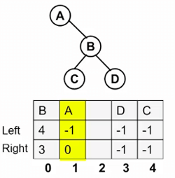
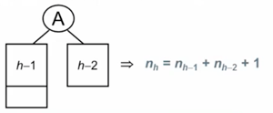
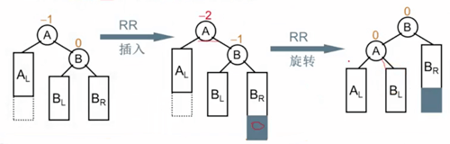
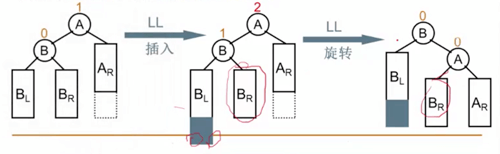
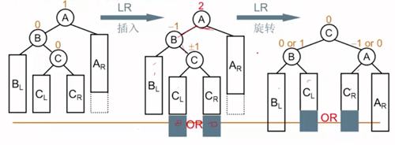
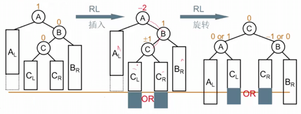

# Tree 树

## Features

- 操作运行时间平均为`O(logN)`
- 二叉查找树，`binary search tree`， `set`和`map`的实现基础。
- 组成
  - 根
  - 结点（叶结点，兄弟结点，父结点，子结点）
  - 路径，深度
- [实现](#implementation)
- [二叉树](#binary-tree)
- [平衡树和伸展树](#平衡树和伸展树)
- [遍历](#traversal)


## Implementation

树的实现关键点在于当前结点指向其他结点的情况。
有个疑问：某个结点的父节点怎么知道？

```C#
struct TreeNode 
{
    Object element;
    TreeNode *firstChild;
    TreeNode *nextSibling;
}
```

在UNIX的文件系统（类树结构），每个结点含有额外两个指针，一项指向自身，另一项指向父目录。 

## Binary Tree

每个结点均不能有多于两个儿子的树。二叉树的实现略有不同。

```C#
struct BinaryTreeNode
{
    Object element;
    BinaryTreeNode *left;
    BinaryTreeNode *right; 
}
```

### 表达树二叉树

叶结点是操作数(operand)，其他结点为操作符(operator)。

### 二叉查找树

成为二叉查找树的关键是**对于结点X，其左子树中所有项均小于X，而其右子树中所有项均大于X**。
递归的查找时，平均深度是`O(logN)`，查找效率决定于树的高度。

```C
# 在查找目标时（无论精确项、最小项 或者最大项），不论选择递归方式或者while循环，都应先进行处理空树的退化情形，避免出现`NULL`引用。

Position Find (ElementType x, BinaryNode BST)
{
    if (!BST) return NULL;
    if ( x > BST->element )
        return Find( x, BST->right );
    else if ( x < BST->element )
        return Find( x, BST->left );
    else 
        return BST;
}

Position IterFind (ElementType x, BinaryNode BST)
{
    while (BST) {
        if ( x > BST->element)
            BST = BST->right;
        else if ( x < BST->element )
            BST = BST->left;
        else
            return BST;
    }
    return NULL;
}

Position FindMin(BinaryNode BST)
{
    if ( !BST ) return NULL;
    else if ( !BST->left)
        return BST;
    else
        return FindMin( BST->left );
}

Position FindMax (BinaryNode BST)
{
    if ( BST )
        while (BST->right) BST = BST->right;
    return BST;
}
```

插入方法可以类似与查找过程，直到找到空位置允许新建该插值。 

```C# 
void insert ( const Comparable & x, BinaryNode * & t )
{
    if ( t == NULL )
        t = (BinaryNode)malloc(sizeof(struct BinaryNode));
        t->element = x;
        t->left = t->right = NULL;
    else if ( x < t->element )
        t->left = insert( x, t->left );
    else if ( x > t->element )
        t->right = insert( x, t->right );
    else
        ; //Duplicate, do nothing

    return t;
}
```

删除时，需要考虑结点是否有子节点，情况多种。

```C#
# no child node, remove direclty 
# one child node, either left or right, after changing the reference in father to that child should be removed 
# either 0 or 1 child, the actual progress is replace the target node with the child node, NULL if there no child.

# two children node, find the minNode in target's right children tree, then replace the target with minNode, then removing the minNode will be the same as the situation in the above. 

void remove ( const Comparable & x, BinaryNode * & t)
{
    if ( t == NULL )
        return ; // Item not found, do nothing
    if ( x < t->element )
        remove( x, t->left );
    else if ( x > t->element )
        remove( x, t->right );
    else if ( t->left != NULL && t->right != NULL ) // Two children
    {
        t->element = findMin( t->right )->element;
        remove(t->element, t-right);
    }
    else
    {
        BinaryNode *oldNode = t;
        t = ( t->left != NULL ) ? t->left : t->right;
        delete oldNode;
    }
}
```

* 析构函数，回收内存

```C#
~BinarySearchTree( )
{
    makeEmpty();
}

void makeEmpty( BinaryNode * & t)
{
    if ( t != NULL )
    {
        makeEmpty( t->left );
        makeEmpty( t->right );
        delete t;
    }
    t = NULL;
}
```

* Deep Copy

```C#
const BinarySearchTree & operator=( const BinarySearchTree & rhs )
{
    if ( this != &rhs )
    {
        makeEmpty( );
        root = clone( rhs.root );
    }
    return *this;
}

BinaryNode * clone( BinaryNode * t ) const
{
    if ( t == NULL )
        return t;
    
    return new BinaryNode( t->element, clone( t->left ), clone( t->right ) );
}
```

* 除了`makeEmpty`和`operator=`以外所有操作的运行时间均为`O(d)`，d为包含所访问项结点的深度。不过树所有结点的平均深度为`O(logN)`。

## 平衡树和伸展树 

## Traversal

树的遍历

* [前序遍历](#前序遍历)
* [中序遍历](#中序遍历)
* [后序遍历](#后序遍历)
* [极少出现的层序遍历](#层序遍历)

### 前序遍历 

当前结点处理在它的儿子结点被处理之前。

### 中序遍历

先处理当前左子树，然后处理当前结点，最后处理右子树。

```C#
# 一个运行时间为 O(N) 的中序遍历例程，打印整个树

void printTree( ostream & out = cout ) const
{
    if ( isEmpty( ) )
        out << "Empty tree" << endl;
    else
       __printTree( root, out );
}

void __printTree( BinaryNode * t, ostream & out ) const
{
    if ( t != NULL ) 
    {
        __printTree( t->left, out );
        out << t->element << endl;
        __printTree( t->right, out);
    }
} 
```

### 后序遍历

当前结点处理在它的儿子结点被处理之后。

```C#
# 一个运行时间为 O(N) 的后续遍历例程，计算当前结点的高度
int height ( BinaryNode * t )
{
    if ( t == NULL )
        return -1;
    else
        return 1 + max( height( t->left ), height( t->right ));
}
```

### 层序遍历

这种遍历方法极少出现，所有深度为`d`的结点要在深度为`d+1`的结点之前进行处理。层序遍历是以队列方式实施，而不是递归所默认的栈。

一种解法就是通过队列的方式，利用先进先出，将每层的元素依次塞到末尾，从头逐个取出，如下：
```javascript
function TrieByLevel ( root ) {
    let queue = [root];
    while(queue.length > 0) {
        let tmp = queue.shift();
        console.log(tmp);
        if (tmp.left) {
            queue.push(tmp.left);
        }
        if (tmp.right) {
            queue.push(tmp.right);
        }
    }
}
```
层序遍历也可以看作是广度优先的遍历，深度优先的遍历则可以借助堆栈的性质来完成，需要先将右子节点入栈，再将左子节点入栈，如下：
```javascript
function DepthTrie(root) {
    let queue = [root];
    while(queue.length > 0) {
        let tmp = queue.pop();
        console.log(tmp);
        if (tmp.right) {
            queue.push(tmp.right);
        }
        if (tmp.left) {
            queue.push(tmp.left);
        }
    }
}
```

## 二叉静态链表实现检验树的同构


> <div style="text-align: center">
> 
> </div>


```C
#define MaxTree 10
#define ElmentType Char
#define Tree int
#define Null -1
struct TreeNode
{
    ElementType Element;
    Tree Left;
    Tree Right;
} T1[MaxTree], T2[MaxTree];

int main ()
{
    Tree R1, R2;
    R1 = BuildTree(T1);
    R2 = BuildTree(T2);
    if (Isomorphic(R1,R2)) printf("Yes\n");
    else printf("No\n");

    return 0;
}

Tree BuildTree (struct TreeNode T[])
{
    # node amounts
    scanf("%d\n", &N); 

    if (N) {
        /* DataType {string} A, {number} leftNodeIndex, {number} rightNodeIndex */
        for (i = 0; i < N; i++) check[i] = 0;
        for (i = 0; i < N; i++) {
            scanf("%c %c %c\n", &T[i].Element, &cl, &cr);
            if (cl != '-') {
                T[i].Left = cl-'0';
                check[T[i].Left] = 1;
            } else T[i].Left = Null;
            if (cr != '-') {
                T[i].Right = cr - '0';
                check[T[i].Right] = 1;
            } else T[i].Right = Null;

            for (i = 0; i < N; i++) 
                if (!check[i]) break;
            Root = i;
        }
    }
    return Root;
}

int Isomorphic ( Tree R1, Tree R2)
{
    /* both empty */
    if ( R1==Null && R2==Null )
        return 1;

    /* only one of them is empty */
    if ( (R1==Null && R2!=Null) || (R1!=Null && R2==Null) )
        return 0;

    /* root are different */
    if (T1[R1].Element != T2[R2].Element)
        return 0;

    /* both have no left subtree */
    if (T1[R1].Left == Null && T2[R2].Left == Null)
        return Isomorphic(T1[R1].Right, T2[R2].Right);

    /* no need to swap the left and the right */
    if ( (T1[R1].Left != Null && T2[R2].Left != Null) && (T1[T1[R1].Left].Element != T2[T2[R2].Left].Element) )
        return (Isomorphic(T1[R1].Left, T2[R2].Left) && Isomorphic(T1[R1].Right, T2[R2].Right));
    else /* need to swap the left and the right  */
        return (Isomorphic(T1[R1].Left, T2[R2].Right) && Isomorphic(T1[R1].Right, T2[R2].Left));
}
    
```

## B树 

## 平衡二叉树

搜索树的结点插入次序不同，将导致不同的树结构（不同的深度以及不同的平均查找长度ASL）。

*平衡因子（Balance Factor）*：BF(T) = h<sub>l</sub> - h<sub>r</sub>，其中h<sub>l</sub>、h<sub>r</sub>分别位T的左、右子树的高度。

平衡二叉树，Balanced Binary Tree，空树或者任一结点左、右子树高度差的绝对值不超过1。

设 n<sub>h</sub> 高度为 h 的平衡二叉树的最少节点数。类似于斐波那契数列。

> <div style="text-align: center">
> 
> </div>

可以证明，给定结点数为 n 时，数的高度能达到 log(n)。

### 平衡二叉树的调整

可以归结为四种情况，二叉树的调整时，一定要保证搜索性质不变，左子树小于当前结点，右子树大于当前结点。

*RR插入*：不平衡的发现者是 A， 麻烦结点（灰色区域）是在发现者 A 的右子树的右边，需要进行RR旋转，右单旋。


> <div style="text-align: center">
> 
> </div>

*LL插入*：不平衡的发现者是 A，麻烦结点（灰色区域）是发现者 A 的左子树的左边，需要进行LL旋转，左单旋。

> <div style="text-align: center">
> 
> </div>

*LR插入*：不平衡的发现者是 A，麻烦结点（灰色区域）是发现者 A 的左子树的右边，需要进行LR旋转。

> <div style="text-align: center">
> 
> </div>

todo pictures

*RL插入*：不平衡的发现者是 A，麻烦结点（灰色区域）是发现者 A 的右子树的左边，需要进行RL旋转。

> <div style="text-align: center">
> 
> </div>

