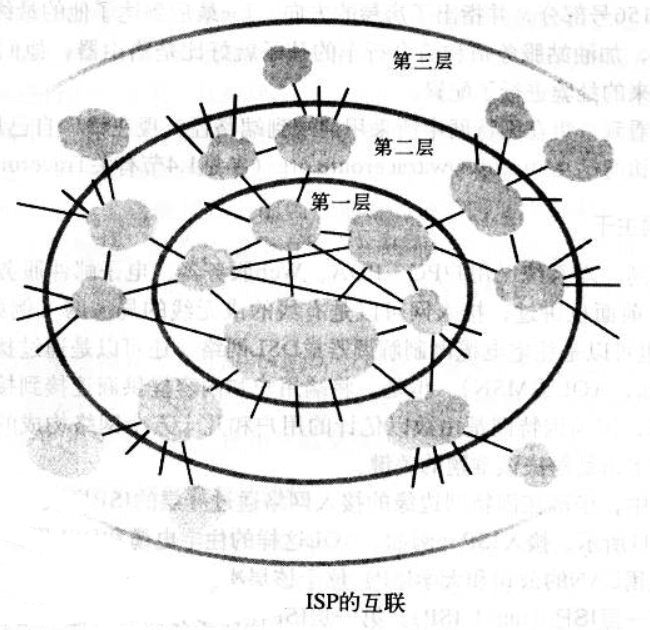
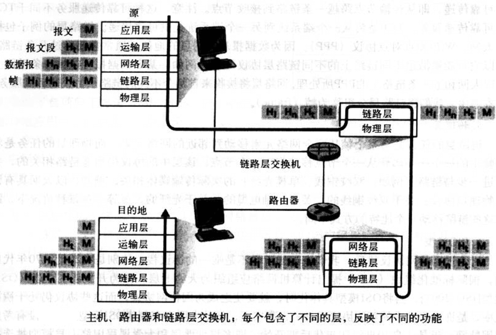

# 计算机网络和因特网

## Summary

本章再来了解某些基本术语和概念之后，将先看看构成网络的**基本硬件和软件组件** 。从 **网络的边缘** 开始，考察在网络中运行的 **端系统和网络应用** ；再研究计算机网络的核心，探讨 **传输数据的链路和交换机** ，以及连接端系统与网络核心的 **接入网和物理媒体** 。将了解因特网是 “网络的网络” ，以及这些网络是如何彼此连接起来的。

浏览完计算机网络的边缘和核心之后，将从更广泛、更抽象的角度来考察计算机网络。介绍计算机网络中 **时延、丢包和吞吐量** ，给出一个简单的 端到端 吞吐量和时延的定量模型，并且给出考虑了传输、传播和排队时延的模型。

再接下来介绍计算机联网时的一些关键的体系结构上的原则，（如协议分层和服务模型）。

## About Internet

### Internet的构成

因特网中所有设备都称为 **主机 host** 或者 **端系统 end system** 。端系统通过 **通信链路 communication link** 和 **分组交换机 packet switch** 连接到一起。

当一台端系统有数据要向另一台端系统发送时，发送端系统将数据分段，并为每段都加上首部字节，由此形成的信息包被称为 **分组 packet** ，这些分组通过网络发送到目的端系统。

分组交换机从它的一条 **入通信链路** 中接收到达的分组，并从它的一条 **出通信链路** 转发该分组。典型的交换机是 **路由器 router** 和 **链路层交换机 link-layer switch** 。

从发送端系统到接收端系统，一个分组所经历的一系列通信链路和分组交换机被称为该网络的 **路径 route or path** 。

端系统通过 **因特网服务提供商 Internet Service Provider ,ISP** 接入因特网。每个ISP是一个由多个分组交换机和多段通信链路组成的网络。低层的ISP通过国家的、国际的高层ISP互联起来。高层的ISP是由通过高速光线链路互联的高速路由器组成。

端系统、分组交换机和其他因特网部件，都要运行控制因特网中信息接受和发送的一系列 **协议 protocol**。 TCP (Transmission Control Protocol，传输控制协议) 和 IP (Internet Protocol，网际协议)是两个最为重要的协议。IP协议定义了分组在路由器和端系统中发送和接收的格式。 **因特网工程任务组 (Internet Engineering Task Force, ITTF)** 的标准文档被称为 **Request For Comment, RFC** 。

### 服务描述

还可以从另外的角度来看待因特网。 **为应用程序提供服务的基础设施** ，这些应用程序包括电子邮件、Web、IM、Stream Media、P2P，称为 **分布式应用程序 distribution application** 。它们设计多台相互交换数据的的端系统。而且， **因特网应用程序是运行在端系统上，而不是在网络核心中的分组交换机上** 。

运行在一个端系统伤的APP如何才能指示因特网向运行在另一个端系统上的APP发送数据呢？

与因特网相连的端系统提供了一个 API ，它规定了运行在一个端系统上的软件请求因特网基础设施向运行在另一个端系统上特定目的地软件交互数据的方式。

### What is Protocol

一个 **协议** 定义了在两个或多个通信实体之间交换的报文格式和次序，以及在报文传输和、或接收其他事件方面所采取的动作。

## 网络边缘

本节了解身边非常熟悉的部件， Computer\PDA\Cell Phone 等，下节会从网络边缘向网络核心推进，探讨计算机网络中的交换和选路。

与因特网相连接的计算机等设备通常被称为 **端系统** ，因为它们位于因特网的边缘。

端系统也称为 **主机 host** ，因为它们容纳（即运行）各种应用程序。在本书中， 主机 === 端系统 。主机有时候被进一步划分为两类： **客户机 client** 和 **服务器 server**。

### 客户机和服务器程序

**客户机程序 client program** 是运行在一个端系统上的程序，它发送请求，并从运行在另一个端系统上的 **服务器程序 server program** 接收服务。

客户机程序和服务器程序在因特网互相发送报文而进行交互。在这个层次的抽象下，路由器、链路和因特网服务的其他具体构件可看作一个“黑盒子”。下图中一条横跨的黑线显示了这种级别的 抽象。

除了客户机、服务器这样的功能以外，例如 P2P文件共享应用程序 使得端系统既能够作为客户机又能作为服务器。当它向另一个对等方请求文件时，起客户机的作用，当它向另一个对等方发送文件时，起服务器作用。

### 接入网 access network

将端系统连接到 **因特网边缘路由器 edge router** 的物理链路，称为 **接入网 access network** 。边缘路由器时端系统到任何其他远程端系统的路径上的第一台路由器。

网络接入大致可分为三类：

- 住宅接入 residential access，
- 公司接入 company access，
- 无线接入 wireless access

> 住宅接入

一种接入形式是通过普通模拟电话线用 **拨号调制解调器 dial-up modem** 与住宅 ISP 相连。家用调制解调器将 PC 输出的数字信号转换为模拟形式，以便在模拟电话线上传输。

拨号的方式速度极低，替代的则是新型的宽带接入技术，有两种常见类型： **数字用户线 digital subscriber line, DSL** 和 **混合光纤同轴电缆 hybrid fiber-coaxial cable, HFC** 。

DSL 概念上类似于拨号调制解调器，是一种新型调制解调器技术。通过限制用户和 ISP 调制解调器之间的距离， DSL 能够以高得多的速率传输和接收数据。另外数据传输速率在两个方向上是不对称的， 从 ISP 路由器到家庭的速率比从家庭到 ISP 路由器的速率要高。

HFC 接入网扩展了当前用于广播电缆电视到电缆网络。在传统到电缆系统中，电缆 **头端 head end** 广播通过同轴电缆和放大器的 分配网络传向住宅。HFC 需要特殊的解调器，被称为 **电缆调制解调器 cable modem** 。电缆调制解调器将 HFC 网络划分为两个信道，即下行信道和上行信道。与DSL类似，下行信道通常分配了更大到带宽，拥有更快到传输速率。

HFC的一个重要特征是它共享广播媒体。头端发送的每个分组向下行经每段链路到每个家庭，每个家庭发送的每个分组经上行信道向头端传输。因为上行信道的共享，需要一个分布式多路访问协议，以协调传输和 避免碰撞。

> 公司接入

在公司和大学校园， **局域网 LAN** 通常被用于连接端用户与边缘路由器。

交换以太网技术使用星型拓补使主机直接与一台 “交换机” 向连，以允许所有主机以LAN的全部速率同事发送和接收。

> 无线接入

目前有两大类无线因特网接入方式。在 **无线局域网 wireless LAN** 中，无线用户与位于几十米半径内的基站发送、接收分组。这些基站通常与有线的因特网相连接，于是能为诬陷用户提供连接到有线网络的服务。在 **广域无线接入网 wide-area wireless access network** 中，分组经由用于 cell phone的相同无线基础设施进行发送，基站由电信提供商管理，为数万米半径内的用户提供无线接入服务。

基于 IEEE 802.11 技术的无线局域网。

### 物理媒体

HFC 使用了光缆和同轴电缆相结合的技术、拨号调制解调器和ASDL使用了双绞铜线，移动接入网络使用了无线电频谱。

物理媒体通常划分为两类： **导引型媒体 guided media** 和 **非导引型媒体 unguided media** 。对于导引型媒体，电波沿着固体媒体被导引，对于非导引型媒体，电波在空气或外层空间中传播。

- 双绞铜线
- 同轴电缆
- 光缆
- 陆地无线电信道
- 卫星无线电信道

## 网络核心

网络核心，即 **互联了因特网端系统的分组交换机和链路的网状结构** 。下图中红色区域。

### 电路交换和分组交换

通过网络链路和交换机移动数据有两种基本方法： **电路交换 circuit switching** 和 **分组交换 packet switching**。

在电路交换中，沿着端系统通信路径，为端系统之间通信所提供的资源（缓存、链路传输速率）在通信会话期间 会被预留。

在分组交换中，这些资源则不被预留。会话的报文按需要使用这些资源，这将导致可能不得不等待（即排队）接入通信线路。

> 电路交换

在上图这个网络中，用4条链路互联4台电路交换机。这些链路每条都有 n 条电路，因此每条链路能够支持 n 条电路同时连接。每台主机直接与一台交换机直接连接。当两台主机要通信时，该网络在两台主机之间创建一条专用的 **端到端连接 end-to-end connection** （虽然多个设备之间的会议呼叫也是可能的）。因此主机 A 为了向主机 B 发送报文，该网络必须在两条链路之一上预留一条电路。因为每条链路 具有 n 条电路，每条链路由端到端连接使用，该连接在连接期间获得该链路带宽的 1/n 部分。

> 电路交换网络中的多路复用

链路中的电路要么通过 **频分多路复用 Frequency-Division Multiplexing, FDM** 实现，要么通过 **时分多路复用 Time-Division Multiplexing, TDM** 实现。

对于 FDM ，链路的频谱由跨越链路创建的所有连接共享。特别的，该链路在连接期间为 每条连接专用一个频段。

对于 TDM ，时间被划分为固定区间的帧，并且每帧又被划分为固定数量的时隙。当网络跨越一条链路创建一条连接时，该网络在每个帧中为该连接指定一个时隙。这个时隙专门由该连接单独使用，用于传输该链接的数据。

> 分组交换

在现代计算机网络中，源主机将 **长报文 long  message** 划分为较小的数据块，称为 **分组 packet** 。在源和目的地之间，这些分组中的每一个都通过通信链路和分组交换机（主要是路由器和链路层交换机）传送。分组以该链路的最大传输速率在通信电路上传输。

多数分组交换机在链路的输入端使用 **存储转发传输 store-and-forward transimission** 机制。该机制是指交换机能够开始向输出链路传输该分组的第一个比特之前，必须接收到整个分组。因此存储转发式分组交换机沿着该分组的路径在每条链路的输入端引入了 **存储转发时延** 。

对于相连于分组交换机的众多链路中每一条而言，该分组交换机具有一个 **输出缓存 output buffer** ，也称 **输出队列 output queue** 。它用于存储路由器准备发往那条链路的分组。如果到达的分组需要跨越链路传输，但发现该链路正忙于传输其他分组，于是该到达分组必须在输出缓存中等待。因此，分组还要承受输出缓存的 **排队时延迟 queue delay** 。这些时延的长短是不同的，取决于网络中的拥堵水平。并且交换机的缓存空间是有限的，所以一个到达的分组可能发现缓存已满，这种情况下就会出现 **分组丢失或丢包 packet lost** —— 可能是到达的分组丢失，也可能是已经排队的分组被丢弃。

> 分组交换与电路交换对比：统计多路复用

分组交换提供了比电路交换更好的带宽共享，它比电路交换更简单、更有效、实现成本更低。

电路交换不考虑要求而预先分配传输链路的使用，这使得已分配但不需要的链路时间未被利用。另一方面，分组交换使用 **按需** 的方式分配链路。链路传输能力将只在所有的其分组要在链路上传输的用户中，逐个分组地被共享。这样的按需共享资源有时被称为资源的 **统计多路复用 statistical multiplexing** 。

### 分组是怎样通过分组交换网形成其通路的

在因特网中，每个通过该网络传输的分组在它的首部包含了其目的地址，该地址是一种层次结构。当分组到达网络中的一台路由器时，该路由器检查分组的目的地址一部分，并向相邻路由器转发该分组。更特别的是，每台路由器具有一个转发表，用于将目的地址（或其中地址的一部分）映射到输出链路。当分组到达一台路由器时，路由器检查目的地址，并在映射表中搜素，找到合适的输出电路，进行转发。

因特网具有一些特殊的选路协议，用于自动地设置 **转发表 forwarding table** 。选路协议可以决定从每台路由器到每个目的地的最短路径，并使用这些最短路径来配置路由器中的转发表。

## ISP 和因特网主干

因特网是 **网络的网络** ，即若干小规模的网络之间连接形成一个巨大的网络。

在公共因特网中 ，坐落在因特网边缘的接入网路通过分层的ISP层次结构与因特网的其他部分相连。如上图，接入 ISP 位于该层次结构的底部。该层次结构最顶层是数量相对较少的 **第一层ISP tier-1 ISP** 。第一层 ISP 除了基本的链路和路由器构件之外，它的链路速率通常是 622Mbps 或更高，有的甚至是 2.5～10Gbps ，还具有其他特性：

- 直接与其他每个第一层 ISP 相连
- 与大量的第二层 ISP 和其他客户网络相连
- 覆盖国际区域。

第一层 ISP 也被称为 **因特网主干 Internet backbone** 。

第二层 ISP 通常具有区域性或国家性覆盖规模。并且非常重要地金鱼少数第一层 ISP 相连接。为了达到覆盖全球因特网的大部分区域，第二层 ISP 需要引导流量通过它所连接的第一层 ISP。 第二层 ISP 被称为是它所连接的第一层 ISP 的 **客户 customer** ，第一层 ISP 是相对该客户而言是 **提供商 provider** 。第二层 ISP 相互之间也可以直接相连，此时流量可以不经过第一层 ISP 而直接在第二层之间流动。

## 分组交换网中的时延 time delay 、丢包 packets lost 、 吞吐量

### What is delay

分组从一台主机出发，经过一系列路由器传输，到达另一台主机，结束了它的传输历程。期间，分组在沿途的每个节点都经受了几种不同类型的时延。有几种比较突出的时延：

- 节点处理时延 nodal processing delay
- 排队时延 queuing delay
- 传输时延 transimission delay
- 传播时延 propagation delay

> 节点处理时延

检查分组首部和决定分组导向何处所需的时间是节点处理时延的主要部分。当然还包括其他因素，比如检查比特级差错所用的时间。

> 排队时延

在队列中，分组在链路上等待传输的时间。实际排队时延通常在毫秒到微妙级。

> 传输时延

假定分组以先到先服务方式传输，仅当所有已经到达的分组被传输完后才能传输后面的分组。实际的传输时延通常在毫秒到微秒级。

> 传播时延

一旦一个比特被推向链路，该比特要向下一个路由器传播。从该链路的起点到下一个路由器传播所需要的时间被称为传播时延。该比特是以该链路的传播速率传播的。

> 传输时延 和 传播时延 的比较

传输时延是路由器将分组推出所需要的时间，它是分组长度和链路传输速率的函数，与两台路由器之间的距离无关。

传播时延是一个比特从一台路由器向另一台路由器传播所需要的时间，是两台路由器之间距离的函数，与分组的长度无关。

### 排队时延

排队时延的长短很大程度取决于流量到达该队列的速率、链路的传输速率和到达流量的性质。

// 过于数学讨论的部分忽略了...

### 丢包

排队容量是有限的，新到达的分组将发现一个满的队列，此时路由器没有地方存储这个分组，就会 **丢弃 drop** 这个分组，那么这个分组就会 **丢失 lost** 。

### 吞吐量

任何瞬间的 **瞬时吞吐量 instantaneous throughput** 是主机接受到某个文件的速率。如果文件由 F 比特组成，主机接收所有的 F 比特用了 T 秒，则文件的 **平均吞吐量 average throughput** 是 F/T bps 。

单条链路中流动速率最小者限制了瞬时吞吐量的大小。

## 协议层次和它们的服务模型

利用分层的体系结构，可以讨论一个定义良好的、大而复杂的系统的特定部分。

为了给网络协议的设计提供一个结构，网络设计者以 **分层 layer** 的方式组织协议亦即实现这些协议的网络硬件和软件。

每个协议属于一层，这层通过在该层中执行某些动作，或使用直接下层的服务，来为上一层提供本层的服务。

一个协议层能给用软件、硬件或两者结合的方式来实现。HTTP 和 SMTP 等应用层协议通常都是在端系统中用软件来实现。运输层的协议也是如此，因为物理层和数据链路曾负责处理跨特定链路的通信，它们通常在与给定链路相关的网络接口卡（以太网卡、Wi-Fi接口卡）中实现。网络层经常是硬件和软件的混合体。

协议分层具有概念化和结构化的优点。分层提供了一种结构化方式来讨论系统组件。模块化使得更新系统组件更为容易。

不过分层的一个潜在缺点是某层可能重复其较低层的功能。另一种潜在的缺点就是某层的功能可能需要仅在其他某层才出现的信息，这违反了层次分离的目的。

将这些综合起来，各层的所有协议被称为 **协议栈 protocol stack** 。因特网的协议栈由5个层次组成：物理层、链路层、网络层、运输层和应用层。

> 应用层

应用层是网络应用程序及其应用层协议存留的地方。例如 HTTP协议， SMTP协议， FTP协议， DNS协议。应用层协议分布在多个端系统上，一个端系统中的应用程序使用协议与另一个端系统中的应用程序交换信息分组。这中位于应用层的信息分组称为 **报文 message** 。

> 运输层

运输层提供了在应用程序端点之间传送应用层报文的服务。在因特网中主要由两个运输层协议， TCP 和 UDP 。

TCP 向它的应用程序提供了面向连接的服务，包括了应用层报文向目的地的确保传递和流量控制（发送方与接收方速率匹配）。 TCP 能将长报文划分为短报文，并提供拥塞控制机制，当网络拥塞时，源抑制其传输速率。

UDP 协议向它的应用策划个逆袭提供无连接服务。这是一种不提供不必要服务的服务，不提供可靠性，没有流量控制，也没有拥塞控制。在本书中，将运输层的分组称为 **报文段 segment** 。

> 网络层

因特网的网络层负责将称为 **数据报 datagram ** 的网络层分组从一台主机移动到另一台主机。源主机中的因特网运输层协议（TCP、UDP）向网络层递交运输层报文段和目的地址。

因特网网络层包括著名的 IP 协议，该协议定义了数据报中段各个字段以及端系统和路由器如何作用域这些字段。仅有一个 IP 协议，所有具有网络层的因特网组件都必须运行 IP 协议。

因特网的网络层也包括决定路由的选路协议，数据报根据该路由从源传输到目的地。选路协议有许多个。

> 链路层

因特网的网络层通过一系列路由器在源和目的地之间发送分组。为了将分组从一个节点（主机或路由器）移动到路径上的下一个节点，网络层必须依靠链路层的服务。

特别是在每个节点，网络层将数据报下传给链路层，链路层沿着路径将数据包传递给下一个节点。在下一个节点，链路层将数据报上传给网络层。

链路层提供的服务取决于应用于该链路的特定链路层协议。链路层段例子包括以太网、Wi-Fi和点对点协议（PPP）。数据报从源到目的地传送通常需要经过几条链路，所以它可能被沿途不同链路上的不同链路层协议处理。

链路层中的分组称为 **帧 frame** 。

> 物理层

链路层的任务是将整个帧从一个网络元素移动到邻近的网络元素，而物理层的任务是将该帧中的一个一个 比特 从一个节点移动到下一个节点。该层中的协议仍然是链路相关段，并且进一步与链路的时机传输媒体相关（双绞铜线、单模光纤等）。、、

还有一种协议栈，是 ISO 提出的七层的 **开发系统互连模型 OSI** 。

OSI 参考模型的七层是：应用层、表示层、会话层、运输层、网络层、链路层、物理层。

简述多出来的两层，表示层和会话层。

表示层的作用是使通信的应用程序能够解释交换数据的含义，它提供的服务包括数据压缩、数据加密以及数据描述。

会话层提供了数据交换的定界和同步功能，包括建立检查点和恢复方案的方法。

因特网没有这两层，那么这两层重要么？如果应用程序需要使用这两层里面的服务与功能，则开发者需要在自己的应用程序中构建类似的功能。

### 报文、报文段、数据段、帧

如上图，数据从发送端系统的协议栈向下，上下中间的链路层交换机和路由器的协议栈、进而向上达到接收端系统的协议栈。

可以看到，路由器和链路层交换机都是分组交换机，它们都以层的方式组织它们的网络硬件和软件。链路层交换机实现了物理层、链路层，而路由器实现了物理层、链路层、网络层。主机实现了所有的五层。

上图还说明了 **封装 encapsulation** 。

1. 在发送主机中， **应用层报文 application-layer message** 被传送给运输层。

1. 在最简单的情况下，运输层收取报文并附上附加信息（运输层首部信息， Ht），该首部将被接收端的运输层使用。应用层报文和运输层的首部信息共同构成了 **运输层报文段 transport-layer segment** 。运输层报文段封装了应用层的报文。附加的信息可能包括下列信息：允许接收端运输层向上向适当的应用程序交付报文的信息；差错检测比特信息，利用该信息接收方能够判断报文中的比特是否在传输途中发生了改变。

1. 运输层然后向网络层传递该报文，网络层增加了如源和目的地址等网络层首部信息（图中的 Hn）形成 **网络层数据报 network-layer datagram** 。

1. 该数据报接下来被传递给链路层，链路层增加它自己的链路层首部信息，创建 **链路帧 link-layer frame** 。

于是我们看到在每一层，分组由两种类型的字段，首部字段 和 **有效载荷字段 payload field** 。有效载荷通常来自于上一层的分组。

## 网络安全

不好的东西统称为 **恶意软件 malware** 。

1. **病毒 virus** 是一种需要某种形式的用户交互来感染用户设备的恶意软件。比如包含恶意可执行代码的电子邮件附件。

1. **蠕虫 worm** 是一种无需任何明显用户交互就能进入设备的恶意软件。

1. **特洛伊木马 Trojan horse** 是隐藏在有用软件中的恶意软件。

**拒绝服务 Denial-of-Service， DoS** 攻击是一种宽泛类型的安全性威胁。 DoS 使得合法用户不能使用网络、主机或其他基础设施部分。

大多数因特网 DoS 攻击属于下列三种之一：

- 弱点攻击。涉及向目标主机上运行的易受攻击的应用程序或操作发送制作精细的报文。可能导致停止运行、崩溃。

- 带宽洪泛。攻击者向目标的主机发送大量的分组，导致目标的介入链路变得拥塞，从而是合法的分组无法到达服务器。

- 连接洪泛。攻击者在目标主机中创建大量的半开或全开 TCP 连接。目标主机因为这些伪造的连接而陷入困境，从而停止合法的连接。
