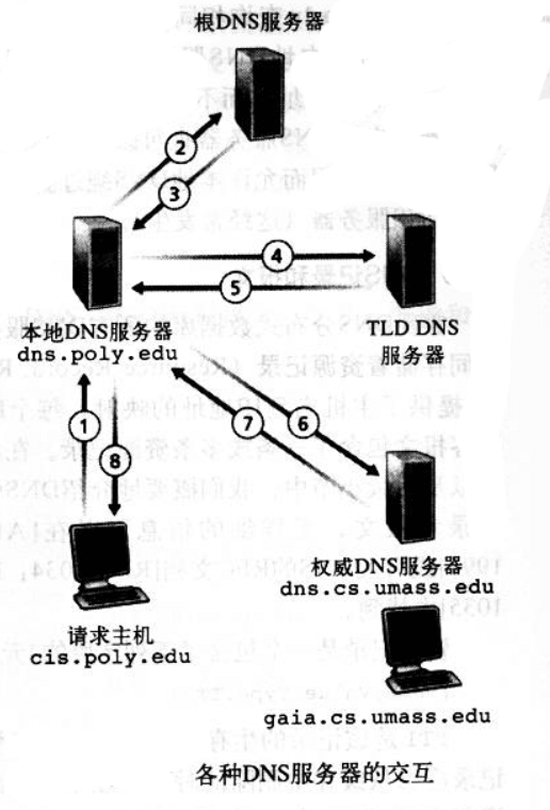

# 应用层

本章从应用层概念开始，包括应用程序所需要的网络服务、客户机和服务器、进程和运输层接口。

讨论几种应用程序，包括 Web 、电子邮件、 DNS 、对等文件分发和 P2P。

再讨论开发运行在 TCP 和 UDP 上的网络应用程序的方法，特别是学习套接字 API 。

## 应用层协议原理

研发网络应用程序的核心是写出能够运行在不同端系统和通过网络彼此通信的程序。

### 网络应用程序体系结构

网络体系结构是固定的，并未应用程序提供了特定的服务集合。 **应用程序体系结构 application architecture** 由应用程序研发者设计，规定了如何在各种端系统上组织该应用程序。

有两种主流体系结构：客户机/服务器体系结构 或 对等(P2P)体系结构。

在 **客户机／服务器体系结构中 client-server architecture** 中，有一个总是打开的主机称为 **服务器 server** ，它给许多称为 **客户机 client** 的机器提供服务。客户机有时候是偶尔打开的，有时候是总是打开的。另一个明显的特点是服务器具有固定的、周知的地址，称为 IP 地址。服务器具有固定地址，并且总是处于打开状态，所以客户机能够通过向该服务器发送分组来与其联系。例如 Web 应用， YouTube 应用。

在 **P2P体系结构 P2P architecture** 中，对总是打开的基础设施服务器有最小的（或者没有）依赖。相反的，任意间断连接的主机对 **对等方** 直接通信。对等方并不是服务提供商提供的，而是用户的端系统。例如 BitTorrent ， eMule ， Skype。

<div style="text-align: center;">

</div>

再如，有些应用是混合了着两种体系结构，比如许多 IM 应用而言，服务器用于跟踪用户的 IP 地址，但用户到用户的报文是两者之间直接发送的。

### 进程通信

在操作系统的术语中，进行通信的实际上是 **进程 process** ，而不是程序。进程可以被认为是运行在端系统中的程序。

当进程运行在同一个端系统上时，它们使用 **进程间通信** 机制相互通信。这个规则由端系统上的操作系统确定。

不同端系统上的进程通过跨越计算机网络交换报文而实现相互通信。发送进程创建并向网络中发送报文，接收进程接收这些报文，并可能负责回送报文。

> 客户机和服务器进程

网络应用程序由成对的进程组成，这些进程通过网络相互发送报文。

**定义。** 在给定的一对进程之间的通信会话中，发起通信（即在会话开始时与其他进程联系）的进程被标示为 **客户机** 。在会话开始的时候等待联系的进程是 **服务器** 。

> 进程与计算机网络之间的接口

进程通过一个称为 **套接字 socket** 的软件接口在网络上发送和接收报文。下图显示了两个经过因特网通信的进程之间的套接字通信情况。此时假设运输层的协议是 TCP 。套接字是同一台主机内应用层与运输层之间的接口。套接字是应用程序与网络之间的 **应用程序编程接口 Application Programming Interface, API** 。应用程序开发者可以控制套接字在应用层的所有东西，但是对该套接字的运输层段几乎没有控制。

<div style="text-align: center;">

</div>

应用程序开发者对运输层的控制仅限于： 1. 选择运输层协议； 2. 设定几个运输层参数。

### 可供应用程序使用的运输服务

发送端的应用程序通过套接字发送报文，在套接字的另一侧，运输层协议负责将报文传输到接收套接字的中。

确定运输层的协议，能为调用它的应用程序提供四个方面的服务： 可靠数据传输、吞吐量、定时和安全性。

>  可靠数据传输

网络中的分组在传输的时候会出现丢包。因此运输层协议能够隐式地向应用程序提供从进程到进程的可靠数据传输服务。当运输层协议提供这种服务时，发送进程只需将数据传递到套接字即可，就可以相信该数据能够无差错的到达接收进程。

当运输层协议不提供可靠数据提供时，由发送进程发送的数据可能无法到达接收进程。这要视应用程序对丢包的容忍程度来衡量。

> 吞吐量

两个进程在一条网络上进行通信会话时，可用吞吐量就是发送进程能够向接收进程交付比特的速率。因为其他会话将共享沿着该网络路径上的带宽，随着其他会话的连接和断开，可用吞吐量会发生波动。于是自然有了一种服务能保证会话中至少使用一定的可用吞吐量。即如果网络路径中可用的吞吐量低于确保的需求吞吐量时，应用程序可以选择放弃或者延迟发送报文。

对吞吐量有要求的应用程序被称为 **带宽敏感的应用 bandwidth-sensitive application** 。而 **弹性应用 elastic application** 能够根据需要充分利用可供使用的吞吐量。

> 定时

运输层协议也能提供定时保证的服务。可以设置发送方法注入套接字中的每个比特到达接收方的套接字不低于 100 ms 。在非实时的应用中，较低的时延总比较高的时延要好，但是对端到端的时延没有严格要求。

> 安全性

运输层协议能为应用程序提供一种或多种安全性服务。比如，数据在运输层中发送前加密，到达后解密。这中服务对发送进程和接收进程是黑盒子。还有包括数据完整性和端点鉴别等安全保证。

### 因特网的运输服务

因特网上使用了两个运输层协议： UDP 和 TCP 。在创建应用程序的时候，首先要考虑的是选择 UDP 还是 TCP 。

<div style="text-align: center;">

</div>

> TCP 服务

TCP 服务模型包括面向连接服务和可靠数据传输服务。

**面向连接服务** ：使用TCP时，在应用层数据报文开始流动之前，其客户机程序和服务器程序之间相互交换运输层控制信息。这个所谓的握手过程提示客户机和服务器做好传输分组的准备。在握手阶段之后，就在两个进程的套接字之间建立一个 **TCP连接 TCP connection** 。这个连接是全双工的，即连接双方的进程可以在此连接上同事进行报文收发。当应用程序结束报文发送时，必须拆除该连接。

**可靠数据传输服务** ：进行通信的程序依靠 TCP 协议，无差错、按适当顺序交付发送的数据。当应用程序的一段通过套接字传送一个字节流时，它能够依靠TCP协议将相同的字节流交付给接收方的套接字，没有字节的丢失和冗余。

TCP 协议还具有拥塞控制机制。虽然这个机制不一定能为通信进程带来直接的好处，但能为整个因特网带来整体的好处。当发送方和接收方之间的网络出现拥塞时，TCP协议的拥塞机制会 **抑制发送进程** ，无论是客户机还是服务器的发送进程。 TCP协议的拥塞机制试图限制每个 TCP 连接，使她们达到公平共享网络带宽的目的。对于有最低带宽限制的实时音频、视频应用而言，抑制传输速率非常不好。况且实时应用是可以容忍数据丢失的，并不完全需要完全可靠的传输服务。

>
> 安全TCP
>
> TCP和UDP本身没有提供任何加密机制，亦即发送进程传送至其套接字的数据，与经网络传送到目的进程的数据相同。
>
> 人们研究了 TCP 的加强版本，称为 **安全套接字层 Secure Socket Layer** 。用 SSL 加强后的 TCP 不仅能够做传统的TCP所做的一切，而且还提供了关键的进程到进程的安全性服务，包括加密、数据完整和端点鉴别。
>
> 需要知道 SSL 不是独立于 TCP 和 UDP 的第三种运输层协议。它只是对 TCP 的加强，这种加强是在应用层上实现的。
>
> 如果一个应用要使用 SSL 的服务，它需要在其客户机端和服务器端中包括 SSL 的代码。 SSL 有它自己的类似于传统 TCP 套接字API的套接字 API 。
>
> 当一个应用使用 SSL 时，发送进程向 SSL 套接字传递明文数据；发送主机中对 SSL 则加密该数据，并将加密后的数据传递给 TCP 套接字。加密后的数据经因特网传递到接收进程中的 TCP 套接字。该接收套接字将加密后的数据传给 SSL ，由 SSL 解密。最后 SSL 通过其 SSL 套接字将明文数据传递给接收进程。
>

> UDP 服务

UDP 是一种不提供不必要服务的轻量级运输层协议。它仅提供最小服务。 UDP 是无连接的，因此两个进程通信前时没有握手过程的。 UDP 协议提供的是不可靠数据传输服务， UDP 协议不保证该报文能够被接收进程接收到，而且，接收进程收到到报文也可能是乱序到。

UDP 没有拥塞控制机制，所以发送端可以以任意速率向其下面的层（网络层）注入数据（然而实际的端到端吞吐量可能小于这一速率，可能是因为中间链路的带宽受限或拥塞所致）。因为实时应用通常可以忍受一定程度的数据丢失，同时由最低速率的要求，所以开发者会选择 UDP 协议，以避开 TCP 协议的拥塞机制和分组开销。不过，因为许多防火墙被配置为 **阻塞 UDP 流量** ，所以设计者在多媒体和实时应用中也会使用 TCP 连接。

上表指出了一些流行到因特网应用所使用的运输层协议。

|应用|应用层协议|支撑到运输层协议|
|:-|:-:|:-:|
|电子邮件|SMTP|TCP|
|远程终端访问|Telnet|TCP|
|Web|HTTP|TCP|
|文件传输|FTP|TCP|
|流媒体|HTTP|TCP或UDP|
|因特网电话|SIP、RTP|通常UDP|

> 远程寻址

一个进程是如何使用这些服务来指示它要与哪个进程进行通信呢？

为了识别接收进程，需要定义两种信息： **该主机到名称或地址** ， **用来指定目的主机上接收进程到标识** 。

在因特网中，主机是用 **IP 地址， IP address** 进行标识的。发送程序也必须识别运行在主机上的接收进程。主机上通常同时运行多个网络应用程序，目的地 **端口号 port number** 就是服务于这个目的。比如 Web 服务使用的80端口，邮件服务使用的是25端口。

### 应用层协议

**应用层协议 application-layer protocol** 定义了运行在不同端系统上的应用程序进程如何相互传递报文。特别的，应用层协议定义了：

- 交换的报文类型，如请求报文和响应报文
- 各种报文类型的语法，如报文中的各个字段及其详细描述
- 字段的语义，即包含在字段中的信息的含义
- 进程何时、如何发送报文及对报文进行响应的规则。

## Web 应用和 HTTP 协议

Web的 **按需操作** ：当用户需要时，就能主动地得到想要的东西。这不同于广播和电视，用户只能被动地收听、收看提供者提供的内容。

### HTTP 概况

Web 的应用层协议是 **超文本传输协议 HyperText Transfer Protocol, HTTP** ，它是 Web 的核心。HTTP协议由两部分程序实现：一个客户机程序和一个服务器程序，各自运行在不同的端系统中，通过交换 HTTP 报文进行会话。

**URL地址** 由两部分组成，存放对象的服务器主机名和对象的路径名。 **Web浏览器** 实现了 HTTP 的客户机端， **Web服务器** 实现了 HTTP 的服务器端，用于存储 Web 对象，每个对象根据 URL 来寻址。常见的 Web服务器 有 Apache、Microsoft Internet Information Server、Nginx 。

<div style="text-align: center;">

</div>

如上图，当用户请求一个 Web 页面，客户机向服务器发出对该页面中所包含对象的 HTTP 请求报文，服务器接受请求并用包含这些对象的 HTTP 响应报文进行响应。

HTTP 使用 TCP 作为它的支撑运输层协议。

客户机发起一个与服务器的 TCP 连接，一旦连接建立，客户机和服务器进程之间就可以通过套接字接口访问 TCP 。客户机端的套接字接口是客户机进程与 TCP 连接之间的媒介，服务器端的套接字接口则是服务器进程与 TCP 连接之间的媒介。客户机从套接字接口发送 HTTP 请求报文和接收 HTTP 响应报文。服务器也是从套接字接口接收 HTTP 请求报文和发送 HTTP 响应报文。

一旦客户机发送了一个请求报文，该报文就 “脱离了客户机控制” 并 “进入TCP的控制” 。 TCP 保证了一个客户机进程发出的每个 HTTP 请求报文最终都能完整地到达服务器。类似的，服务器的 HTTP 响应报文也能完整的到达客户机。

这里体会到了分层体系结构带来的巨大优点， HTTP 协议不用担心数据的丢失，也不用操心 TCP 是如何从网络的数据丢失和乱序故障中恢复，这些工作属于 TCP 以及协议栈底层协议 。

要注意，服务器向客户机发送被请求的文件时，并没有存储任何关于该客户机的状态信息。所以说 HTTP 是一个 **无状态协议 stateless protocol** 。另外， Web 服务器总是打开的，具有一个固定的 IP地址，它服务于多个不同的客户机。

### 长连接和短连接

TCP 协议之上时，应用程序的每个请求／响应对时经过一个单独的 TCP 连接的情况称为 **短链接 non-persistent connection** ，所有的请求／响应对都是经过相同的 TCP 连接的情况被称为 **长连接 persistent connection** 。

默认方式下， HTTP 使用持久连接。

> 非持久连接

过程如下：

1. 客户机进程在端口号80发起一个到服务器 www.server.com:80 的 TCP 连接，客户机和服务器上分别有一个套接字与该连接相关联。

1. 客户机进程经它的套接字向服务器发送一个 HTTP 请求报文。报文中包含请求资源的路径。

1. 服务器进程经它的套接字接收请求报文，从自己的存储器中检索资源，并在一个 HTTP 响应报文中封装资源，随后通过其套接字向客户机发送响应报文。

1. 服务器进程通知 TCP 断开 TCP 连接（但是直到 TCP 确认客户机已经完整接收响应报文后，它才会真正中断）。

1. 客户机进程接收到响应报文，TCP 连接关闭。

注意到，每个 TCP 连接只传输一个请求报文和一个响应报文。

<div style="text-align: center;">

</div>

如图，一个 TCP 连接涉及一个 “三次握手” 的过程，即客户机向服务器发送一个小 TCP 报文段，服务器用一个小 TCP 报文段做出确认和响应，最后客户机向服务器返回确认。客户机会在三次握手的最后一个确认部分，与一个 HTTP 请求报文 结合起来发送数据。于是服务器接收到请求报文后作出响应。

> 长连接

短连接有一些缺点。首先，必须为每个请求对象都建立和维护一个全新的连接。对于每个这样的连接，在客户机和服务器都要分配 TCP 的缓冲区和变量。其次，每个请求的传输时延为 两个 RTT ，一个 RTT 用于建立 TCP ，另一个用于请求和接收对象。

在长连接的情况下，服务器在发送响应后保持该 TCP 连接打开。在相同的客户机与服务器之间的后续请求和响应报文可通过同一个 TCP 连接进行通信。

一般来说，如果一个连接经过一定时间间隔之后仍未被使用， HTTP 服务器就关闭该连接。 HTTP 的默认模式使用了流水线方式的长连接。

### HTTP 报文格式

HTTP 报文有两种：请求报文和响应报文。

> 请求报文

例如

```bash
GET /somedir/page.html HTTP/1.1
Host: www.someserver.com
Connection: close
User-agent: Mozilla/4.0
Accept-language: fr
<blank line>
```

可以看到，

1. 该报文使用普通段 ASCII 文本书写的。
1. 报文每行用回车换行符结束。最后一行后跟有一个附加的回车换行符。事实上，报文可以有更多行，或仅有一行。
1. 请求报文的第一行叫做 **请求行 request line** ，其后继的行叫做 **首部行 header line** 。请求行有三个字段：方法字段、URL字段、HTTP 协议版本字段。请求方法可以取 GET 、 POST 、HEAD 、 PUT 、 DELETE 。
1. 首部行部分。
    - Host 一行定义了目标所在主机名，这个信息是 Web 代理高速缓存所要求的。
    - Connection: close 行是客户机告诉服务器此连接采用短连接，服务器在发送完响应之后就关闭连接。
    - User-agent 行用来定义用户代理，向服务器发送请求的客户机标识。
    - Accept-language 行表示用户想得到请求对象的语言版本，否则使用服务器的默认版本。

<div style="text-align: center;">

</div>

上图给出了请求报文的通用格式。在首部行和附加的回车换行符之后有一个附加的 **实体主体 entity body** ，使用 POST 方法时可以在此处添加内容。

HEAD 方法类似于 GET ，服务器收到 HEAD 方法之后会用一个 HTTP 报文进行响应，但是不返回请求对象，可以用 HEAD 方法 debug 服务器。

> 响应报文

例如

```bash
HTTP/1.1 200 OK
Connection:close
Date: Mon, 19 Feb 2018 10:25 GMT
Server: Apache/1.3.0 (Unix)
Last-Modified: Sun, 18 Feb 2018 22:22 GMT
Content-Length: 682
Content-Type: text/html

(data data data data data ...)
```

可以看到：

1. 响应报文分三个部分： **状态行 status line** ， **首部行 header line** ， **实体主体 entity body** 。
1. 状态行有3个字段：协议版本 状态码 相应状态信息。
1. 实体主体是报文的主体，包含所请求的对象的内容。
1. 首部行部分。
    - 服务器用 Connection: close 告诉客户机在报文发送后，关闭了该 TCP 连接。 
    - Date: 行指示服务器产生并发送该响应报文的日期和时间。值得一提的是，这个时间是服务器从它的文件系统中检索到该对象、插入到响应报文并发送该响应报文的时间。
    - Server 行表示响应是由哪款服务器软件产生的，类似与请求报文中的 User-agent。
    - Last-Modified 行表示对象创建或者最后修改的日期和时间。
    - Content-Length 行表示了被发送对象的字节数。
    - Content-Type 行表示实体对象的类型。

<div style="text-align: center;">

</div>

上图给出了响应报文的通用格式。

补充一些状态码：

- 200 OK：请求成功，信息在响应报文中
- 301 Moved Permanently：请求对象被永久转移了，新的 URL 定义在响应报文的 Location 首部行中，客户机自动用新的 URL 获取该对象。
- 400 Bad Request：一个通用的差错代码，表示服务器不能理解该请求
- 404 Not Found：被请求的资源不存在。
- 505 HTTP Version Not Supported：服务器不支持请求报文使用的 HTTP 协议版本。

### 用户与服务器的交互： cookie

HTTP 服务器是无状态的，但是又需要识别客户机。为此 HTTP 使用了 cookie 。

<div style="text-align: center;">

</div>

如上图，cookie 技术有4个组成部分。

1. 在 HTTP 响应报文中有一个 cookie 首部行。
1. 在 HTTP 请求报文中有一个 cookie 首部行。
1. 在用户端系统保留有一个 cookie 文件，由用户的客户机（浏览器）管理。
1. 在 Web 站点又一个后端数据库。

cookie 可以用于标识用户。用户首次访问站点时，需要提供一个用户标识，在后续的访问中，客户机向服务器传递一个 cookie 首部，供服务器验证、识别该用户。因此， cookie 可以在无状态的 HTTP 上建立一个用户会话层。

### Web 缓存

**Web 缓存器 Web cache** 也叫 **代理服务器 proxy server** ，它是能够代表初始 Web 服务器来满足 HTTP 请求的网络实体。

<div style="text-align: center;">

</div>

如上图，可以配置客户机的所有 HTTP 请求都指向 Web 缓存器。此时会发生如下情况：

1. 客户机建立一个到 Web 缓存器的 TCP 连接，并向 Web 缓存器中的对象发送一个 HTTP 请求。
1. Web缓存器检查本地是否存储了该对象拷贝。如果有，Web 缓存器就用 HTTP 响应报文向客户机返回该对象。
1. 如果 Web 缓存器没有该对象，它就与该对象的初始服务器打开一个 TCP 连接。 Web 缓存器则在这个 TCP 连接上发送获取该对象的 HTTP 请求。在收到请求后，初始服务器向 Web 缓存器发送具有该对象的 HTTP 响应。
1. Web 缓存器接收到来自初始服务器的响应后，先在本地存储空间存储一份拷贝，并用 HTTP 响应报文向客户机的浏览器发送该拷贝的响应报文（通过先前建立在客户机和 Web 缓存器之间的 TCP 连接）。

Web 缓存器可以大大地减少对客户机请求的响应时间，特别是当客户机与初始服务器之间的瓶颈带宽远低于客户机到 Web 缓存器之间到瓶颈带宽。另外， Web 缓存器可以大大减少一个机构内部与因特网接入链路上的通信量。通过减少通信量，该机构不必急于增加带宽。而且， Web 缓存器能从整体上大大降低因特网上到 Web 流量，从而改善应用的性能。

### 条件 GET 方法

Web 缓存器能减少请求响应时间。但是也引入了一个缓存对象变陈旧的问题。不过 HTTP 协议有一种机制能够允许缓存器检验它到对象是最新到。这种机制就是 **条件GET conditional GET** 方法 。

如果 **1. 请求报文使用 GET 方法** ， **2. 请求报文中含一个 If-modified-since 首部行** ，那么这个 HTTP 请求报文就是一个 条件GET 请求报文。

例如：

缓存服务器代表原请求客户机，向初始服务器发送一个请求报文
```bash
GET /dir/pic.gif HTTP/1.1
Host: www.server.com
```

Web 服务器向缓存服务器发送具有被请求对象到响应报文

```bash
HTTP/1.1 200 OK
Date: Mon, 19 Feb 2018 12:00:02
Server: Appache/1.3.0 (Unix)
Last-Modified: Mon, 19 Feb 2018 10:00:01
Content-Type: image/gif

(binary data ... binary data ...)
```

缓存服务器将该对象的响应报文转发给原请求客户机的同时，也将对象保存了在本地缓存器中，同时也存储了该对象到最后修改时间。于是，经过一段时间后，另外到客户机再次请求同一个对象时，该对象必然已存在于缓存服务器中，不过此时缓存服务器会给初始服务器发送一个条件 GET 请求，执行最新检查，具体如下：

```bash
GET /dir/pic.gif HTTP/1.1
Host: www.server.com
If-modified-since: Mon, 19 Feb 2018 10:00:01
```

这里到 If-modified-since 首部行的值正好等于之前初始服务器发送给缓存服务器的响应报文中的 Last-modified 首部行的值。该条件GET请求报文告诉服务器，仅当该对象的修改时间在指定时间之后时，才需要初始服务器发送该对象。假设初始服务器中该对象并没有被修改，此时初始服务器会向缓存服务器发送一个304的响应报文：

```bash
HTTP/1.1 304 Not Modified
Date: Tue, 20 Feb 2018 10:00:01
Server: Apache/1.3.0 (Unix)

(empyt entity body)
```

由于没有更新对象，所以响应报文中实体为空，可以节省带宽。缓存服务器得到这个报文之后，就直接向请求客户机转发了请求对象的拷贝。

## 文件传输协议： FTP 

典型的FTP会话中，从一台主机，向另一台远程主机上传或下载文件。为了让主机能访问远程主机，用户必须提供一个用户标识和口令。

<div style="text-align: center;">

</div>

用户通过一个FTP用户代理与FTP交互。该用户先提供远程主机的主机名，使本地主机的FTP客户机进程建立一个到远程FTP服务器进程的TCP连接。然后该用户提供用户标识和口令。作为 FTP 命令的一部分在TCP连接上传送。一旦该服务器向该用户授权，用户就可以向远程文件系统上传、下载一个或多个文件。

FTP 使用两个并行的 TCP 连接来传输文件，一个是 **控制连接 control connection** ，一个是 **数据连接 data connection** 。控制连接用于在两个主机之间传输控制信息，如用户标识、口令、改变远程目录的命令以及 put 和 get 文件的命令。数据连接用于实际传输一个文件。

因为FTP协议使用一个分离的控制连接，也称FTP的控制信息是 **带外 out-of-band** 传送的。另外，用于控制音频和视频等流媒体的传输 RTSP 协议也是带外传送控制信息的。HTTP 协议是在传输文件的 TCP 链接中发送请求和响应首部行的，所以称 HTTP 是 **带内 in-band** 发送控制信息的。

当FTP的客户机与FTP服务器开始一个 FTP 会话前， 客户机首先在21端口上发起一个 **用于控制的** 与服务器的 TCP 连接。客户机通过该控制连接发送用户标识和口令，也发送给编远程目录的命令。当服务器从该连接上收到一个文件传输的命令后（无论是从客户机到服务器还是从服务器到客户机），就发起一个到客户机的TCP数据连接。FTP 在该数据连接上准确地传送一个文件，完成后关闭该连接。如果同一个会话期间，还需要传输另一个文件，FTP则打开另一个数据连接。

因此，对于FTP而言，控制连接贯穿了整个会话期间，但针对会话中的每一次文件传输，都需要建立一个新的数据连接（数据连接是非持久的）。

FTP服务器必须在整个会话期间保留用户的 **状态 state** 信息。特别的，FTP服务器必须把特定的用户与控制连接联系起来。随着用户在远程目录树上移动，服务器必须追踪用户在远程目录树上的位置。对每个活动着的会话进行追踪，可以对FTP会话总数进行限制。

> FTP Q&A

从客户机到服务器的命令和从服务器到客户机的回答，都是按照7位ASCII格式在控制连接上传送。FTP协议的命令也是自释的，为了连续的命令，每个命令后跟回车换行符。每个命令由大写字母组成，有些有可选参数。

- USER username ，用于向服务器发送用户标识
- PASS password ，用于向服务器发送用户口令
- QUIT ，断开连接
- LIST ，用于请求服务器返回远程主机当前目录的所有文件列表，文件列表是在数据连接上传送的，而不是控制TCP连接上。
- CDUP ，索引上一级目录
- PWD ，列出当前目录路径
- MKD ／ RMD ，创建／移除当前目录
- CWD ，更换当前目录，用于在目录树上移动
- RETR filename ，用于从服务器的当前目录检索 get 文件，该命令出发服务器发起一个数据连接，并在该数据连接上发送请求的文件
- STOR filename ，用于向服务器的当前目录存放 put 文件。
- STOU ，服务器文件不重复存储，似乎是声明当前目录的存储状态？
- RNFR filename \n\r RNTO filename ，两个命令需要紧连使用，用于修改服务器上的文件名

服务器对于命令的典型回答摘抄如下，仅部分：

- 331 Username OK, Password required
- 125 Data connection already open; transfer starting
- 425 Can't open data connection
- 452 Error writing file

## DNS

主机可以用 **主机名 hostname** 或者 **IP地址 IP address** 来标识。

> DNS:通过客户机/服务器模式提供的重要网络功能
>
> 与 HTTP、 FTP、 SMTP 一样， DNS 协议是应用层协议。原因如下
> 1. 使用客户机/服务器模式在通信的端系统之间运行
> 1. 在通信的端系统之间通过下面的端到端运输层协议来传送DNS报文。 DNS为因特网上的应用程序等软件提供核心功能，即将主机名转换为它们对应的 IP 地址。
>
> DNS 通过采用客户机/服务器在网络边缘实现了 名字地址转换功能 。

能将主机名转换到 IP 地址的服务，即 **域名系统 Domain Name System** 。 DNS 是一个 `1. 一个由分层的 DNS服务器 实现的分布式数据库`，`2. 一个允许主机查询分布式数据库的应用层协议`。 DNS 服务器通常运行在 Berkeley Internet Name Domain 软件的 UNIX 机器上。DNS协议运行在 UDP 之上，使用53端口。

DNS通常由其他应用层协议(HTTP, SMTP, FTP等)所使用，用于将用户提供的主机名解析为 IP 地址。下面来看看如何实现这个过程：

1. 同一台主机上运行中 DNS 应用的客户机端
1. HTTP的客户机从 URL 中抽取出主机名 www.server.com ，并将它传递给 DNS 的客户机应用
1. DNS 客户机向 DNS 服务器发送一个包含主机名的请求
1. DNS 客户机最终收到一份响应报文，其中包含对应于该主机的 IP 地址。
1. 一旦HTTP客户机接收到来自 DNS 客户机的 IP 地址，就可以向 该 IP 地址的 HTTP 服务器发起一个 TCP 连接。

除了上述的转换服务以外， DNS 还提供其他服务：

- **主机别名 host aliasing 。** 主机名可以有0个或多个别名，如 server.com 和 www.server.com 。这么多别名中有一个又臭又长的 **规范主机名 canonical hostname** 。DNS 能够解析主机别名对应的 规范名 和 相应的IP地址。

- **邮件服务器别名 mail server aliasing** 。 me@hotmail.com 中后缀的 hotmail.com 对应的实际主机名可能非常丑陋，需要通过 DNS 来进行解析。

- **负载分配 load distribution** 。繁忙的站点可能被冗余的分布在多台服务器上，因此对于同一个规范主机名可能对应的 IP 地址是一个 **地址集合** 。DNS 数据库中存储这些 IP 地址集合。当客户机为映射到这个IP 地址集合的名字发出一个 DNS 请求时，服务器会用包含全部这些地址的报文进行回答，但是在每个响应中调整集合中地址的顺序。因为 请求客户机总是向 IP 地址中排在最前面的服务器发送请求报文，所以 DNS 就在这些冗余的 Web 服务器中旋转分配负载。同样的情况可用于邮件服务器。

### DNS 工作机理概述

DNS 将主机名转换为 IP 地址的过程对于使用者来说是个非常简单好用的黑盒子服务，但是内部实现过程非常复杂，由分布于全球的大量 DNS 服务器以及定义了 DNS 服务器与查询主机通信方式的应用层协议组成。

单一DNS服务器运行完全是不可能的，遇到的原因此处不表，网上一大堆。事实上，DNS 是一个在因特网上实现分布式数据库的精彩范例。

<div style="text-align: center;">

</div>

> 分布式、层次数据库

为了处理规模问题， DNS 使用了大量的 DNS 服务器，以层次方式组织，并且分布在全世界范围内。大致来说，有3种类型的 DNS 服务器：`根DNS服务器`，`顶级域名 Top-level Domain 服务器`，`权威DNS服务器`。这些服务器的组织层次可以看上图。

- **根DNS服务器** 。因特网上有为数不多的根DNS服务器，分布在全球各地，一般而言把它们视为单个服务器，而事实上它们是冗余服务器的群集，以提供安全性和可靠性。

- **顶级域名TLD服务器** 。这些服务器负责顶级域名(com, org, net, edu, gov)和所有国家的顶级域名(cn, uk等)。

- **权威DNS服务器** 。在因特网上具有公共可访问主机的每个组织机构必须提供公共可访问的 DNS 记录，这些记录将这些主机的名字映射为 IP 地址。由组织机构的权威 DNS 服务器负责保存这些 DNS 记录。也可以花钱将这些记录存储在某个服务器提供商的权威DNS服务器中。

还有一类重要的DNS服务器，称为 **本地DNS服务器 local DNS server** 。严格来说，本地DNS服务器不属于DNS服务器层次结构的一部分，但是它对DNS层次结构很重要。当主机与某个ISP连接时，该ISP提供一台主机的IP地址，该主机具有一台或多台其本地DNS服务器的IP地址。通过访问UNIX的网络状态窗口，可以确定本地DNS服务器的IP地址。当主机发出DNS请求时，该请求首先被发往本地DNS服务器，它起到代理的作用，代理主机将请求转发到DNS服务器的层次结构中。

<div style="text-align: center;">

</div>

看上图，本地DNS服务器代理主机转发DNS请求，并依次分别同根DNS服务器、TLD DNS服务器、权威DNS服务器通信，最后才把得到的IP地址返回给请求主机。

不过，一般而言， TLD DNS服务器不可能都知道对应的权威DNS服务器，可能只知道中间的某个DNS服务器，该中间DNS服务器依次才能知道真正的权威DNS服务器是谁。

上图的DNS查询利用了 **递归查询 recursive query** 和 **迭代查询 iterative query** 。从请求主机到本地DNS服务器的查询是递归的，其余查询时迭代的。

> DNS 缓存

为了改善时延性能和减少在因特网上到处传输的DNS报文数量，DNS广泛使用了缓存技术。

原理非常简单：在请求链中，当一个DNS服务器接受一个DNS回答时，DNS服务器能将回答中信息缓存在本地存储器。由于主机和主机名与IP地址之间的映射不是永久的，所以DNS服务器在一段时间后（通常为两天）就将丢弃缓存信息。

### DNS 记录和报文

实现 DNS 分布式数据库的所有DNS服务器共同存储着 **资源记录 Resource Record** 。资源记录是一个包含下列字段的4元组：`(Name, Value, Type, TTL)`。TTL 是该记录的存储时间，它决定了资源记录应当从缓存中删除的时间。

- 如果 `Type=A`，则 Name 是主机名， Value 是主机名的 IP 地址。类型为 A 的资源记录题哦过年了标准的主机名到 IP 地址的映射。例如 `(www.server.com, 123.123.112.112, A, TTL)`

- 如果 `Type=NS`，则 Name 是域， Value 是该域中所有主机存在的权威 DNS 服务器主机名。这个记录用于沿着查询链路进一步路由DNS查询。例如 `(foo.com, dns.foo.com, NS, TTL)`

- 如果 `Type=CNAME`，则 Value 是别名为Name的主机对应的规范主机名，该记录能向请求主机提供一个主机名对应的规范主机名。例如 `(alias.foo.com, canonical.foo.com, CNAME, TTL)`

- 如果 `Type=MX`，则 Value 是别名为 Name 的邮件服务器的规范主机名。例如 `(foo.com, mail.foo.com, MX, TTL)`。因此一个公司的邮件服务器和其他服务器可以使用同样的别名。为了获得邮件服务器的规范主机名， DNS 客户机应当请求一条 MX 记录，而为了获得其他服务器的规范主机名， DNS 客户机应当请求一条 CNAME 记录。

如果一台 DNS服务器 不是某特定主机名的 权威DNS服务器，那么该 DNS服务器 会有一条包含该主机名的类型A记录。（即使 该DNS服务器 不是主机的 权威DNS服务器 ，它也可能在缓存中国年包含有一条类型A记录）。

如果 DNS服务器 不是某个主机名的 权威DNS服务器 ，那么该服务器将包含一条类型NS记录，该记录对应于包含主机的域，它还将包括一条类型A记录，该记录提供了在NS记录中的Value字段中 DNS服务器的 IP 地址。

（DNS 报文的内容忽略了，具体可看RFC文档）。

terminal 里面可以看一下 `nslookup` 命令的玩法，模式较少，不怎么好玩。

> 在DNS数据库中插入记录

下面讲讲整个过程。首先要在 域名注册登记机构 注册一个域名 network.com。 **注册登记机构 registrar** 会验证域名的唯一性，并将域名输入DNS数据库。

注册时，需要提供基本 权威DNS服务器 和 辅助权威DNS服务器 的名字与IP地址。对于这两个权威DNS服务器，注册登记机构确保将一个类型NS和一个类型A的记录输入 TLD com 服务器。类似如下：

    (network.com, dns1.network.com, NS, TTL)
    (dns1.network.com, 212.212.212.1, A, TTL)

此时需要确保用于服务的 www.network.com 的类型A记录和用于邮件服务的 mail.network.com 的类型MX记录被输入到权威 DNS 服务器中。

现在已经不用静态配置上述过程了，DNS报文能够对数据库中的内容进行动态的添加或删除。
