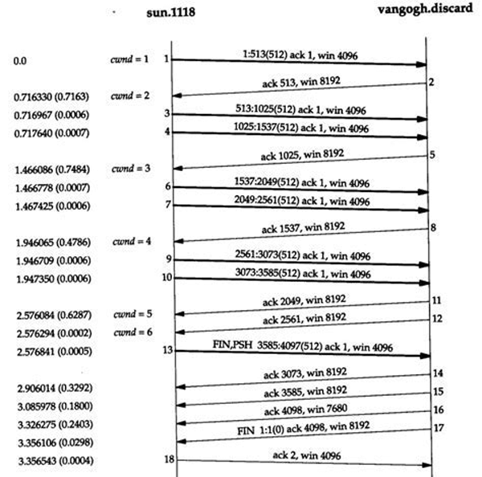

# 运输层

首先将讨论运输层和网络层的关系。先研究运输层的第一个关键功能，即 将网络层的在两个端系统之间的交付服务，扩展到运行在两个不同端系统上的应用层进程之间的交付服务。

其次，讨论两个实体怎么样才能在一种会丢失或损坏数据的介质上可靠的通信。

最后讨论网络中的第二个重要问题，控制运输层实体的传输速率以避免网络中的拥塞，或从拥塞中恢复过来。

## 概述和运输层服务

运输层协议为运行在不同主机上的应用进程之间提供了 **逻辑通信 logic communication** 功能。应用进程使用运输层提供的逻辑通信功能彼此发送报文进行通信，而无需考虑承载这些报文的物理基础设施的细节。

<div style="text-align: center;">

</div>

如上图，运输层协议是在端系统中而不是在网络路由器中实现的。在发送方，运输层将接收到来自发送应用进程的报文转换称运输层分组，术语为 **报文段 segment** 。可能的方法是将应用报文划分为较小的块，并为每块加上一个运输层首部来创建运输层报文段。然后，在发送方端系统中，运输层将这些报文段传递给网络层，网络层将其封装称网络层分组（数据报 datagram）并向目的地发送。要注意，网络路由器仅作用于该数据报的网络层字段，它们不检查封装该数据报的运输层报文段的字段。在接收方，网络层从数据报中提取运输层报文段，并将该报文段上交给运输层。运输层处理接收到的报文段，使得接收方应用进程可使用该报文段中的数据。

> 运输层和网络层的关系

运输层刚好位于网络层之上，运输层为运行在不同主机上的进程之间提供了逻辑通信，而网络层则提供了主机之间的逻辑通信。

运输层协议只工作在端系统中，运输层协议将来自应用进程的报文移动到网络边缘。

运输层协议所能提供的服务受到了底层网络服务模型的限制。如果网络层协议不能为两主机之间发送的运输层报文段提供时延和带宽保证，那么运输层协议也不能为两进程之间的报文提供时延和带宽保证。

> 运输层概述

UDP（用户数据报协议）为调用它的应用程序提供了一种不可靠的、无连接的服务。

TCP（传输控制协议）为调用它的应用程序提供了一种可靠的、面向连接的服务。

应用程序的开发人员在创建套接字时必须指定选择 UDP 还是 TCP 。

本章中，运输层的分组称为 **报文段 segment**， 而 **数据报 datagram** 留给了网络层分组。

在介绍 UDP 和 TCP 之前先了解一下网络层。因特网网络层协议名字为 IP ，全程是网际协议。 IP 为主机之间提供了逻辑通信。 IP 的服务模型是 **尽力而为的交付服务 best-effort delivery service** 。这意味着，IP 不能确保报文段的交付，不保证报文段的按序交付，更不保证报文段中数据的完整性。因此 IP 被称为 **不可靠服务 unreliable service** ，每台主机都有一个 IP 地址。

总结一下 UDP 和 TCP 所提供的服务模型。 UDP 和 TCP 最基本的任务是，将两个端系统间 IP 的交付服务扩展为运行在两个端系统上的进程之间的交付服务。将主机间的交付扩展到进程间的交付，称为运输层的 **多路复用 multiplexing** 与 **多路分解 demultiplexing** 。UDP 和 TCP 还可以通过在其报文段的首部添加差错检测字段而提供完整性检查。进程间数据交付和差错检测是两种最低限度的运输层服务，也是UDP所能提供的仅有的两种服务。特别的 UDP 不能保证一个进程所发送的数据能够完整无损地到达目的进程。

TCP还为应用程序提供了几种附加服务。首先，它提供 **可靠数据传输 reliable data transfer** 。通过流量控制、序号、确认和定时器等技术，TCP 确保正确地、按序地将数据从发送进程交付给接收进程。TCP还提供 **拥塞控制 congestion control** ，不太严格的说， TCP 拥塞控制防止任何一条TCP连接使用过多流量。从原理上讲，TCP允许TCP连接通过一条拥塞的网络链路，平等地共享网络链路带宽。这可以通过调节发送方TCP发送到网络的流量速率来实现。相对的，使用UDP传输的应用程序可以根据需要以任何速率发送数据，其流量无法调节。

## 多路复用与多路分解

多路复用和多路分解服务是所有计算机网络都需要的。

在目的主机，运输层从下层网络层接收报文段。运输层负责将这些报文段中国年的数据交付给在主机上运行的合适的应用进程。

进程有一个或多个套接字，它相当于网络与进程之间通信、传递数据的媒介。如下图所示，接受主机中的运输层实际上并没有直接将数据交付给进程，而是通过一个套接字来传递的。主机上可能同时有多个套接字，每个套接字都有唯一的标识符。

<div style="text-align: center;">

</div>

下面考虑接受主机怎样将一个接收到的运输层报文段定向到合适的套接字。为达到这一目的，每个运输层报文段中设置了几个字段。在接收端，运输层检查这些字段并识别出接收套接字，然后将该报文段定向到该套接字。将运输层报文段中的数据交付到正确的套接字的工作称为 **多路分解 demultiplexing** 。从源主机的不同套接字中收集数据块，并为每个数据块封装上首部信息，从而生成报文段，然后将报文段传递到网络层的工作称为 **多路复用 multiplexing** 。

为了满足运输层多路复用的要求： `1.套接字有唯一的标识符`，`2.每个报文段有特殊字段来指示该报文段所要交付的套接字`。这些特殊字符字段是 **源端口号字段 source port number field** 和 **目的端口号字段 destination port number field** 。端口号是一个 16 比特数字，取值 0 ～ 65535 ， 0～1023是保留给应用层协议的。

现在应该清楚运输层是怎样实现多路分解服务的了：主机上的每一个套接字被分配一个端口号，当报文段到达该主机时，运输层检查报文段中的目的端口号，并将其定向到相应的套接字。然后报文段中的数据通过套接字进入其所连接的进程。

> 无连接的多路复用与多路分解

应用程序的客户机端让运输层自动地并且透明地分配端口号，而服务器端分配一个特定的端口号。

下面的代码分别建立了一个自动分配端口号的套接字（客户机端）和指定端口号的套接字（服务器端）：

```java
DatagramSocket clientSocket = new DatagramSocket();

DatagramSocket serverSocket = new DatagramSocket(19517);
```

一个UDP套接字是由一个包含目的IP地址和目的端口号的二元组 **（目标IP地址，目标port）** 来全面标识的。源端口号的用途用于当服务器想要向客户机发送一个报文时，需要在这个报文中标识好相应的IP地址（即源主机的IP地址）和端口号（即源端口号）。

> 面向连接的多路复用和多路分解

为了理解TCP的多路分解，需要直到TCP套接字和UDP套接字之间的细微差别，即 TCP套接字是由一个四元组 **（源IP地址，源port，目标IP地址，目标port）** 来标识的。

特别的，与UDP不同的是，两个具有不同源IP地址或者源端口号的到达TCP报文将被定向到两个不同的套接字。除非TCP携带了初始创建连接的请求。具体可看下图。A与C之间，C不同进程之间都向服务器B发送了TCP连接。服务器根据不同的四元组创建了不同的TCP连接。

<div style="text-align: center;">

</div>

上图中，服务器为每个连接都创建了一个新进程，事实上，高新能Web服务器通常只使用一个进程，但是为每个连接创建一个具有新连接套接字的新线程。这样，在任意给定的时间，都可能有许多套接字连接到相同的进程。

## 无连接运输 UDP

RFC 768定义的 UDP 只是做了运输协议能够做的最少工作。除了多路复用/多路分解以及一些轻微的差错检测之外，它几乎没有对 IP 协议增加别的东西。

UDP从应用进程得到数据，附加上多路复用／多路分解服务所需对源端口号和目的端口号字段，以及两个其他小极端，然后将形成对报文段交给网络层。网络层将该运输报文封装到一个 IP数据报 中，然后尽力地将此报文交付接收主机。如果该报文段到达接收主机后，UDP使用目的端口号来将报文段中的数据交付给正确的应用进程。注意到使用UDP时，在发送报文段前，发送方和接收方对运输层实体之间没有进行握手，故称UDP为无连接的。

DNS时使用UDP的极好的例子。当一台主机中的DNS应用程序想要进行一次查询时，它构造了一个DNS查询报文并将其交给UDP套接字。无须执行任何与目的端系统的握手过程，客户机的UDP套接字给查询报文添加首部字段，然后将形成的报文段交给网络层。网络层将UDP报文段封装进一个IP数据报中，发送给一个本地DNS服务器。查询主机的DNS应用程序便等待着查询的响应。如果没有收到响应，它可能会试图向另一个本地DNS服务器发送查询，也可能通知调用应用程序未获得响应。

这么看来，开发应用时，选择UDP还是TCP似乎是毫无悬念的，那么事实上呢？事实上，有许多应用更适合用UDP，主要有以下原因：

- 应用程序能更好地控制要发送的数据和发送时间。
- 无需连接建立。UDP不会像TCP一样存在所谓的连接建立时延。
- 无连接状态。TCP需要在端系统中维护连接状态（接收／发送缓存、拥塞控制参数、序号参数、确认号参数）。
- 分组首部开销小。每个TCP报文段都有20字节的首部开销，而UDP仅8字节的开销。

|应用|应用层协议|使用的运输层协议|
|:-:|:-:|:-:|
|电子邮件|SMTP|TCP|
|远程终端访问|Telnet|TCP|
|Web|HTTP|TCP|
|文件传输|FTP|TCP|
|远程文件服务器|NFS|通常UDP|
|流式多媒体|专用协议|UDP或TCP|
|因特网电话|专用协议|UDP或TCP|
|网络管理|SNMP|通常UDP|
|选路协议|RIP|通常UDP|
|DNS转换|DNS|通常UDP|

需要提一下，使用UDP的应用是可以通过自身中建立可靠性机制（确认与重传机制）来实现可靠数据传输的。换句话说，应用进程可以进行可靠通信，而无需受制于TCP拥塞控制机制而引起的传输速率约束。

### UDP报文段结构

<div style="text-align: center;">

</div>

应用层数据占用了UDP报文段的数据字段。UDP首部只有4个字段，每个字段两个字节。通过端口号可以使目的主机将应用交给运行在目的端系统中的相应进程。接收主机使用检验和来检查报文段中是否存在差错。计算检验和时，除了UDP报文段以外还使用了IP首部的一些字段，此书不详解。长度指明了包括首部在内的UDP报文段长度（单位 字节）。

UDP只有提供了差错检测，却不能进行差错恢复。

## 可靠数据传输的原理

<div style="text-align: center;">

</div>

上图显示了接下来讨论可靠数据传输的框架。提供给上层实体的服务抽象是， **数据可以通过一条可靠的信道进行传输** 。you 了可靠信道，就不会有数据传输时比特受损或丢失，且数据都是按照发送顺序进行传送的。

实现这种服务抽象的是 **可靠数据传输协议 reliable data transfer protocol** 的责任。事实上，可靠数据传输协议的下层 协议也许是不可靠的。为了便于学习，将底层视为不可靠的点对点信道。

图中 b 部分说明了数据传输协议的接口。可以通过 rdt_send() 函数，来调用数据传输协议的发送方。它把待发送的数据交付给接收方的上层。在接收方，当分组从信道的接收端抵达时，将调用 rdt_rcv() 函数。当 rdt协议 想要向较高层交付数据时，需要调用 deliver_data() 来完成。在讨论可靠传输时，将使用 “分组” 而不是 运输层的“报文段” 。此段仅考虑单向传输情况，双向传输在原理上是一致的。而且需要知道，除了含有待发数据的分组之外，rdt 的发送方和接收方还需要来回交换控制分组。rdt的发送方和接收方都需要通过 udt_send() 发送分组给对方 (udt表示不可靠数据传输)。

（可靠数据传输原理过于黑盒，不适应摘抄，可自行研究）

## 面向连接的运输：TCP

TCP协议 是因特网传输层、面向连接的可靠运输协议。

### TCP概述

TCP是 **面向连接 connection-oriented** 的，这是因为在一个应用进程可以开始向另一个应用进程发送数据之前，这两个进程必须先相互 “握手” ，即它们必须相互发送某些预备报文段，以建立确保数据传输所需的参数。

这种 TCP连接 不是一条端粒连接也不是一条虚电路，它段连接状态完全保留在两个端系统中，所以中间元素 **路由器和链路层交换机**  不会维持TCP的连接状态。事实上，中间元素对于TCP连接完全不知情，它们看到的只是数据报。

TCP连接提供的是 **全双工服务 full-duplex service** ：如果一台主机上的进程A 与另一台主机上的进程B 存在一条TCP连接，那么应用层数据可以从进程B流向进程A，也可以从进程A流向进程B。

TCP连接也总是 **点对点 point-to-point** 的，即单个发送方与单个接收方之间的连接。因此 broadcast 在 TCP 来说是不可能的。

下面看看TCP连接是如何建立的。

客户机应用进程首先通知客户机运输层，它想要与服务器上的一个进程建立一条连接。例如下面的Java代码：

    Socket clientSocket = new Socket("hostname", portNumber);

其中hostname是服务器名字，portNumber是服务器上进程的标识。这样客户机上的运输层便开始与服务器上的运输层建立一条TCP连接（下文详述）。客户机线发送一个特殊的TCP报文段，服务器用另一个特殊的报文段响应，最后客户机再用第三个特殊报文段作为响应。前两个报文段不承载 “有效载荷” ，即不包含应用层数据，而第三个报文可以承载有效载荷。这中连接过程通常被称为 **三次握手 three-way handshake** 。

<div style="text-align: center;">

</div>

一旦建立了TCP连接，两个应用进程之间就可以相互发送数据了。客户机进程通过套接字传递数据流。数据通过套接字，控制权就交到客户机中运行的TCP了。TCP将这些数据引导到该链接的 **发送缓存 send buffer** 里，发送缓存是在三次握手初期设置的缓存之一。接下来TCP就会不时地（只要知道是在恰当的时机就好了）从发送缓存里取出一块数据，给它加一个TCP首部，从而形成多个 **TCP报文段 TCP segment** 。这些报文段被下传给网络层，网络层将其封装在网络层IP数据报中，再被发送到网络中。TCP在另一端收到一个报文段后，该报文段的数据就被放入该TCP的接收缓存，应用程序从此缓存中读取数据流。TCP连接的每一段都有各自的发送缓存和接受缓存。

### TCP报文段结构

TCP报文段由首部字段和数据字段组成。数据字段含有一块应用数据。

<div style="text-align: center;">

</div>

如上图，首部包括 **源端口号 source port number** 和 **目的端口号 destination port number** ，它用于多路复用／多路分解来自或送至上层应用数据，还包括 **检验和字段 checksum field** 。还有：

- 32比特的 **序号字段 sequence number field** 和32比特的 **确认号字段 acknowledgement number field** 。这些字段被TCP发送方和接收方用来实现可靠数据传输服务。
- 16比特的 **接收窗口 receive window** 字段。该字段用于流量控制，用于指示接收方愿意接受的字节数量。
- 4比特的 **首部长度字段 header length field** ，该字段指示了以32比特的字为单位的TCP首部长度。由于TCP选项字段的原因，TCP首部的长度是可变的。
- 可选与变长的 **选项字段 options field** 。该字段用于当发送方与接收方协商最大报文段长度，或在高速网络环境下用作窗口调节因子时使用。首部字段中还定义一个时间戳选项。
- 6比特的 **标志字段 flag field** 。ACK比特 用于指示确认字段中的值是有效的。RST、 SYN 和 FIN比特用于连接建立和拆除。当PSH比特被设置时，就指示接收方应立即将数据交给上层。最后 URG比特用来指示报文段里存在着被发送方的上层实体置为 “紧急” 的数据。紧急数据的最后一个字节由16比特的 **紧急数据指针字段 urgent data pointer field** 指出。当紧急数据存在并给出指向紧急数据尾的指针时，TCP必须通知接收方的上层实体。（实际中 PSH 、URG和紧急数据指针并没有使用，为了完整性才提及╮(￣▽￣"")╭ ...）

> 序号和确认号

最重要的两个字段。

TCP把数据堪称一个无结构的但是有序的字节流。序号是建立在传送的字节流之上，而不是建立在传送的报文段的序列之上。一个 **报文段的序号 sequence number for a segment** 是该报文段首字节的字节流编号。例如某次数据流由一个包含500,000个字节的文件组成，MSS为1000字节，数据流的首字节号为0。TCP将为该数据流构建500个报文段。第一个报文段序号被赋为0，第二个报文段序号被赋为1000，第三个2000，以此类推。每一个序号被填入到相应TCP报文段首部的序号字段中。

事实上，一条TCP连接的双方均可随机地选择初始序号。这样可以减少那些仍在网络中的来自两台主机之间先前已终止的连接的报文段被误认为是后来这两台主机之间新建连接所产生的有效报文段的可能性。

确认号要比较难理解一些。

主机A在向主机B发送数据的同时，也接收来自主机B的数据。从主机B到达的每个报文段中都有一个序号用于从B流向A的数据。 **主机A填充进报文段的确认号是主机A期望从主机B中收到的下一字节的序号** 。看三个例子：

1. 假设主机A已经收到了来自主机B编号为0～535的所有字节，同时假设A要发一个报文段给B。A等待B的数据流中字节536及后续所有字节。所以A会在它发往B的报文段的确认号字段中填上536。

1. 假设主机A已经收到一个来自主机B的包含字节0～535的报文段，以及另一个包含900～1000的报文段。由于某些原因，A还没有收到字节 536～899 的报文段。A为了重组B的数据流，仍在等待字节536和536后面的字节。因此A到B的下一个报文段将在确认号字段中包含536。 因为TCP只确认数据流中至第一个丢失字节为止的字节，所以TCP被称为是提供 **累计确认 cumulative acknowledgement** 。

1. 主机A在收到第二个报文段（字节536～899）之前收到了第三个报文段（字节900～1000）。因此发生了失序到达。TCP文档里面没有明确规定此时该怎么做，程序员有两种方式：`1.接收方立即丢弃失序报文段（可以简化接收方的设计）`,`2.接收方保留失序的字节，并等待缺少的字节以填补该间隔`。事实上，第二种方式对网络带宽更有效，也是实践中采用的方法。

为了加深理解，可以从双向通信的过程来看看确认号在实际应用中的使用，[文章](http://blog.csdn.net/tianyue168/article/details/5822042)。

> Telnet：序号和确认号的一个学习案例

Telnet 是一个用于远程登录的应用层协议，运行在TCP之上，被设计成可以在任意一对主机之间工作。现在更多的用户愿意使用 ssh 协议而不是 Telnet ，因为Telnet连接中发送到数据都是未加密的。

客户机 A 发起一个与服务器 B 的 Telnet 会话。假设客户机和服务器起始序列号分别为42和79。因此客户机发送的第一个报文段的序号为42，隐式地，客户机等待的字节号为79，服务器发送的第一个报文段序号为79，隐式地，服务器等待的字节号为42。

<div style="text-align: center;">

</div>

如上图，一共3个报文段，第一个由客户机发往服务器，其数据字段包含一个字节的字符“C”的ASCII码，序号字段内容是42，隐式地，确认号字段是79。

第二个是服务器发往客户机的。它有两个目的，第一个目的是服务器收到数据的确认。服务器通过在确认号字段中填入43，告诉客户机它已经成功地收到字节42以及以前的所有字节，现在等待着字节43的出现。第二个目的是回显字符“C”，因此会在第二个报文段的数据字段里面填入字符“C”的ASCII码。第二个报文段的序号79，它是该TCP连接上从服务器到客户机的数据流的起始序号，也是服务器要发送的第一个字节的数据。注意到对客户机到服务器的数据的确认被装载在一个承载服务器到客户机的数据的报文段中，这种确认被称为 **捎带 piggybacked** 在服务器到客户机的数据报文段中的。

第三个报文段是从客户机发往服务器的。它的唯一目的是确认已从服务器收到的数据。该报文段的数据字段为空，确认号字段填入的是80，（客户机已经收到了字节流中序号为79及以前的字节，它现在正在等待字节80的出现）。似乎有点奇怪的是，该报文段里没有数据但有序号，这是因为TCP存在序号字段，报文段需要填入某些序号。

### 往返时延的估计与超时

TCP采用超时／重传机制来处理报文段的丢失问题。实际使用中还有一些很微妙的问题，最明显的一个就是超时间隔长度的设置。接下来看看TCP定时器的管理问题。

> 估计往返时延

考虑一下TCP是如何估计发送方与接收方之间的往返时延。报文段的 **样本RTT Sample RTT** 就是从 **某报文段被发出（即交给IP）到对该报文段的确认被收到** 之间的时间量。大多数TCP的实现仅在某个时刻做一次 SampleRTT 测量，而不是每个发送的报文段都进行测量，亦即，在任意时刻，仅为一个已发送的但目前尚未被确认的报文段估计 SampleRTT，从而产生一个接近每个RTT的新SampleRTT值。另外，TCP绝不会为已重传的报文段计算 SampleRTT ，而仅为传输一次的报文段测量。

显然由于路由器拥塞和端系统负载的变化，这些报文段的SampleRTT会波动，于是要对它进行一些统计行为。一旦获得一个新的SampleRTT，TCP会根据下面的公式来计算

    EstimatedRTT = (1-α) * EstimatedRTT + α * SampleRTT 

上述语句是一句编程语句，RFC 2988 文档中 α = 0.125。

<div style="text-align: center;">

</div>

注意到 EstimatedRTT 是一个加权值。除了 EstimatedRTT 以外，测量RTT的变化也是有意义的， RTT 偏差 DevRTT 用于估算 SampleRTT 一般会偏离 EstimatedRTT 的程度：

    DevRTT = (1-β) * DevRTT + β * [SampleRTT - EstimatedRTT]

> 设置和管理 重传超时间隔

超时间隔应该大于等于 EstimatedRTT ，否则将造成不必要的重传。但是不能太大，否则报文丢失时，TCP不能很快的重传该报文。DevRTT这个时候就有用了。考虑这些情况之后，重传超时间隔的计算为：

    TimeoutInterval = EstimatedRTT + 4 * DevRTT

### 可靠数据传输

TCP 在 IP 的尽力而为但是不可靠的（不保证完整性和按序到达）服务基础上建立了一种可靠数据传输服务。TCP 的可靠数据传输服务确保一个进程从其接收缓存中读出非损坏的、无间隔的、非冗余的和按序的数据流。TCP 协议遵循了RFC 2988 中建议的单一的重传定时器，即使有多个已发送但还未被确认的报文段。

下文将分两个步骤来讨论TCP饰如何提供可靠数据传输的。

先给出一个TCP发送方的高度简化的描述，该发送方只用超时来恢复报文段的丢失。然后描述高级版本，即不仅使用超时机制，还使用冗余确认技术。

假定一个很大的文件数据要从主机A发往主机B。

```java
/*伪代码，
假设发送方不受TCP流量和拥塞控制的限制，
来自上层的数据长度小于MSS，
且数据传输只在一个方向进行。
*/
NextSeqNum = InitialSeqNumber
SendBase = InitialSeqNumber

loop (forever) {
    switch (event) {
        event: data received from application above
            create TCP segment with sequence number NextSeqNum
            if (timer currently not running)
                start timer
            pass segment to IP
            NextSeqNum = NextSeqNum + length(data)
            break;

        event: timer timeout
            retransmit not-yet-acknowledged segment with smallest sequence number
            start timer
            break;

        event: ACK received, with ACK field value of y
            if (y > SendBase) {
                SendBase = y
                if (there are currently any not-yet-acknowledged segment)
                    start timer
            }
            break;
    }
} /* end of loop forever */
```

上面的代码各处了一个TCP发送方的高度简化的描述，看到TCP发送方有3个与发送和重传有关的主要事件: 

1. 从上层应用程序接受数据；将数据封装在一个报文段中，并将该报文段传给IP。顺便开启定时器，该定时器的过期间隔为 `TimeoutInterval = EstimatedRTT + 4 * DevRTT` 。 **值得注意的是，下一个报文段的序列号是根据当前序列号跟数据字节长度求和出来的。**

1. 定时器超时：TCP重传引起超时的报文段（未响应确认收到的报文段中序号最小那个）来响应超时时间，之后重启定时器。

1. 收到确认报文段（ACK报文）。TCP将ACK的值 y 与变量 SendBase 进行比较。 TCP状态变量 SendBase 是最早未被确认的字节的序号。（因此 SendBase-1 就是指接收方已正确按序接收到的数据的最后一个字节的序号。 ）TCP采用累计确认，所以 y 确认了字节编号在 y 之前的所有字节都被收到。如果 y > SendBase ，则 ACK 是在确认一个或多个先前未被确认的报文段。因此发送方更新其SendBase 变量；另外当前如果有未被确认的报文段，TCP还用重启定时器。

下面举个例子说明 **累计确认** 的好处：主机A有两个报文，第一个报文段序号为92号报文段，8字节数据，确认号为100。第二个报文段序号为100号，20字节数据，确认号为120。这两个报文依次发送给主机B。第一个报文段的确认报文在网络中丢失了，但是在超时事件发生前，主机A收到了一个确认号为120的确认报文。因此主机A知道主机B已经收到了序号为119及以前的 **所有字节** ，所以主机A不会重新传送这两个报文中的任意一个。

<div style="text-align: center;">

</div>

> 加倍超时间隔

下面讨论一下大多数TCP实现中所做的一些改动。

每当超时事件发生时，TCP重传具有最小序号的还未被确认的报文段。但是每次TCP重传都会将下一次的超时间隔设为当前值的两倍，而不是之前计算公式的值。然而当定时器在另外两个事件（上层应用的数据和收到ACK）时，超市间隔由最近的EstimatedRTT值和DevRTT计算公式推出。

这种改动提供了一个有限形式的拥塞控制。定时器过期可能是由网络拥塞引起的。如果拥塞时，源主机继续持续重传分组，会使拥塞更加严重。相反，TCP使用了更优雅的方式，每个发送方的重传都是经过越来越长的时间间隔后进行的。

> 快速重传

超时出发重传存在的另一个问题时超时周期较长。当一个报文段丢失时，这种较长的超时周期迫使发送方等待很长时间才重传丢失的分组，因而增加了端到端时延。幸运的事，发送方通常可在超时事件发生之前通过注意所谓的冗余ACK来较好的检测丢包情况。 **冗余ACK duplicate ACK** 就是再次确认某个报文段的ACK，而发送方已经收到了对该报文段的确认。在继续讨论之前需要学一下为什么会发送冗余ACK。

|事件|TCP接收方动作|
|:-:|:-:|
|所期望序号的报文段按序到达，所有在期望序号及其以前的数据都已经被确认|延迟的ACK。对另一个按序到达的报文段最多等待500ms，如果下一个报文段在这个时间内没有到达，则发送一个ACK|
|有期望序号的报文段按序到达，另一个按序报文段等待ACK传输|立即发送单个累计ACK，以确认两个按序报文段|
|比期望序号大的失序报文段到达，检测出数据流中的间隔|立即发送冗余ACK，指明下一饿期待字节的序号（也就是该间隔的低端字节序号）|
|能部分或完全填充接受数据间隔的报文段到达|倘若该报文段起始于间隔的低端，立即发送ACK|

上表总结了TCP接收方的ACK生成策略。当TCP接收方收到一个 大于下一个所期望的、按序的序号 的报文段时，它检测到了数据流中断间隔，即有报文丢失。这个间隔可能是由于在网络中丢失或重新排序造成的。因为TCP不使用否定确认，所以接收方不能向发送方发回一个显示的否定确认，而是只需对按序接收到的最后一个字节数据进行重复确认，即产生了一个冗余ACK。当失序后的报文段到达时，也会发送它的ACK。这是上表中第四种情况的含义。

因为发送方经常持续发送大量的报文段，所以如果一个报文段丢失，就很可能引起许多一个接一个的冗余ACK。如果TCP发送方接收到对相同数据的3个冗余ACK，它就认为跟在这个已被确认过3次的报文段之后的报文段丢失。于是执行 **快速重传 fast transmit** ，即该报文段的定时器国旗之前重传该报文，对于有快速重传的TCP，可用下列代码代替前面代码中的收到ACK事件代码。

[思考·为什么是3个ACK](https://www.zhihu.com/question/21789252/answer/110640581)

```java
/*
伪代码
*/
    event: ACK received, with ACK field value of y
        if (y > SendBase) {
            SendBase = y
            if (there are currently any not-yet-acknowledged segments)
                start timer
        } else { /* duplicate ACK for already ACKed */
            increment number of duplicate ACKs received for y

            if (number of duplicate ACKs received for y == 3)
                /* TCP fast transmit */
                resend segment with sequence number y
        }
        break;
```

<div style="text-align: center;">

</div>

> 流量控制

前述，一条TCP连接的双方主机都为该连接设置了接收缓存。当TCP收到正确、按序的字节后，它就将数据放入接收缓存中。相关联的应用进程会从该缓存中读取数据，但没有必要数据刚到就立即读取。当应用程序读取太慢或者发送方发送数据太多太快，很容易使该连接的接收缓存溢出。

TCP为应用程序提供了 **流量控制服务 flow-control service** 以消除发送方使接收方缓存溢出的可能性。因此可以说，流量控制是一个速度匹配服务，即发送方的发送速率与接收方的读取速率相匹配。IP网络的拥塞而遏制的形式被称为 **拥塞控制 congestion control** 。

下面的讨论中会假设TCP接收方丢弃失序报文段。

TCP让发送方维护一个称为 **接收窗口 receive window** 的变量来提供流量控制。非正式地讲，接收窗口用于告诉发送方，该接收方还有多少可用的缓存空间，而且连接两端的发送方都各自维护一个接收窗口。现在来研究在传输一个文件的情况下接收窗口的情况。

<div style="text-align: center;">

</div>

假设主机A通过一条TCP连接向主机B发送一个大文件。主机B为该连接分配了一个接收缓存，并用 RcvBuffer 来表示大小。主机B上的应用不时地从该缓存中读取数据。并定义：1. LastByteRead 是主机B上的应用进程从缓存读出的数据流最后一个字节的编号。 2. LastByteRcvd 是从网络中到达的并且已放入主机B接受缓存中的数据流最后一个字节的编号。

由于TCP不允许已分配的缓存溢出，所以 `LastByteRcvd - LastByteRead <= RcvBuffer` 必要成立，接收窗口用 RcvWindow 表示，根据缓存可用空间地数量来设置：

    RcvWindow = RcvBuffer - [LastByteRcvd - LastByteRead]

显然， RcvWindow 是动态的。主机B通过把当前的RcvWindow值放入它发给主机A的报文段接收窗口字段中。连接起始 RcvWindow = RcvBuffer。

主机A轮流跟踪两个变量 LastByteSend 和 LastByteAcked ，这两个变量的差 `LastByteSent - LastByteAcked` 就是主机A发送到连接中但未被确认的数据量。通过将未确认的数据量控制在 RcvWindow 以下，就可以保证主机A不会被主机B的接收缓存溢出。因此主机A在整个连接的生命中必须保证 `LastByteSent - LastByteAcked <= RcvWindow` 。

对于这个方案中还有一个神奇的地方。假设主机B的接收缓存已满， `RcvWindow = 0`。在将这个信息告诉主机A之后，B就不再有任何数据（信息）发送给A。那么随着主机B上的缓存逐渐清空，但是A再也没有发送新的数据，因为它不知道B的缓存被清空了。为了解决这样的问题，TCP 规约中要求：当主机B的接收窗口为0时，主机A继续发送只有一个字节数据的报文段。这些报文段将会被接收方确认。最终缓存将开始清空，并且确认报文里将包含一个非0的RcvWindow的值。

> 简要提一下UDP实现。UDP将会把这些报文段添加到相应套接字“前面”的一个有限大小到缓存中。进程每次从缓存中读取一个完整到报文段。如果进程从缓存中读取报文段的速度不够快，那么缓存将会溢出且报文段将被丢弃。

> TCP连接管理

这里会较为深入到讨论如何建立和拆除一条TCP连接。假如客户机上的进程要跟服务器上的进程建立一条TCP连接。客户机上到进程首先通知客户机TCP，它想建立一条连接。步骤如下：

<div style="text-align: center;">

</div>

1. 第一步。客户机的TCP首先向服务器的TCP发送一个特殊的TCP报文段。该报文段不包含应用层数据，但是报文段到首部中到SYN标志位置为1。另外客户机会随机出一个起始序号（client_isn），并将其放在起始的TCP SYN 报文段中的序号字段中。该报文段会被封装在一个IP数据报中，发送给服务器。

1. 一旦包含TCP SYN报文段的IP数据报到达服务器主机，服务器会从该数据报中提取出TCP SYN报文段，为该TCP连接分配TCP缓存和变量，并向客户机TCP发送允许连接到报文段。这个允许连接的报文段也不包含应用层数据，但是报文段的首部却包含3个重要信息。首先，SYN被置为1。其次，该TCP报文段首部到确认号字段被置为client_isn+1。最后，服务器选择自己的初始序号（server_isn)，并将其放置到TCP报文段首部到序号字段中。这个允许连接到报文段实际上表明了：“我收到了你要求建立连接的、带有初始序号client_isn的SYN分组。同意建立连接。本次连接中，我的初始序号为server_isn”。

1. 在收到允许连接报文段之后，客户机也要给该连接分配缓存和变量。客户机主机还会向服务器发送另外一个个报文段，这个报文段对服务器允许连接的报文段进行了确认（客户机通过将值 server_isn+1 放置到TCP报文段首部的确认字段中来完成此项工作）。因为连接已经建立了，SYN比特被置为0。

一旦完成了上述3步过程，客户机和服务器就可以相互发送含有数据的报文段了。在之后的每个报文段中，SYN比特都为0。

> 第三次握手时，允许携带应用层数据，此时会消耗序号（即序号会增长掉）。当然第三次握手也可以不带应用层数据，此时不消耗序号。[拓展文章](https://yq.aliyun.com/articles/15118)

参与TCP连接建立的两个进程中的任何一个都能终止该连接。当连接结束后，主机中使用的“缓存和变量”等资源将被释放。

<div style="text-align: center;">

</div>

例如，客户机想要关闭连接。于是客户机应用进程发出一个关闭连接命令。此时客户机TCP会向服务器发送一个特殊的TCP报文段，这个报文段首部中的FIN比特位会被置为1。当服务器接收到该报文段后，向客户机发送一个确认报文段。然后服务器发送其终止报文段，其中FIN比特位被置为1。最后客户机对这个服务器的终止报文段进行确认。此时两台主机上用于该连接的所有资源都被释放了。

TCP连接的生命周期内，运行在主机中的TCP协议在各种 **TCP状态 TCP state** 之间变迁。

<div style="text-align: center;">

</div>

上图表示了 *客户机TCP* 会经历的一系列典型TCP状态。客户机的应用程序发起一个新的TCP连接，这会引起客户机的TCP向服务器中的TCP发送一个 SYN报文段 。客户机在发送过 SYN报文段 之后，进入 SYN_SENT同步发送 的状态，等待来自服务器TCP对客户机所发报文段进行确认的且SYN比特置为1的报文段。当接收到允许连接的报文段之后，客户机TCP进入 ESTABLISHED 状态，在这个状态下，TCP客户机就能发送和接收包含有效载荷数据（应用层数据）的TCP报文段。

> [思考·如果服务器在第二次握手时，返回的确认报文段中，SYN为0，此时服务器该做什么？客户机又该做什么？] - [虽然没找到答案，但是看看连接队列的问题](http://www.cnblogs.com/menghuanbiao/p/5212131.html)

假设客户机应用程序决定要关闭该连接（当然服务器也有这个主动权），这会引起客户机TCP发送一个FIN比特被置为1的TCP报文段，并进入FIN_WAIT_1状态，此时客户机等待着一个来自服务器的带有确认信息的TCP报文段。当它接收到允许关闭确认报文段时，客户机TCP进入 FIN_WAIT_2状态，此时等待的是服务器中FIN比特被置为1的另一个报文段。当接收到服务器的关闭报文段后，可回家对服务器的报文段进行确认（发挥一个确认报文段），自身进入 TIME_WAIT 状态。 TIME_WAIT 使得TCP客户机重传最终确认报文，以防该ACK丢失。在TIME_WAIT 中消耗的时间与具体实现有关，一般为30s, 60s, 120s。经过等待后，连接就正式关闭了，客户机端所有与连接有关段资源（包括端口号）将被释放。

<div style="text-align: center;">

</div>

上图说明了服务器端TCP通常要经历的一系列TCP状态。其中假设是客户机申请段连接拆除。

上面假设了客户机和服务器都准备痛惜，即服务器正在即监听客户机发送它的SYN报文段段端口。考虑下面的情形：服务器接收到一条TCP报文段，其中的端口号或源IP地址与该主机上进行重的套接字都不匹配的情况。比如，服务器接收了具有目的端口80的一个 TCP SYN 分组，但服务器在80端口️不接收连接，于是乎服务器向源发送一个特殊的重置报文段。该重置报文段中RST标志位为1，这个报文段告诉源：“服务器没有那个请求报文段中的套接字，请不要再发送相关的报文段了。”

## 网络拥塞控制方法

网路拥塞的原理简单概括就是重传、缓存限制等行为导致发送速率不能很高，就好像被堵住了一样。具体原因有很多，可自行网络搜索。

在最宽泛的层次上，可根据网络层是否为运输层拥塞控制提供了显示的帮助来区分拥塞控制方法。

**端到端拥塞控制** 。在端到端拥塞控制方法中，网络层没有为运输层拥塞控制提供显式支持。即使在网络中存在拥塞，端系统也必须通过对网络行为的观察（分组丢失或时延）来推断。TCP必须通过端到端的方法处理拥塞控制，因为IP层不会向端系统提供有关网络拥塞的反馈信息。TCP 报文段的丢失被认为是网络拥塞的一个迹象，TCP会相应减小其窗口长度，另外TCP也可以通过往返时延值作为判断网络拥塞程度的指标。

**网络辅助的拥塞控制** 。在网络辅助的拥塞控制中，网络层组件（路由器）向发送方提供关于网络中用色状态的显式反馈信息。这中方法可以通过一个比特来指示链路中的拥塞情况。还有一种 ATM ABR 拥塞控制，允许路由器显式地通知发送方，它（路由器）能在输出链路上支持的传输速率。

<div style="text-align: center;">

</div>

上图显示了对于网络辅助的拥塞控制，拥塞信息从网络反馈到发送方通常有两种方式。直接反馈信息可以由网络路由器发给发送方。这种方式的通知通常采用一种 **阻塞分组 choke packet** 的形式。另一种方式的通知是路由器标记或更新从发送方流向接收方的分组中的某个字段来指示拥塞的产生。一旦接收方收到这个有拥塞标记的分组，机会通知发送方网络发生了拥塞，注意，这种形式的通知至少要经过一个完整的往返时间。

## TCP 拥塞控制

因为IP层不向端系统提供显式的网络拥塞反馈，TCP必须使用端到端拥塞控制而不是网络辅助的拥塞控制。

TCP采用的方法是让每一个发送方根据所感知到的网络拥塞的程度，来限制其能向连接发送流量的速率。如果发送方感知到没有什么拥塞，它就会增加发送速率。但是发送方感知到了有拥塞，就会降低其发送速率。这种方法提出了三个问题：1.发送方如何限制它向连接发送流量的速率，2.发送方如何感知它从目的地之间的路径上存在拥塞，3.当发送方感知到端到端的拥塞时，采用什么算法来改变其发送速率。

先看一下TCP发送方时如何限制向其连接发送流量的。TCP连接的每一端都有一个接收缓存、一个发送缓存和几个变量（LastByteRead, RcvWindow等）。TCP拥塞控制机制让连接的每一端都记录一个额外的变量，即 **拥塞窗口 congestion window** 。拥塞窗口表示为 CongWin，它对每一个TCP发送方能向网络中发送流量的速率进行限制。特别是在一个发送方中未被确认的数据量不会超过 CongWin 与 RcvWindow 中的最小值，即 

    LastByteSent - LastByteAcked <= min{CongWin, RcvWindow}

为了关注拥塞控制（与流量控制形成对比），假设TCP接收缓存足够大，因此发送方中未被确认的数据量仅受限于CongWin。上面的约束限制了发送方中未被确认的数据量，因此间接地限制了发送方的发送速率。

接下来考虑TCP发送方是如何感知它与目的地之间的路径上出现了拥塞。当出现过度拥塞时，连接路径上的路由器发生缓存溢出，导致数据报丢失。丢失的数据报会引起发送方的丢失事件（超时或者收到3个冗余ACK），发送方就认为连接路径上出现了拥塞的指示。

考虑了拥塞检测问题之后，接下来考虑网络没有拥塞的更为乐观的情况，即没有出现丢包事件。此时TCP的发送方将收到对于以前未确认报文段的确认。TCP将这些确认的到达作为一切正常的标志，并使用确认来增加拥塞窗口的长度（及其传输速率）。如果确认以相当慢的速率到达，则拥塞窗口将以相当慢的速率增加。反过来，确认以高速率到达，则该拥塞窗口就会更迅速地增大。因为TCP使用确认来触发它的拥塞窗口长度的增大，所以TCP被称为 **自计时 self-clocking** 。

接下来考虑TCP发送方的调节算法细节。这个算法就是广受好评的 **TCP拥塞控制算法 TCP congestion control algorithm** 。包括3个主要部分：1.加性增 additive-increase、乘性减 multiplicative-decrease，2.慢启动 slow start，3.对超时事件作出反应。

> 加性增、乘性减

TCP拥塞控制的基本思想时，当出现丢包事件时，让发送方通过减小拥塞窗口 CongWin 的大小来降低其发送速率。因为通过该相同拥塞路由器的其他TCP连接也很可能出现丢包事件，所以它们也可能会降低其发送速率。因此该整体租用时让所有通过这一拥塞路由器路径的源来降低它们向网络发送数据的速率，从而减轻拥塞程度。

当出现丢包事件时，TCP就将当前的CongWin值减半。CongWin值也许会多次减半，但是不能降低到1个MSS之下。

增大发送速率的基本原则是，TCP察觉到没有拥塞时，说明可能有可用的带宽被该TCP使用，TCP会缓慢的增加其拥塞窗口的长度。TCP的具体表现是，每次它接收到一个确认后就把CongWin增大一点，其目标是在每个往返时延内CongWin增加一个MSS。

> 例如，MSS=1460字节，CongWin是14600字节，则在一个RTT内发送10个报文段。每到达一个ACK，拥塞窗口长度增加 1/10 MSS，因此在收到所有10个报文段的确认以后，拥塞窗口的值会增加MSS，与期望值一样。

<div style="text-align: center;">

</div>

> 慢启动

当一个TCP连接开始时，CongWin的值初始置为1个MSS。这就使得初始发送速率大约为 MSS／RTT 。因此TCP发送方在初始阶段不是线性地增加其他发送速率，而是以指数的速度增加，即每过一个RTT将CongWin翻倍。直到发生一个丢包事件后，CongWin将被将为一半，此后就变成了线性增加。因此这个被称为 **慢启动 slow start** 的初始化阶段期间，TCP发送方以慢速率发送，但是以指数的速度快速增加。每当一个传输报文段被确认后，CongWin的值就增加1个MSS，从而使得发送方的发送速率得到指数级增长。

<div style="text-align: center;">

</div>

如上图，TCP向网络发送第一个报文段并等待一个确认。如果该报文段在丢包之前被确认，则TCP发送方将拥塞窗口增加一个MSS，并发出两个最大长度的报文段，如果这两个报文段在超时之前都被确认，则发送方每收到一个确认报文段就将拥塞窗口增加1个MSS。使得拥塞窗口变成4个MSS，并发射出4个最大长度的报文段。只要确认报文段在丢包事件之前到达，这个过程就会继续下去。

[图中题外话]图中的客户机先发起了关闭请求，服务直到处理完其他数据请求之后才响应了关闭请求。

> 应对超时事件

TCP对 因超时的丢包事件 和 因收到3个冗余ACK的丢包事件 的处理策略是不同的。

在收到3个冗余ACK的丢包事件，TCP会减半拥塞窗口，然后线性增加。但是发生超时事件时，TCP发送方进入一个慢启动阶段，即它将拥塞窗口设置为1个MSS，然后窗口长度以指数形式增长，直到增长到发送超时事件之前窗口值的一半。此后，拥塞窗口按线性增长，就跟冗余ACK事件一样。

TCP通过位置一个称为 **阈值 Threshold** 的变量来管理这些较为复杂的动态过程。Threshold的初始值设置的很大，（比如 65KB ），以便它没有初始效应。每当发送一个超时丢包事件时，Threshold值就设为当前 CongWin 值的一半，所以超时事件发生后的慢启动过程能有个结束判断。

事实上，这个阈值的讨论也很多，以及收到3个冗余ACK是否也要进行慢启动的讨论，涉及很多策略及实现，详细的内容可以去别的地方搜索。

---

> 书中还讨论了一些丢包率、公平性等问题，可作为拓展性知识去阅读。