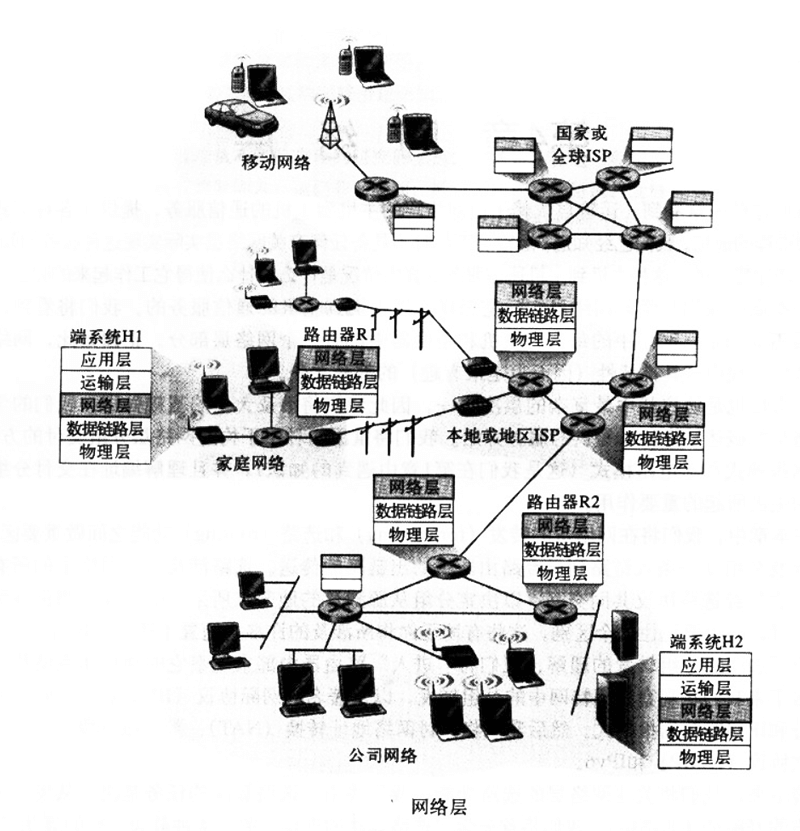
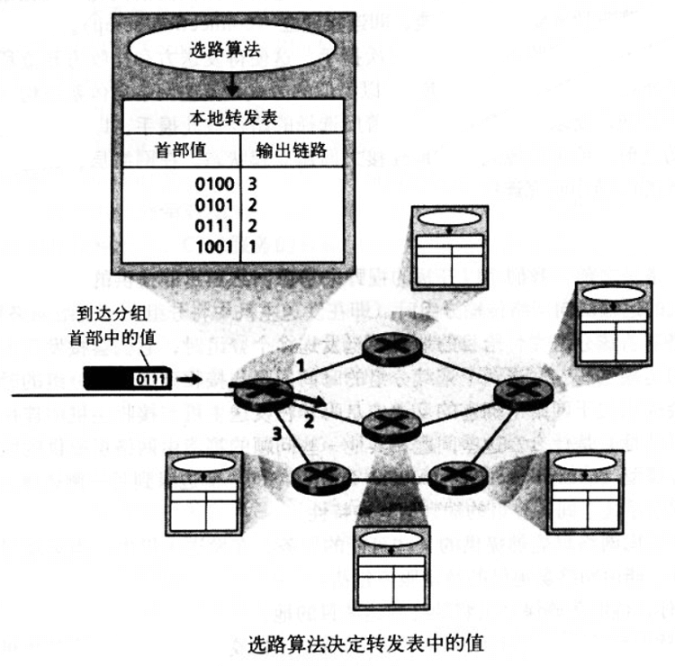
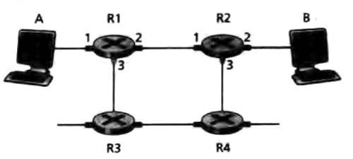
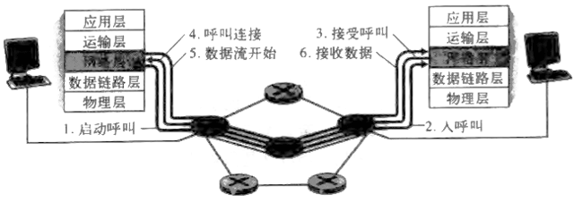
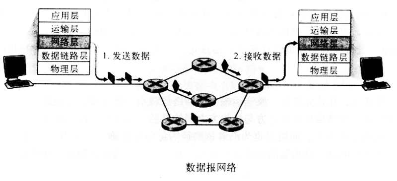
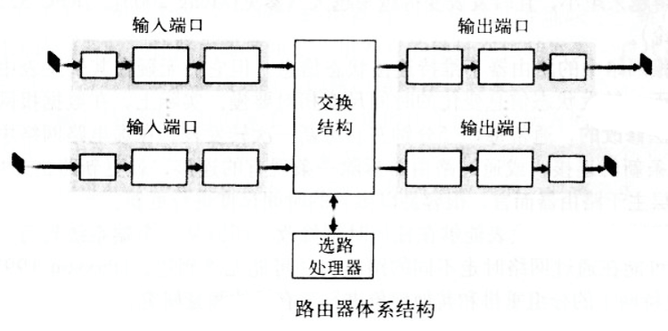
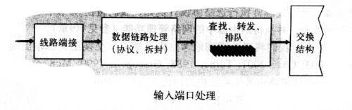
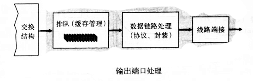
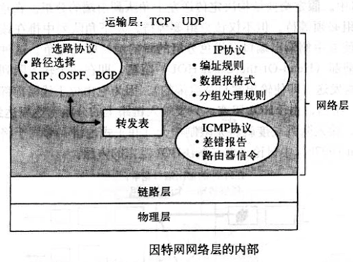

## 网络层

网络层是协议栈中最复杂的层次之一。讲重温两种用于构造网络层分组交付的方法，即数据报模式和虚电路模式，并且理解编址在交付分组到其目的主机中所起的重要作用。

而去还会对网络层的 **转发 forwarding** 和 **选路 routing** 功能之间做重要区分。转发涉及分组从在路由器中的一条入链路到一条出链路的传送。选路涉及一个网路中所有路由器，它们经选路协议共同交互，以决定分组从源到目的地的节点所采用的路径。

为了加深对分组转发的理解，将“进入”路由器的内部来观察它的硬件体系结构和组织。然后观察因特网中的分组转发，以及 **网际协议 IP** ，研究网络层编址和IPv4的数据报格式，然后探讨网络地址转换NAT、数据报分段、互联网 控制报文协议ICMP和IPv6。

然后才看一下网络层的选路功能。选路算法的任务时决定从发送方到接收方的好路径（路由）。

## 概述

上图给出了一个具有H1和H2两台主机且在H1和H2路径上有几台路由器的简单网络。假设H1正在向H2发送信息，考虑一下这些主机与中间路由器中的网络层所起的作用。H1中的网络层接受来自H1运输层的每个报文段，将其封装成一个数据报（即网络层分组），然后将数据报向相邻路由器R1发送。在接收方主机H2，其网络层接收来自相邻路由器R2的数据报，提取出运输层报文段，并将其向上交付给H2的运输层。路由器的主要作用便是将数据报从入链路转发到出链路。

### 转发和选路

网络层的作用从表面上看极为简单，即将分组从一台发送主机移动到一台接收主机。需要两种重要的网络层功能：

**转发** 。当一个分组到达某路由器的一条输入链路时，该路由器必须将该分组移动到适当的输出链路。

**选路** 。当分组从发送方流向接收方时，网络层必须决定这些分组采用的路由或路径。计算这些路径的算法被称为 **选路算法 routing algorithm** 。

**连接建立** 。回想TCP，数据从发送方流向接收方之前需要三次握手。类似地，某些网络层体系结构而非因特网，要求从源到目的地沿着所选择的路径彼此握手，以便在网络层数据分组开始流动之前，给定的源到目的地连接之间建立起状态，在网络层，该过程被称为 **连接建立** 。

每台路由器具有一张 **转发表 forwarding table** 。路由器通过检查到达分组首部中的一个字段的值，然后使用该值在该路由器中的转发表中索引查询来转发一个分组。查询结果是分组将被转发的路由器的链路接口。分组首部中的该值可能时该分组的目的地地址或该分组所属连接的指示，这取决于网络层协议。

上图给出一个例子。一个首部字段值为0111的分组到达路由器。该路由器在它的转发表中索引，决定该分组的输出链路接口是接口2。于是路由器在内部将该分组转发到接口2。

路由器中的转发表时如何配置的，它揭示了选路和转发间的重要相互作用关系。选路算法决定了插入该路由器的转发表中的值。选路算法可能是集中式的，也可能是分布式的。在任何一种情况下，路由器都接收选路协议，并用于配置其转发表。

为了谨慎描述，约定术语 **分组交换机** 是指一台通用分组交换设备，它根据分组首部字段中的值，从输入链路接口到输出链路接口传送分组。某些分组交换机称为 **链路层交换机 link-layer switch** ，它们基于链路层字段中的值作转发决定。因为本文档中关注的是网络层，所以使用术语 **路由器** 代替分组交换机。

### 网络服务模型

当位于发送主机的运输层向网络传输分组时该运输层能指望网络层将该分组交付给目的地吗？当发送多个分组时，它们能按序交付给接收主机的运输层吗？发送两个连续分组的时间间隔与接收到这两个分组的时间间隔相同吗？网络层会提供关于网络中拥塞的反馈信息吗？在发送主机和接收主机中连接运输层通道的抽象视图是什么？

**网络服务模型 network service model** 定义网络的一侧边缘到另一侧边缘分组的端到端运输特性。

在发送主机中，当运输层向网络层传递一个分组时，能由网络层提供的特定服务包括：

- **确保交付**
- **具有时延上界的确保交付**
- **有序分组交付**
- **确保最小带宽** 。这中网络层服务器模仿在发送主机和接收主机之间一条特定比特率的传输链路行为。只要发送主机以低于特定比特率的速率传输比特，分组就不会丢失，且每个分组会在预定的主机到主机时延内到达。
- **确保最大时延抖动** 。该服务确保发送方发送的两个相继分组之间的时间量等于在目的地接收到它们之间的时间量（或这中间隔的变化不超过某些特定的值）。
- **安全性服务** 。使用仅仅源和目的主机知晓的秘密会话秘钥，源主机中的网络层能够加密向目的主机发送的所有数据负载。目的主机中的网络层负责解密该负载。这种服务能够为源和目的主机之间的所有运输层报文段提供机密性。除了机密性以外，网络层还能提供数据完整性和源鉴别服务。

上面的是网络层能够提供的服务的部分，而因特网的网络层提供了单一的服务，称为 **尽力而为服务 best-offer service** 。这种最低要求的网络服务模型时有一些正当原因的。

## 虚电路和数据报网络

运输层能够为应用程序提供无连接服务或面向连接服务。例如，因特网的运输层提供的 无连接的UDP服务 和 面向连接的TCP服务 。网络层的连接和无连接服务在许多方面与之类似。存在的差异为：

- 在网络层中，这些服务是由网络层向运输层提供的主机到主机的服务。在运输层中，这些服务则是由运输层向应用层提供的进程到进程的服务。

- 在迄今为止的所有主要的计算机网络体系结构（因特网、帧中继等）中，网络层或者提供主机到主机的无连接服务，或者提供了主机到主机的连接服务，而不同时提供两种。仅在网络层提供连接服务的计算机网络被称为 **虚电路 Virtual-Circuit 网络** ；仅在网络层提供无连接服务的计算机网络被称为 **数据报网络 datagram network** 。

- 在运输层实现面向连接的服务与在网络层实现连接服务是根本不同的。运输层面向连接的服务是位于网络边缘的端系统中实现的；网络层的连接服务除了在端系统中实现外，也在位于网络核心的路由器中实现。

### 虚电路

因特网是数据报网络。不过先来看看虚电路的服务。

一条虚电路的组成如下：`源和目的主机之间的路径（一系列路由器和链路）`，`VC号，沿着该路径的每段链路一个号码`，`沿着该路径的每台路由器中的转发表`。属于一条虚电路的分组将在它的首部携带一个VC号。因为一条虚电路在每条链路上可能具有不同的VC号，所以每台中间路由器必须用一个新的VC号替代每个传输分组的VC号，该新的VC号从转发表获得。

通过下面这个例子来理解这个概念。上图中靠近R1链路的号码是链路接口号。现假定主机A请求该网络在它和主机B之间创建与主机B之间创建一条虚电路且虚电路路径选择为 A-R1-R2-B ，并为这条路径上的这3条链路分配VC号12、22和32。在这种情况下，当这条虚电路中的分组离开主机A时，该分组首部中的VC字段的值是12；当它离开R1时，该值为22，当它离开R2时该值为32。

对于虚电路网络，每台路由器的转发表包括了VC号的转换。可能像下面的：

|入接口|入VC号|出接口|出VC号|
|:-:|:-:|:-:|:-:|
|1|12|2|22|
|2|63|1|18|
|3|97|2|17|
|1|7|3|87|
|...|...|...|...|

当跨越一台路由器创建一条新的虚电路时，转发表就增加一个新项，而且无论何时终止一条虚电路，就删除沿着该路径的每个表中的相应项。

为什么一个分组沿着其路由在每条链路上不能保持相同的VC号。从有两个方面来解答。第一，逐链路代替该号码减少了分组首部中VC字段的长度。第二，允许沿着该虚电路路径每条路径有一个不同的VC号，大大简化了虚电路的建立。特别是具有多个VC号，该路径上的每条链路能够选择一个VC号，独立于沿着该路径的其他链路所选的VC号。否则，如果沿着某条路径的所有链路需要一个共同的VC号，路由器将不得不交换并处理大量的报文，以约定一个共同的VC号来用于一次连接。

在虚电路网络，该网络的路由器必须为进行中的连接维持 **链接状态信息 connection state information** 。特别是，每当跨越一台路由器创建连接时，就必须将一个新的连接状态一个新的连接项加到该路由器转发表中；每当释放一个连接时，就必须从该表中删除该项。注意，即使没有VC号转换，也有必要维持连接状态信息，该信息将VC号与输出接口号联系起来。

在虚电路中有3个明显不同的阶段：

- **虚电路建立** ：在建立阶段，发送运输层与网络层联系，指定接收方地址，等待该网络建立虚电路。网络层决定发送方与接收方之间的路径，即该虚电路的所有分组要通过的一些列链路与路由器。网络层也为沿着该路径的每条链路确定一个VC号。最后，网络层在沿着路径的每台路由器的转发表中增加一项。在虚电路建立期间，网络层还可以预留虚电路路径上的资源（如带宽）。

- **数据传送** ：如下图所示，一旦创建了虚电路，分组就可以沿着该虚电路流动了。

- **废电路拆除** ：当发送方（或接收方）通知网络层它想终止该虚电路时，就启动这个阶段。网络层通常会通知网络另一侧的端系统结束呼叫，并更新路径上每台路由器中的转发表以表明该虚电路已不存在了。

网络层的虚电路建立与运输层的连接建立之间有个细微但很重要的区别。运输层的建立仅涉及两个端系统，并且在连接建立期间，两个端系统独自决定运输层连接的参数，虽然这两个端系统已经知道该运输层连接，但网络中的路由器对这些完全不知情。另一方面，对于一个虚电路网络层，沿两个端系统之间路径上的路由器都要参与虚电路的建立，且每台路由器都完全知道经过它的所有虚电路。

端系统向网络发送指示虚电路启动与终止的报文以及路由器之间传递的用于建立虚电路（即修改路由器中的连接状态）的报文被称为 **信令报文 signaling message** ，用来交换这些报文的协议被称为 **信令协议 signaling protocol** 。

### 数据报网络

在 **数据报网络 datagram network** 中，每当一个端系统要发送分组时，它就为该分组加上目的地端系统的地址，然后将该分组在网络中推进。完成这些无需建立任何虚电路。在数据报网络中，路由器不维护任何有关虚电路的状态信息。

随着分组从源向目的地传输，它通过一系列路由器。这些路由器中的每个都使用该分组的目的地址来转发该分组。特别是，每台路由器有一个将目的地址映射到链路接口的转发表；当分组到达路由器时，该路由器使用该分组的目的地址在该转发表中查找适当的输出链路接口，然后路由器有意识地将该分组向输出链路接口转发。

路由器的转发表，会寻找该分组目的地址的 **前缀prefix** 与该表中的前缀匹配部分进行匹配；如果存在匹配，该路由器向与该匹配联系的链路转发该分组。下面是一个转发表例子：

|前缀匹配|链路接口|
|:-:|:-:|
|110010000001011100010|0|
|1100100000010011100011000|1|
|110010000001011100011|2|
|其他|3|

另外，有些地址可能存在多个匹配结果时，该路由器使用 **最长前缀匹配规则 longest prefix matching rule** ，并向与最长前缀匹配的链路接口进行转发。要使最长匹配有效，每个输出链路接口应当负责转发大块的连续目的地址。提前透露一句，因特网地址通常以层次的方式来分配。

虽然数据报网络中的路由器不维持连接状态，但它们无疑在其转发表中维持了转发状态信息。然而，转发状态信息变化的时间尺度相对要慢。实际上，在数据报网络中，转发表是选路算法修改的，通常1～5分钟左右更新一次转发表。而在虚电路网络中，只要通过路由器建立一条新的连接，或通过路由器拆除一条现有的连接，就更新路由器中的转发表（这对一台第一层主干路由器而言，很容易以微秒的时间尺度进行更新）。

### 虚电路和数据报网络的由来

作为一条重要原则，虚电路的概念来源于电话界，它采用了真正的电路。由于呼叫建立及每次呼叫的状态要在网络中的路由器上维持，因此面向虚电路的网络显然比数据报网络要复杂得多。

因特网作为一种数据报网络，是由互连计算机的需求发展而来的，由于端系统设备复杂的多，因为因特网设计者们选择网络层服务模型尽可能简单。

## 路由器工作原理

接下来看看网络层的 **转发功能 forwarding function** ，即实际将分组从一台路由器的入链路传送到适当的出链路。（深入探讨路由器设计远超出本章讨论，所以会从简）

下图显示了一个通用路由器体系结构的总体视图。其中标识了一台路由器的4个组成部分。

- **输入端口** 。输入端口执行几项功能。1 - 它要执行将一条输入的物理链路端接到路由器的物理层功能（图中输入端口部分最左侧的方框与输出端口部分最右侧的方框）。2 - 它也要执行需要位于入链路远端的数据链路层功能交互的数据链路层功能（由输入端口于输出端口部分中间方框表示）。3 - 它还要完成查找与转发功能（输入端口部分最右侧的方框于输出端口最左侧的方框），以便转发到路由器交换结构部分的分组能出现在适当的输出端口。4 - 控制分组（如携带选路协议信息的分组）从输入端口转发到选路处理器。实际上，在路由器中，多个端口经常被集中到路由器的一块 **线路卡 line card** 上。

- **交换结构** 。交换结构将路由器的输入端口连接到它的输出端口。交换结构完全包容在路由器中，即它是一台网络路由器中的网络！

- **输出端口** 。输出端口存储经过交换结构转发给它的分组，并将这些分组传输到输出链路。因此输出端口执行与输入端口顺序相反的数据链路层和物理层功能。当一条链路是双向（承载两个方向的流量）链路时，与链路相连的输出端口通常与输入端口在同一线路卡上成对出现。

- **选路处理器** 。选路处理器执行选路协议，维护选路信息于转发表，并执行路由器中的网络管理功能。

> 输入端口

下图给出了一个更详细的输入端口功能的视图。

输入端口的线路端接功能与数据链路处理实现了通向路由器的各个输入链路相关的物理层和数据链路层。

输入端口的查找／转发模块对于路由器的转发功能至关重要。在许多路由器中，都是在这里确定一个到达的分组经交换结构转发给哪个输出端口。输出端口的选择是通过转发表中包含的信息进行的。虽然转发表是由选路处理器计算的，但通常一份转发表的影子拷贝会被存放在每个输入端口，并且时常更新，这也正是选路处理器所需要的。因为有了转发表的本地拷贝，就可以在每个输入端口本地作出转发决策，而无需调用中央选路处理器。这种 *分散式* 的转发可避免在路由器中的某个单点产生转发处理的瓶颈。

在输入端口处理能力受限的路由器中，输入端口也许直接将分组转发给中央选路处理器，然后该处理器执行转发表查找并将分组转发到恰当的输出端口。这就是当一个工作站或服务器用作一台路由器时所采用的方法。这里选路处理器实际就是该工作站的CPU，而且输入端口实际上就是一块网络接口卡。

转发表存在以后，从概念上讲表查找是很简单的。但是实际情况是，人们希望输入端口的处理速度能够达到 **线路速度 line speed** ，即执行一次查找的时间应小于从输入端口接收一个分组所需的时间。这意味着对接收到的分组的输入处理可以在下一个接收操作结束之前完成。

例如考虑运行速率为2.5Gbps的 OC-48 链路。对于256字节的分组，意味着查找速度大约为每秒进行一百万次查找。

优化查找的方法可以通过二分查找技术、高速缓存等方式去解决，可由读者自行探索。

一旦通过查找确定了一个分组的输出端口，则该分组可转发进入交换结构。然而，在进入交换结构之前可能会暂时 **阻塞 blocked** ，这是由于来自其他输入端口的分组当前正在使用交换结构。因此一个被阻塞的分组必须要在输入端口处排队，并等待稍后被及时调度以通过交换结构。

> 交换结构

交换结构位于一台路由器的核心部位。正是通过交换结构，分组才能实际地从一个输入端口交换（转发）到一个输出端口中。下图展示了交换的不同技术方式。

*经内存交换* 。这是最简单、最早的交换技术，分组的转发在CPU选路处理器的直接控制下完成，此时，输入端口与输入端口的作用就像传统操作系统中的I/O设备一样。一个分组到达一个输入端口时，该端口会先通过中断方式向选路处理器发出信号。于是，该分组从输入端口处被拷贝到处理器内存中。选路处理器则从分组的首部中取出目的地址，在转发表中找出适当的输出端口，并将该分组拷贝到输出端口的缓存中。

许多现代路由器也是通过内存交换的。与早起路由器的差别在于，目的地址的查找和将分组储存（交换）进适当的存储位置是由输入线路卡伤的处理来执行的。在某些方面，经内存交换的路由器看起来很像共享内存的多处理器，用一个线路卡上的处理器将分组交换进适当输出端口的内存中。

*经一根总线交换* 。输入端口经一根共享总线将分组直接传送到输出端口，不需要选路处理器的干预。（注意，经内存交换时，分组进出内存也必须跨越系统总线）。虽然选路处理器没有涉及总线传送，但是由于总线是共享的，故一次只能有一个分组通过总线传送。某个分组到达一个输入端口时，发现总线正忙于传送另一个分组，则它会被阻塞而不能通过交换结构，并且在输入端口排队。值得注意的是，在当前技术下，总线带宽可能超过1Gbps，对于运行在接入网或企业网中的路由器来说，通过总线交换通常是足够的。

*经一个互联网络交换* 。克服单一、共享式总线带宽限制的一种方法是，使用一个更复杂的互联网络。一个纵横式交换机就是一个由2n条总线组成的互联网络，它将n个输入端口和n个输出端口连接。一个到达某个输入端口的分组沿着连到输入端口的水平总线穿行，直至该水平总线与连到所希望的输出端口的垂直总线的交叉点。如果该条连到输出端口的垂直总线是空闲的，则该分组被传送到输出端口。否则，它就被阻塞了，需要在输入端口排队。

> 输出端口

输出端口处理取出存放在输出端口内存中的分组并将其传送到输出链路上。数据链路协议处理与线路端接是发送方的链路层与物理层功能，这些功能实现与输出链路另一端的输入端口之间的交互，如下图。

当交换结构将分组交付给输出端口的速率超过输出链路的速率时，就需要排队与缓存管理功能。

> 何时出现排队

路由器的缓存空间是有限的，随着输入端口和输出端口的分组队列增长，缓存空间终将耗尽，于是会出现 **丢包 packet loss** 。分组丢失的实际位置（要么在输入端口队列、要么在输出端口队列）将取决于流量负载、交换结构的相对速率和线路速率等几个因素。

假定输入线路速率和输出速率是相同的，且有n个输入端口和n个输出端口。定义 **交换结构速率 switching fabric speed** 为交换结构能够从输入端口到输出端口移动分组的速率。如果交换结构的速率至少是输入线路速率的n倍，则在输入端口处不会出现排队。因为交换结构能在某个时间内处理所有n个输入端口到达的分组。但是考虑输出端口，最坏的情况就是所有的分组要发往同一个输出端口，因此容易在输出端口产生排队、甚至是分组丢失。

考虑使用缓存来吸收流量负载的波动，那么需要多少缓存？计算缓存长度的经验方法是缓存量 B 等于平均往返时延 RTT 乘以链路容量 C 。还有一种考虑是当大量的 TCP (N) 流经一条链路是，所需要的缓存量是 B = RTT * C ／ {sqrt(N)}，对于通常有大量流经的大型主干路由器链路，N值可能很大，因而所需的缓存长度将明显减小。

输出端口排队的后果就是，输出端口上的一个 **分组调度程序 packet scheduler** 必须在这些排队的分组中选一个来传送。这种选择可能是根据简单的原则来确定，如先到先服务；也可能是根据复杂的调度规则来的，如加权公平排队。分组调度程序在提供 **服务质量保证 quality-of-service guarantee** 方面起着关键作用。

类似的如果没有足够的内存来缓存一个入分组，那么必须作出决定，要么丢弃到达的分组（称为 **弃尾 drop-tail** 的策略），要么删除一个或多个已排队的分组。在某些情况下，再缓存填满前就丢弃（活在首部加标记）一个分组，以便向发送方提供一个拥塞信号的做法是有意的。

另一方面，如果交换结构不能快得使所有到达分组无延时的通过它传送，则在输入端口也将出现分组排队。

如上图，其中输入队列前端的两个分组要法网同一个输出端口中。假定交换结构传送左上角队列前端的分组，此时，左下角输入端口的分组队列中的第一个必须等待，而且它的后面的分组也需要等待，即使后面的分组想要去的是其他的输出端口。这种现象被称为输入排队交换机中的 **线路前部 Head-of-the-line 阻塞** ，即一个输入队列中排队的分组的线路前面一个分组被阻塞时，它也必须被阻塞。

## 网际协议：因特网中的转发和编址

考虑构成因特网的网络层的组件。主要有三个组件，即 IP协议、选路组件（决定数据报从源到目的地所流经的路径）、报告数据报中的差错和对某些网络层信息请求进行响应的设施。

> 数据报格式

介绍数据报的构成是很枯燥的事情，有兴趣的同学可以自己去看。

这里提一下 **IP数据报分片** ，不同的链路层协议承载的网络层分组长度不一样。例如，以太网可承载不超过1500字节的数据，而某些广域网链路的帧只能承载不超过576字节的数据。一个链路层帧能承载的最大数据量叫做 **最大传输单元 Maximum Transmission Unit** 。对IP数据报长度的限制并不是主要问题，真正的问题是在发送方和目的地之间的链路可能使用了不同的链路层协议，且每种协议具有不同的MTU。

假如从某条链路收到一个IP数据报，而即将转发出去的链路MTU要比该数据报的长度要小。此时。解决问题的方法是将IP数据报中的数据分片成较小的若干个数据报，用单独的链路层帧封装它们，然后向输出链路上发送这些帧。这些较小的数据报叫做 **片 fragment** 。

片 到达目的地的运输层以前需要杯重新组装。实际情形是为了坚持网络内核的 keep-simple 原则，IPv4的设计者将数据报的重新组装工作被放到了端系统中，而不是在网络路由器中。

不过 IPv6 中从根本上废止了分片，从而简化了IP分组的处理。

> IPv4编址

当一台主机通常只有一条链路连接到网络；当主机中的IP想要发送一个数据报时，它就在这条链路上发送。主机与物理链路之间的边界叫做 **接口 interface** 。路由器的任务是从链路上接收数据并从某些其他链路转发出去，所以路由器必须拥有至少2条链路接口。因为每台主机与路由器都能发送和接收IP数据报，IP协议要求每台主机和路由器都拥有自己的IP地址。因此，一个IP地址在技术上是与一个接口相关联的，而不是与该接口的主机或者路由器相关联的。

每个IP地址长度为32比特，因此总共有 232 个可能的地址。在全球因特网中，每台主机和路由器的每个接口都必须有一个全球唯一的IP地址。一个接口的IP地址的组成部分需要由其连接的子网来决定。

